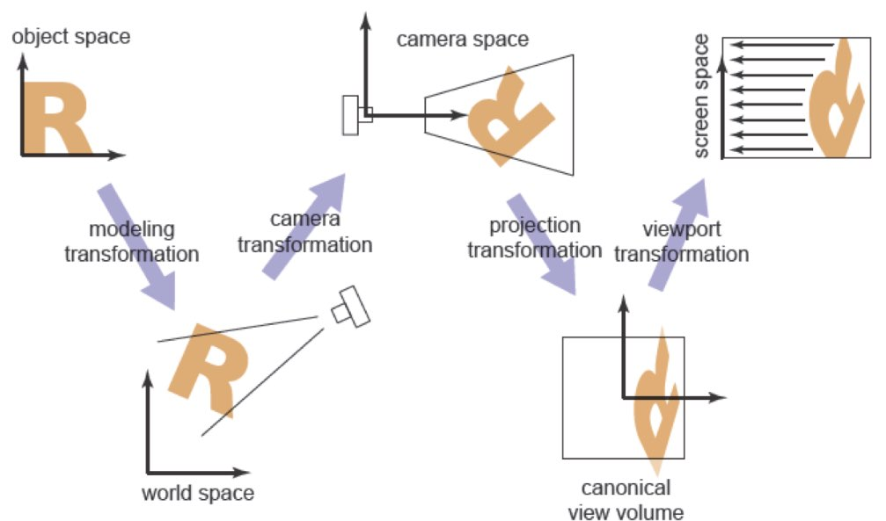
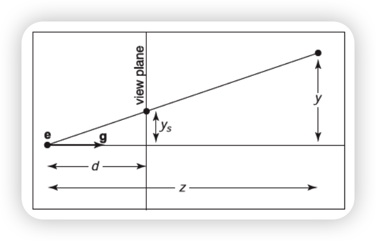

# Computer Graphics — Viewing

## Viewing Transformations

我们知道，尽管我们认为游戏世界是三维的，但我们的屏幕目前只能是二维的，也就是我们需要将三维的世界显示在二维的屏幕上，这样的变换就叫做**视图变换（Viewing Transformation）**。这与之前所讲解的**变换矩阵（Transformation Matrix）**紧密相关。

具体来说可以分为以下几个步骤：

其中最核心的过程就是 Model Transformation、Camera/View Transformation、Projection Transformation，一般直接统称 **MVP 变换**。

Model Transformation 和 Camera/View Transformation 很容易理解，就是将物体局部坐标转换成世界坐标，然后将相机移动到原点，相机朝向根据需要可以选择 -z 或者 z 方向。在本系列中，都认为相机朝向为 \(-z\)，\(+y\) 为正上方。

### Viewport Transformation

我们先从后往前来理解。Viewport Transformation 做的事就是将坐标从 Normalized Device Coordinates (NDC) space 投影到 screen space，深度（z）我们暂时不用管，在透视投影和光栅化阶段会更详细说明，我们当前的目标是将坐标从 \([-1, 1]^3\) 投影到 \([-0.5, n_x-0.5] \times [-0.5, n_y-0.5]\)，\(n_x, n_y\) 是屏幕的横竖像素数。由于 \(z\) 不用管，因此实际上只需要投影 \([-1, 1]^2\)。这样的区间投影实际上只需要两步变换，第一步是拉伸区间长度，第二步是平移区间，因此我们很容易可以得到 Viewport Transformation Matrix:

$$
\begin{bmatrix}
x_{screen} \\
y_{screen} \\
1
\end{bmatrix}
=
\begin{bmatrix}
\frac{n_x}{2} & 0 & \frac{n_x-1}{2} \\
0 & \frac{n_y}{2} & \frac{n_y-1}{2} \\
0 & 0 & 1
\end{bmatrix}
\begin{bmatrix}
x_{canonical} \\
y_{canonical} \\
1
\end{bmatrix} \\
\\
M_{vp} = 
\begin{bmatrix}
\frac{n_x}{2} & 0 & 0 & \frac{n_x-1}{2} \\
0 & \frac{n_y}{2} & 0 & \frac{n_y-1}{2} \\
0 & 0 & 0 & 1
\end{bmatrix}
$$

### Orthographic Projection Transformation

我们知道相机一般有正交（Orthographic）和透视（Perspective）两种，我们暂时先讲解正交，因为透视会更加复杂，将在后面几节中说明。

这一步变换的目的就是，将视景体（View Volume）内看到的画面，投影到刚才的 NDC 空间中。正交的 View Volume 是一个长方体，具体来说，左前下角的点为 \((l, b, n)\)，右后上角的点为 \((r, t, f)\)。

各裁剪面为与坐标轴对齐的平面（下式中 \(x=l\) 表示左裁剪面、\(x=r\) 表示右裁剪面，其余类推）：

$$
\begin{align}
& x = l = \text{left plane,} \\
& x = r = \text{right plane,} \\
& y = b = \text{bottom plane,} \\
& y = t = \text{top plane,} \\
& z = n = \text{near plane,} \\
& z = f = \text{far plane.} \\
\end{align}
$$

要从 \([l, r] \times [b, t] \times [f, n]\) 投影到 \([-1, 1]^3\)，实际上上一节已经说明了，先拉伸再平移即可（需要注意的是中心点的坐标也会对应拉伸）。容易得到 Orthographic Projection Transformation Matrix:

$$
M_{ortho} =
\begin{bmatrix}
\frac{2}{r-l} & 0 & 0 & -\frac{r+l}{r-l} \\
0 & \frac{2}{t-b} & 0 & -\frac{t+b}{t-b} \\
0 & 0 & \frac{2}{n-f} & -\frac{n+f}{n-f} \\
0 & 0 & 0 & 1
\end{bmatrix}
$$

### Camera Transformation

我们知道，Camera Transformation 的作用是将坐标从世界空间转换到相机空间，但是我们只有相机坐标点和相机观测方向，是无法构成一组基向量的，因此无法张成相机空间，那应该怎么办呢？

为了解决这个问题，图形学引入了一个世界向上向量，通常情况下，我们强制规定：**在世界空间中，天空的方向是正上方**。因此，我们人为提供一个**辅助的**世界向上向量 \(\vec{t}\)（通常就是世界坐标系的 Y 轴：\(\begin{bmatrix} 0 & 1 & 0 \end{bmatrix}^T\)）。这只是一个大概的参考标准，它**不需要**（通常也**不会**）与相机的观测方向严格垂直。它的唯一作用，就是告诉相机：“你的头顶尽量往这个方向靠拢，不要倒立，也不要侧翻”。

重新整理下，现在我们有：

- the eye position \(\mathbf{e}\),
- the gaze direction \(\mathbf{g}\),
- the view-up vector \(\mathbf{t}\).

我们要使用这些信息开始构建基向量。

首先是 \(z\) 轴，前面说过相机总是看向 -z 或者 z 方向，因此观测方向 \(\mathbf{g}\) 本身就是 \(z\) 轴方向，由于我们认为相机朝向 \(-z\)，因此我们可以得到 \(z\) 轴基向量：

$$
\mathbf{w} = -\frac{\mathbf{g}}{\lVert \mathbf{g} \rVert}
$$

其次是 \(x\) 轴，我们有了 \(z\) 轴基向量 \(\mathbf{w}\) 和近似于 \(y\) 轴的向上向量 \(\mathbf{t}\)，因此我们可以使用叉乘来构建 \(x\) 轴基向量：

$$
\mathbf{u} = \frac{\mathbf{t} \times \mathbf{w}}{\lVert \mathbf{t} \times \mathbf{w} \rVert}
$$

同理，有了 \(z\) 轴基向量 \(\mathbf{w}\) 和 \(x\) 轴基向量 \(\mathbf{u}\)，我们可以使用叉乘得出真正的 \(y\) 轴基向量 \(\mathbf{v}\)：

$$
\mathbf{v} = \mathbf{w} \times \mathbf{u}
$$

于是我们得到了相机在世界空间中的变换矩阵，描述的是相机空间到世界空间的变换：

$$
M_{camera}
= \begin{bmatrix} \mathbf{u} & \mathbf{v} & \mathbf{w} & \mathbf{e} \\ 0 & 0 & 0 & 1 \end{bmatrix}
= \begin{bmatrix} x_u & x_v & x_w & x_e \\ y_u & y_v & y_w & y_e \\ z_u & z_v & z_w & z_e \\ 0 & 0 & 0 & 1 \end{bmatrix}
$$

但是 Camera Transformation 的作用是将坐标从世界空间转换到相机空间，因此我们需要的实际上是 \(M_{camera}\) 的逆变换矩阵，也就是大名鼎鼎的 \(LookAt\) 矩阵。我们知道这番变换只涉及旋转与平移变换，对于旋转变换部分，由于是正交矩阵，因此逆矩阵为转置矩阵；而对于平移部分，只需平移负值即可。故：

$$
M_{LookAt}
= \begin{bmatrix} x_u & y_u & z_u & 0 \\ x_v & y_v & z_v & 0 \\  x_w & y_w & z_w & 0 \\ 0 & 0 & 0 & 1 \end{bmatrix}
\begin{bmatrix} 1 & 0 & 0 & -x_e \\ 0 & 1 & 0 & -y_e \\ 0 & 0 & 1 & -z_e \\ 0 & 0 & 0 & 1 \end{bmatrix}
$$

那么到此为止，我们实际上已经跑通了一个视图变换流程了：

$$
\begin{aligned}
& \text{construct } M_{vp} \\
& \text{construct } M_{ortho} \\
& \text{construct } M_{LookAt} \\
& M = M_{vp} M_{ortho} M_{LookAt} \\
& \textbf{for } \text{each line segment } (a_i, b_i) \textbf{ do} \\
& \quad p = M a_i \\
& \quad q = M b_i \\
& \quad \text{drawline}(x_p, y_p, x_q, y_q)
\end{aligned}
$$

## Projective Transformations

接下来我们步入更为复杂的透视变换。我们的思路是将透视空间转换成正交空间，这样我们可以直接使用前面推导出来的后续矩阵了。我们都知道透视遵循着近大远小的原则，也就是同一物体离观察点越近时所成的像越大。在已知物体位置、视平面和视点的情况下，我们可以给出这样的关系图：

物体 \(y\) 与所成像 \(y_s\) 大小满足：

$$
y_s = \frac{d}{z}y
$$

也就是说，在 \(y\) 与 \(d\) 不变时，\(y_s\) 与深度 \(|z|\) 成反比（等价地，透视缩放因子与 \(|z|\) 也成反比）。

但是这也就导致了新的问题，**所有的坐标变换，必须且只能用矩阵乘法来完成**，而这是线性变换，也就是说我们只能得到这样的形式：

$$
x' = a \cdot x + b \cdot y + c \cdot z + d
$$

这怎么办呢？还记得我们在讨论齐次坐标时提到过，我们将坐标 \(\begin{bmatrix} x & y & z \end{bmatrix}^T\) 升维成齐次坐标 \(\begin{bmatrix} x' & y' & z' & w \end{bmatrix}^T\) ，并且和 \(\begin{bmatrix} x'/w & y'/w & z'/w & 1 \end{bmatrix}^T\) 表示的是一个点，这一步其实在设计硬件时免费给我们送了一个除法！只是平时我们为了方便起见，都设 \(w = 1\)。

更广义地说，我们可以设 \(\tilde{w} = ex + fy + gz + h\)，于是有：

$$
x' = \frac{a_1x + b_1y + c_1z + d_1}{ex + fy + gz + h} \\
y' = \frac{a_2x + b_2y + c_2z + d_2}{ex + fy + gz + h} \\
z' = \frac{a_3x + b_3y + c_3z + d_3}{ex + fy + gz + h} \\
\begin{bmatrix} \tilde{x} \\ \tilde{y} \\ \tilde{z} \\ \tilde{w} \end{bmatrix} = \begin{bmatrix} a_1 & b_1 & c_1 & d_1 \\ a_2 & b_2 & c_2 & d_2 \\ a_3 & b_3 & c_3 & d_3 \\ e & f & g & h \end{bmatrix}\begin{bmatrix} x \\ y \\ z \\ 1 \end{bmatrix} \\
(x', y', z') = (\tilde{x}/\tilde{w}, \tilde{y}/\tilde{w}, \tilde{z}/\tilde{w})
$$

这样的变换称之为：**投影变换 / 单应性变换 (Projective Transformation / Homography)**。而我们将要应用的令 \(w = -z\) 就是其特例。

## Perspective Projection

我们再回到透视的问题，我们已知了 \(x, y\) 坐标的变换，但是 \(z\) 坐标如何变换呢？从图上看，似乎因为所有点都在 \(z=n\) 平面上，因此 \(z\) 坐标变换后直接变成 \(d\) 即可，但是这样变换的话，原来的深度所携带的信息就全部消失了，比如说我们希望近的物体能够遮挡远处的物体，但是这样变换后实际上已经无法判断远近了。因此我们需要对 \(z\) 轴有一定的变换，但是具体怎样变换我们暂且不得而知：

$$
(x, y, z) \rightarrow \left( \frac{nx}{-z}, \frac{ny}{-z}, \text{unknown} \right)
$$

我们期望的是：

$$
\begin{bmatrix} ? & ? & ? & ? \\ ? & ? & ? & ? \\ ? & ? & ? & ? \\ ? & ? & ? & ? \end{bmatrix} \begin{bmatrix} x \\ y \\ z \\ 1 \end{bmatrix} = \begin{bmatrix} nx \\ ny \\ \text{unknown} \\ -z \end{bmatrix}
$$

实际上我们可以据此反推出变换矩阵的部分：

$$
M_{persp \to ortho} = \begin{bmatrix} n & 0 & 0 & 0 \\ 0 & n & 0 & 0 \\ ? & ? & A & B \\ 0 & 0 & -1 & 0 \end{bmatrix}
$$

由于 \(z\) 的变换肯定与 \(x, y\) 是无关的，因此实际上第三行还能精确为 \(\begin{bmatrix} 0 & 0 & A & B \end{bmatrix}\)，也就是 \(z' = Az + B\)，再进一步推导的话，我们需要利用两个几何约束：

1. **近裁剪面（\(z=-n\)）上的任何点，挤压后依然在原地。**

$$
\frac{-An+B}{n} = -n \implies -An + B = -n^2
$$

2. **远裁剪面（\(z=-f\)）上的任何点，挤压后 Z 坐标不变。**

$$
\frac{-Af+B}{f} = -f \implies -Af + B = -f^2
$$

联立可以解得：

$$
A = n + f \qquad B = nf \\ \\
M_{persp \to ortho} = \begin{bmatrix} n & 0 & 0 & 0 \\ 0 & n & 0 & 0 \\ 0 & 0 & n+f & nf \\ 0 & 0 & -1 & 0 \end{bmatrix}
$$

我们因此也得到了 \(z\) 的变换关系：

$$
Z_{ndc} = \frac{(n+f)z + nf}{-z} = -(n+f) - \frac{nf}{z}
$$

可见深度 \(Z_{ndc}\) 和实际物理深度 \(z\) 是反比例关系（\(-1/z\)），这就导致了

1. 当物体**离相机很近**时，\(Z_{ndc}\) 变化非常剧烈，深度精度极高。

2. 当物体**离相机很远**时，公式趋于平缓，几十米的距离在 Z-Buffer 里可能连小数点后五位都没区别

这会造成 **Z-Fighting** 现象，可以使用 **Reversed-Z** 方案，将近裁剪面映射到 \(Z_{ndc} = 1\)，远裁剪面映射到 \(Z_{ndc} = 0\)，配合浮点数的精度分布特性，极大地缓解远处的 Z-Fighting。

话说回来，要得到最终的透视投影矩阵，我们还需再乘一个正交投影矩阵：

$$
\begin{align}
M_{persp} &= M_{ortho} \cdot M_{persp \to ortho} \\
&= \begin{bmatrix} \frac{2}{r-l} & 0 & 0 & -\frac{r+l}{r-l} \\ 0 & \frac{2}{t-b} & 0 & -\frac{t+b}{t-b} \\ 0 & 0 & \frac{2}{n-f} & -\frac{n+f}{n-f} \\ 0 & 0 & 0 & 1 \end{bmatrix} \begin{bmatrix} n & 0 & 0 & 0 \\ 0 & n & 0 & 0 \\ 0 & 0 & n+f & nf \\ 0 & 0 & -1 & 0 \end{bmatrix} \\
&= \begin{bmatrix} \frac{2n}{r-l} & 0 & \frac{r+l}{r-l} & 0 \\ 0 & \frac{2n}{t-b} & \frac{t+b}{t-b} & 0 \\ 0 & 0 & -\frac{f+n}{f-n} & -\frac{2fn}{f-n} \\ 0 & 0 & -1 & 0 \end{bmatrix}
\end{align}
$$

至此，我们已经跑通了视图变换的全流程。

