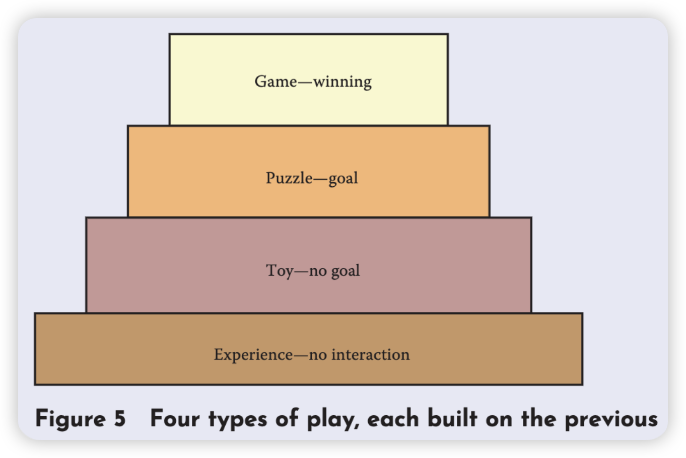

	阅读时间：2025-01-21
	阅读目标：了解何为谜题、解密游戏和其他游戏的区别、如何设计好的谜题。
## 本篇摘要
​	作者给谜题下了定义：
1. 谜题是有趣的
2. 谜题有一个正确答案

​	而如何让一个谜题有趣呢？作者给出以下三点：

1. 小说

2. 不要太简单或太难

3. 小把戏

  而让谜题有一个正确答案是为了区分谜题和其他娱乐形式，并给出他们之间的关系，据此得到判断谜题设计好坏的工具。

## 主要内容与要点
### 什么是谜题？
​	作者最喜欢的谜题的定义是：
1. **谜题是有趣的**

   这说明了谜题是一种玩法

2. **谜题有一个正确答案**

   这区分了谜题和其他形式的玩法，比如游戏和玩具

   这个定义甚至是迷惑性的简单，但也带来很多有趣的效果。
### 好玩吗？
​	给出了一些让谜题变得更好玩的东西。
1. **小说**

   玩开始于怀疑日常生活中的规则，那一些熟悉的东西再加一些小说氛围，是一种让人玩得好的方式。

2. **不要太简单，不要太难**

   太简单的谜题让人失望，太难的谜题让人受挫。不要太高估玩家，也不要太低估玩家。

3. **小把戏**

   让谜题是「反直觉的」，或者说「改变常用的诠释方式」，类似于推理小说中的「叙述诡计」。

​	人们对好玩的感觉是主观的，好不好玩取决于参与者的眼光，但作者认为反而更兴奋的是「在这世界上的每一个问题，无论多么乏味，总会有人想要去解决它」。

### 它有正确答案吗？
​	当答案公布时，绝大多数人都认可这是最佳答案，那么它就是有答案的。但有时候可能仍有漏洞，这就需要额外填补。
### 谜题之于游戏
​	前面说过「拥有一个正确答案」是为了区别谜题和游戏以及其他玩法。Chris Forward 给出了多种玩法类型的关系。

​	这样的结构使我们获得一个判断谜题设计师好坏的好工具：要做一个好的谜题，先要做一个好的玩具。玩家应该能在操作谜题中得到乐趣，即使他们还不能得到一个解法。

### 设计谜题
1. 谜题有两方面，一方面是谜题游戏中的关卡设计，以一个固定的规则为基础来制作一个特定的谜题；另一方面是规则设计，发明整体使用的规则、目标和谜题形式。
2. 总的来说谜题设计和游戏设计拥有一样的目标：让玩家在一个享受并同时拥有挑战的状态中。
## 书中案例与引申
1. 书中给了一个谜题，我认为的确是很简单小巧但是不失精致，挺有趣的。
   
   
   
   已知该字母不是 L，那么是什么呢？
   
   答案是「F」，是一个很巧妙的答案，很多人在尝试还原的时候估计都不会想到折叠过来的部分下面还有一个部分！这运用到了作者给出的让谜题变得好玩的技巧里的「不要太简单也不要太难」和「小把戏」，并且也完全符合作者提出来的谜题的定义！
## 我的思考与疑问
1. 如果我的谜题是为了剧情服务，那我应该如何入手设计？
   
   叙事解谜不需要核心机制，每道题与每道题之间相对独立，没有内在的联系。解谜的逻辑是一种天然的、生活化的逻辑。
## 书中问题
1. 发明一个电脑谜题，灵感源自于今日的新闻头条。至少两个关卡，一个简单一个难。作出纸面原型并让其他人测试并改进。
## 精选摘录
1. 「玩开始于怀疑日常生活中的规则，能放纵我们去做不使用的事情。」
2. 「太简单的谜题让人失望，太难的谜题让人受挫。」
3. 「对你来说是每天的麻烦问题，对其他人来说或许是一个有趣的谜题。」
4. 「在这世界上的每一个问题，无论多么乏味，总会有人会想要去解决它。」
5. 「如果玩家本身没有娱乐精神，即使是最好的游戏也可能被毁掉。」
6. 「玩家是愿意改变游戏规则来让游戏每个人都觉得游戏好玩的。」
7. 「要做一个好的谜题，首先要做一个好的玩具。」
8. 「玩家应该能够在操作谜题中得到乐趣，即使他们还不能得到一个解法。」
## 本章小结与感想
​	学到了关于谜题的定义以及评判和设计谜题的一些方法，正好我打算这段时间开发一个叙事解谜游戏，或许会有所帮助。