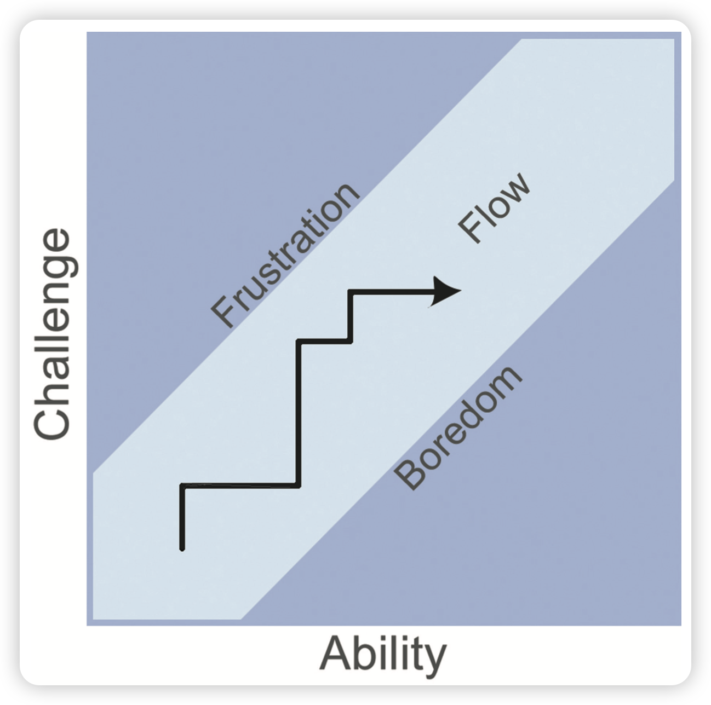
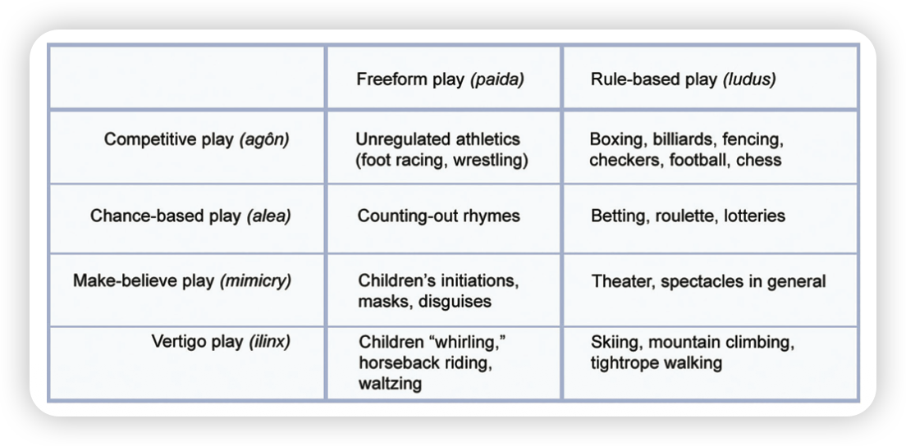
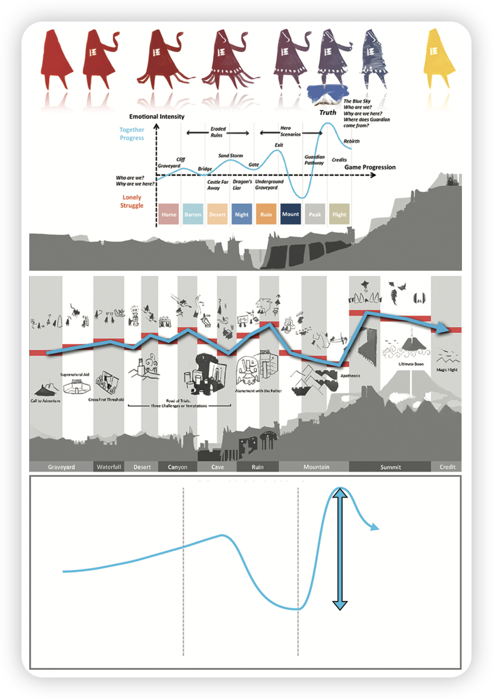

# 📖 运用 Dramatic Elements

## 🎯 阅读目的

> 在了解完游戏的骨架 —— Formal Elements 后，开始了解游戏的骨肉、能让玩家投入情感的元素—— Dramatic Elements。学习这些元素是如何结合并形成投入感的。

## 🧠 本章摘要

> 讲述了一些关键的元素，并构成了一套基础工具，设计师可以用这台工具构建情节、引发共鸣。但除了这套工具，还应对传统戏剧构建工具有深刻的理解，在互动式叙事、传统叙事、电子游戏设计、传统游戏设计中鲜少有全新元素，先去理解先前的游戏和故事是明智的。

## 📌 核心内容整理

### ✦ 关键戏剧元素

#### 挑战 Challenge

游戏应该追求挑战与技能的平衡，也就是追求「心流」状态。

帮助达到心流状态的元素有：

1. **需要技巧的挑战性活动**

  心流的状态在「以目标引导，有规则限制，并需要一定技巧来完成的事情」中出现的最多。
  当一个人有这些技巧并且任务的结果并不完全确定时，这就是一项有挑战的任务。

2. **动作与意识的结合**

  如果一个人所有相关的技能都需要用到一个挑战中的时候，这个人的注意力就完全被这项活动抓住了。

3. **清晰的目标和反馈**

  在心流的体验中，我们知道什么是需要被完成的事情，并且我们很快就能意识到事情做得好坏。

4. **专注于目前正在做的任务**

  心流中的典型元素——我们只意识到了和我们正在做的事相关的事情。

5. **控制的悖论**

  只有当有一个不确定的结果，并且这个人可以影响这个结果时，一个人才可以真的知道 ta 在掌控事件。
  对于游戏设计师重要的地方在于，怎样给玩家提供有意义的选项，但是同时又不给玩家绝对的控制和保证的结果。

6. **失去自我意识**

  心流体验如此引人入胜，让我们失去自我意识，但当心流结束后，我们通常会成为一个更强大的自我。
  人们通过忘记自我的行为实现了自我拓展。

7. **时间的变化**

  最优体验中的一个最常见的形容就是，时间似乎不再以它原本那种方式流逝了。或几小时转瞬即逝，或几秒钟停滞不前。

8. **体验成为了它自己的结果**

  我们享受这些元素创造出的体验的行为是自发的，我们没有理由去做它们，除了我们本身就享受这样的事情。
  这些元素并不是一个创造愉快和有挑战游戏体验的步骤，设计师应该自己相出这些想法对自己的游戏意味着什么。

在设计自己的游戏时思考这些问题：

- 目标观众有什么技巧？是什么样的等级？掌握了这样的知识，应该如何更好地为玩家平衡游戏？

- 如何给玩家清晰的、集中的目标，有意义的选择和可分辨的反馈？

- 如何把玩家操作上的行动和在游戏中的思考结合起来？

- 如何消除失败的干扰和恐惧？也就是，怎样创造一个安全的环境，让玩家失去自我意识并专注于目前的任务？

- 如何让玩家自发性地享受你的游戏？

#### 玩 Play

玩，就是玩家在规则中的自由——紧凑体验和个人表达的机会。

1. **玩的本质**

  玩有很多面，玩并不是任何一个东西，而是一种思维状态、一种活动的方式。一个玩的方式可以被运用在即使是最严肃或最难的主题上，因为可玩是一种思维状态，而不是一种行为。

  Roger Caillois 提出了以下玩的分类：
  
  对于游戏设计师来说，这个分类系统可以让我们讨论特定的游戏类型中的特定的「玩」带来的核心体验。

2. **玩家的类型**

  与 Richard Bartle 的基本玩家分类相似，从玩家乐趣的角度出发可以有以下分类：

  - 竞争型玩家

  - 探索型玩家

  - 收集者型玩家

  - 成就型玩家

    上升通道和等级划分对这类玩家有很大的刺激作用。

  - 娱乐型玩家

    对认真的玩家有潜在的干扰作用，但也可以在游戏生态中融入更多社交性。

  - 艺术型玩家

  - 指导型玩家

  - 故事型玩家

  - 表演型玩家

  - 工匠型玩家

  从这个方向出发可以探寻玩家在情感上对游戏的认同和参与。

3. **参与度**

  不同的玩家获得相同的乐趣，所需要的投入是不同的。

  作为设计师，是否有方法将看游戏的“观众”融入到游戏中？不过当然，设计玩法时只考虑玩游戏的人是最常见、风险最小的做法。

#### 故事预设 Premise

如果没有一个戏剧性的故事预设，很多游戏对玩家来说会太过抽象。为了从情感上把玩家与游戏联系到一起，设计师需要为游戏的交互床架你个戏剧性游戏预设。

故事预设的首要目标是让游戏的正规系统对玩家来说具有可玩性。一个好的故事预设还可以在情感方面吸引玩家。

#### 角色 Character

角色是故事的媒介，故事通过角色的行为来讲述。观众对一个角色和他追求的目标感同身受，使故事中的事件像发生在自己身上，并追随这些时间的动向直到结局。

角色在故事中如何被使用很大程度取决于故事的类型。故事主角身处问题之中，从而创造了故事发展的冲突。在塑造角色时，都需要考虑以下问题：

- 这个角色想要什么？
- 设个角色需要什么？
- 观众/玩家的期待是什么？
- 观众/玩家的恐惧是什么？

**媒介**（*角色在游戏中的实际功能是代表玩家*）和**移情**（*玩家与角色之间建立起情感联接*）必须在游戏内的每个有角色的关卡中都被考虑。

设计师在创作角色时还需要考虑「自由意志」与玩家控制的平衡。玩家控制行为和角色控制行为的冲突是一个很有趣的区域。

#### 故事 Story

传统叙事方式中结局的不确定性是由作者解答的，但是游戏当中的不确定性却是交给玩家解答的，正因为此，把传统叙事方式集合到游戏当中是很困难的。

很多游戏中故事被限制在了背景故事当中，故事的进展不受游戏玩法的影响；有些设计师会让玩家的行为来改变故事结构。

*游戏设计师相信故事和玩法结合会比一个预设好的故事结构的叙事方式更加有潜力。*

游戏叙事最流行的形式是，用故事推进冒险游戏，跟随单人玩家的旅程。

游戏设计师不只是考虑叙事，而是实验型的能够结合和拓展叙事的深度，同时不牺牲玩法的方法。

#### 构建世界 World Building

所谓构建世界，就是把故事结构丝毫不违和地融入玩法和交互中。

现今最广为人知的虚构世界观应该算是 J.R.R. Tolkien 的 **中土世界(Middle-earth)**，国内的话应该是“武侠世界”或者“修仙世界”。

作者创造出一个极具吸引力的环境，但这个环境存在于作者的想象中，并不能被完全探索和感知，但最终这个概念可能会发展得远比作品中甚至作者脑子中的世界更为庞大，因为热爱这套世界观的粉丝们会忍不住地自行创作、补充细节，拓展整个体系。

#### 叙事弧 The Dramatic Arc

最重要的戏剧元素是冲突，任何好的故事核心都是冲突，这同样也是游戏系统的核心：能防止玩家太容易就达成目标，也能营造出跌宕起伏的感觉去吸引玩家深入到游戏的情感层面。

传统的戏剧冲突可以分为以下几类：

- 角色之间的冲突
- 角色与自然的冲突
- 角色与器械的冲突
- 角色自己的内在冲突
- 角色与社会的冲突
- 角色与命运的冲突

作为游戏设计师，我们可能需要构造出另一组类别：

- 玩家与玩家的冲突
- 玩家与多个玩家的冲突
- 队伍与队伍的冲突
- 玩家与游戏系统的冲突

这能够帮助我们把游戏的情节和系统更加自然地整合到一起，还能更加有目的性的塑造玩家与玩家之间的关系，衍生出更多的互动。

冲突应该随着情节的发展而发展，下图表现了戏剧张力在一个故事不同阶段的起伏，也称「叙事弧」，是大部分情节发展的主要形式：

游戏中的紧张感建立在一系列不同难度的玩法上，并不是电影中的线性结构，而是需要玩家亲自去发现、亲自去执行解决冲突的关键步骤。这种在正规和戏剧系统中的综合冲突为玩家在游戏中提供一个强有力的体验。

---

### 🎮 案例提炼
- **互动式叙事的两大误区**
	1. *互动式叙事和传统叙事没什么关系*
	
	  根本原因是故事讲得不够好，对听众没有足够的吸引力，才会使听众不愿意在这个过程中思考和做决定。
	  当一个人十分投入于一件事时，不管是不是互动式叙事，ta 都是在不断地做决定的，区别只在于是否能够采取行动。
	
	2. *互动式叙事和传统游戏设计没什么关系*
	
	  根本就是在胡说，传统游戏的设计过程和设计一款电子游戏没有区别，一位设计师完全可以靠一人之力在短时间做出一个可玩的非电子版本。
	  如果真的想理解如何做好互动娱乐，首先学习传统的互动娱乐，然后试图提高他们。
	
	3. *总结*
	
	  新科技让我们能够把故事和游戏以有意思的方式混合在一起，但却有极少元素在本质上是全新的，多数设计只是把已有的众所周知的元素用心地混合在了一起。如果想掌握新世界的互动叙事，先去理解以前的游戏和故事是明智的。
	
- **《暴雨》的游戏叙事**
	
	《暴雨》的游戏设计师选择让游戏中玩家的行为里改变故事结构，让玩家的选择来影响最终结果。
	在《暴雨》中，你扮演不同角色参与到一个神秘惊悚的探险中，游戏机制从日常的吃东西、刮胡子，到搏斗，还有像你是否要为了救孩子而且掉自己的手指那样巨大的决定，每个决定都会影响到游戏叙事分支，并且游戏会有许多差异巨大的结局。
	
- **《风之旅人》的情感设计**
	
	陈星汉着手设计时，他的目标是为玩家创建一个类似《英雄之旅》书中模式的情感发展。尽管游戏中许多细节十分抽象，但每个阶段的情感都会通过颜色、建筑、营销、音乐来进行明确的表现，游戏机制也会随之有一个微妙的变换。
	
	原始设计中每个游戏关卡的发展模块都与情感的强度有着明确的对应。游戏测试时陈星汉发现游戏后期从深谷这个最低点到爬山关卡之间的情感转变不够大，不足以撑起整个游戏的高潮，因此他和他的团队不得不重新设计游戏。
	
	他们这样大费周章做改造的目标就是，尽可能地让游戏中情感发展的前后反差程度成倍增长。而正是这种对情节发展细节的关注，让这款抽象并充满实验性质的游戏获得了惊人的成功。
	
	
- **Dr. Ray Muzyka 对游戏设计师的建议**
	
	保持开发激情，同时适时地进行自我审视，无论面对表扬还是批评都要保持一颗谦逊的心。
	不要再游戏质量上妥协，同时意识到对游戏质量的投入有一个收益递减点，并不是做得越多效果就会越好，需要自己量力而行。
	一定要尊重员工，游戏和其他所有创造性企业一样，绝对不是一个人努力就可以获得成功的。
	
- **Daglow 的设计师视角**
	- 喜欢的游戏
		1. 《黄金七城》
		
		  如果挑战、悬念、奖励能被巧妙和优雅地融合到关卡中，即是游戏的画面粗糙不堪，也能让人觉得有趣并沉浸其中。
		
		2. 《超级马里奥兄弟》
		
		  手眼协调、环境和敌人之间保持着一个合理的平衡，游戏进程的不断强化以及对隐藏物品的探索让这款游戏变得有趣又具有挑战性。
		
		3. 《模拟城市》
		
		  没有遵守一些被普遍接受的设计原则，让人们知道有电脑游戏还可以这样玩：没有真正的对手、没有明确的得分方式、没有明确的目标，可以随心所欲地在里面进行建设。
		
		4. 《GTA 3》
		
		  GTA 系列太成功了以至于淹没了这款游戏本身的创新。跑动与驾驶相结合的玩法再融入 3D 沙河，这款游戏的概念在 2001 年是革命性的。
		
		5. 《Minecraft》
		
		  通过简单的方式把积木和电脑游戏的优秀玩法元素组合到一起，创造出一个近乎拥有无限潜力的世界。在这里你会感觉这个世界就是你创造的，不是一款强加限制的游戏。
		
	- 给设计师的建议
		
		享受做游戏的过程，而不是在做完游戏后觉得完成了一项任务。
		
		那些最成功的人其实是在这个行业中坚持开发超过 10、15 或 20 年的人，你必须做你想做的事，不断地努力培养你全方位的技能并取得成功，只要你追求每次都比以前做的更好，你很快就会成长起来。
		
		如果你有一个总体规划，想在 30 岁成为一名知名的游戏制作人，那么你想得更多是个人荣誉而不是做出一款伟大的游戏，这将会以最快的方式毁掉你的职业生涯。

---

### 🧩 我的思考 & 提问
- ✍️ 我的观点/感悟
	看完这章，我的感受是 the dramatic elements are all about experiences.
	
- ❓ 疑问或尚不理解的地方
	以下问题的回答是与 ChatGPT 和 Gemini 探讨得出的。
	- *当我们在尝试拓展游戏边界时，我们一般是指「正规元素」上的拓展，而如今的游戏研究又分 Ludology 和 Narratology 两大派，那是否有从「戏剧元素」上拓展的例子？如果有的话，游戏的戏剧元素与传统戏剧元素一脉相承，那我们是否也在探索传统叙事的边界？*
		
		​	存在，电子游戏戏剧性创新的核心在于其能够将亚里士多德所强调的“情节”——即规则和结构——转化为玩家可以主动参与和批判的对象。这种做法将传统戏剧中静止的、预设的命运（Fate）概念，转变为一种可交互的、由系统程序（Protocological）支配的必然性。通过这种转换，游戏将传统的“人与命运”（或“人与人”）的冲突，提升为“玩家的自由意志（Dramatic Agency）与系统的必然性（Ludic Necessity）”之间的元戏剧性冲突。
		
		​	我们是在探索传统叙事的边界，而且可以说是**更根本的叙事革命**。  如果传统叙事是“讲述”（telling），戏剧是“表现”（showing），  那么游戏则是“参与”（doing）。游戏的叙事为传统戏剧提供新的互动模型。
		
	- *「知识锁」算不算叙事与玩法的结合？随着游戏的进行，玩家对角色、机制越发深入了解，从而衍生出更多玩法，更多玩法又反过来推进游戏。*
		
		​	“知识锁”（knowledge lock）确实是**叙事与玩法融合**的一个极具代表性的机制——而且它往往是一种**隐性的融合**，不通过剧情文本，而是通过玩家的「理解」来推进游戏。
		
		​	**“知识锁”** 机制是连接游戏**故事（Story）和玩家行动（Action）的桥梁，它鼓励玩家深入关注叙事细节，并将“思考”本身转化为一种强大的游戏机制**。
		
		​	它重构了传统叙事的时间线：
		
		- 不再是“剧情先于体验”，
		- 而是“体验生成剧情”。
		
	- *我曾玩过一个游戏 《Cypher》，这是纯为密码爱好者准备的游戏，只有几个房间，每个房间是一个类别的密码谜题，似乎除了 Challenge 和 Play 并没有其他戏剧元素：没有 Premise，玩家为何在此、这是哪、玩家是谁都不知道；没有 Character，玩家可以操纵移动，但是其他没有任何能体现这个角色存在的地方；没有 Story，没有任何叙事 等等。是否有游戏能够做到没有任何戏剧元素？如果有的话，完全不叙事是否也是在探索叙事？*
		
		理论上，**几乎不可能存在没有任何戏剧元素的游戏**。只要存在「玩家与系统的交互」，就会**自动生成某种戏剧性框架**。
		
		即使设计者完全不提供叙事，**玩家的大脑也会自发构建意义**。  这正是叙事心理学中所谓的“意义投射”（meaning projection）——我们天生会在序列与事件中寻找故事。
		
		许多游戏看似没有戏剧元素，然而它们并非没有戏剧元素，而是将戏剧元素的功能性部分保留，将描述性、情感性的部分剔除。
		
		有些游戏确实可以说“几乎没有叙事元素”。  但这里有个关键点：它们虽然“无叙事”，却仍然具有**形式上的戏剧性**：每一局游戏都包含起承转合——紧张、逆转、失败、成功——这是一种**程序化的戏剧结构（procedural drama）**。这意味着“完全无戏剧”的游戏在玩家体验层面几乎不可实现。
		
		「无叙事」同样也是在探索叙事。「无叙事」并非反叙事，而是**通过去叙事的形式，探索叙事的必要条件**。「无叙事」并非是叙事上的退缩，而是一种**前卫的叙事策略**：**它将叙事的功能从“告知”转变为“激发”和“创造”**。它在探索“**游戏机制本身如何讲述一个故事，以及玩家的行动如何成为叙事的主体**”。

---

### 🛠️ 练习回应或个人实践
1. *选一款你觉得故事和游戏融合的非常成功的游戏。这款游戏为什么成功？在游戏发展时剧情是怎样展开的？*
	
	一看到这个题目我就想起了《Framed》，中文名应该叫《致命框架》。这个游戏的玩法就是让你自己去编排故事。游戏以漫画格子的方式呈现，玩家需要在正确时间拖动、旋转、刷新漫画格以让主角成功逃脱，在游玩过程中就感觉像在亲自编排、导演这出惊心动魄的逃亡大戏，我认为这也是它成功的原因。游戏在整个游玩过程当中，并不是难度一直上升，而是会在之间插入较为轻松的谜题，既让玩家神经不至于一直紧绷，又让玩家能够更专注于剧情表达，故事与游戏融合的很好。

---

### 💬 精选语录摘录
1. 「享受做游戏的过程，而不是在做完游戏后觉得完成了一项任务。」
2. 「如果你有一个总体规划，想在 30 岁成为一名知名的游戏制作人，那么你想得更多是个人荣誉而不是做出一款伟大的游戏，这将会以最快的方式毁掉你的职业生涯。」
3. 「多数设计只是把已有的众所周知的元素用心地混合在了一起。如果想掌握新世界的互动叙事，先去理解以前的游戏和故事是明智的。」
4. 「人生中大多数事情都是被动的，我们去做它们并不是因为我们享受它们，而是希望可以实现一些目标。但艺术、音乐、运动还有游戏通常都是自发性的，我们没有理由去做它们，除了我们本身享受这样的事情。」
5. 「传统叙事方式中结局的不确定性是由作者解答的，但是游戏当中的不确定性却是交给玩家解答的。」

---

### 🧾 小结 & 后续预期
现在已经了解了骨与血肉，下一章该学习魂灵了。