## 第零章——工欲善其事必先利其器

### 0.提前说明

- 本课程均以 `Windows 11` 系统作为示例，若为 `Linux` 或者 `MacOS` 可另外课外提问或自己查阅资料。

- 个人建议，少用百度，能则 `Google`，不行的话 `Bing` 体验也不错。

### 第一节——Git 及 Github/Gitee 的使用

#### 0. 0自主学习

你也可以通过 GitHub 官方文档[快速入门](https://docs.github.com/zh/get-started/quickstart)或者其他有关网站来自主学习。

如果不想使用 CLI，你也可以下载并安装 [GitHub Desktop](https://desktop.github.com/) 客户端，请参照 GitHub 官方文档 [GitHub Desktop 使用入门](https://docs.github.com/zh/desktop/overview/getting-started-with-github-desktop)自主学习，本课程对此不作教学。

#### 0.1 为什么是Git？

1. **版本管理：** Git 允许开发人员追踪项目的不同版本和修改，以便可以随时回退到之前的版本，查看修改历史，比较不同版本之间的差异，以及解决冲突。这对于协作开发和维护软件项目非常重要。
2. **协作：** Git 是分布式版本控制系统，允许多个开发人员同时在同一项目上工作。开发人员可以在各自的本地仓库上工作，然后将其更改推送到共享的远程仓库。这使得团队协作更加高效，每个人都可以独立工作，而不会干扰其他人的工作。
3. **分支管理：** Git 使得创建、合并和管理分支变得非常容易。开发人员可以创建新分支来开展新的功能开发或修复问题，而不会影响主分支。一旦工作完成，可以将分支合并回主分支。
4. **备份和恢复：** Git 提供了对项目的完整历史记录的备份。即使在本地计算机出现故障或远程服务器遇到问题时，您仍可以从备份中恢复项目状态。
5. **分布式架构：** Git 的分布式性质使得每个开发人员都有整个项目的拷贝，这降低了对中央服务器的依赖。即使中央服务器出现故障，开发人员仍然可以继续工作。
6. **开源社区：** Git 是许多开源项目的首选版本控制系统，因此学习Git可以更容易地参与和贡献开源项目。
7. **跨平台支持：** Git 可在多种操作系统上运行，包括 Windows、Linux 和 MacOS，因此可以满足不同开发环境的需求。
8. **顺应潮流：** 聪明的开发人员应该顺应潮流。Git 正在被越来越多的知名公司和开源项目所使用，如 Ruby On Rails，jQuery，Perl，Debian，Linux 内核等等。拥有一个大型的用户群体是一个很大优势，因为往往会存在很多系统去推动他的发展。大量的教程，工具和服务，这让 Git 更加具有吸引力。

#### 1. 安装Git

进入[官网](https://git-scm.com/downloads)，根据自己的系统选择下载即可，如果下载太慢可以下载群文件里的。

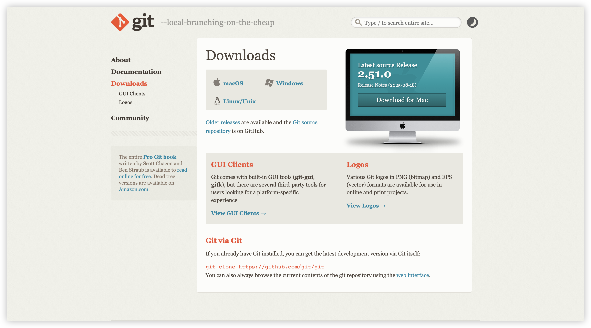

注意在 `Select Components` 时一定要选上 `Git Bash Here`（其实会自动勾选）。

#### 2. 创建 GitHub/Gitee 账户

- Github 账户的创建

  - 如果你能创建 GitHub 账户，那么大概率你能翻墙了，想必也不用多教了，如果你不能翻墙，那你创建GitHub 账户也没什么用。

  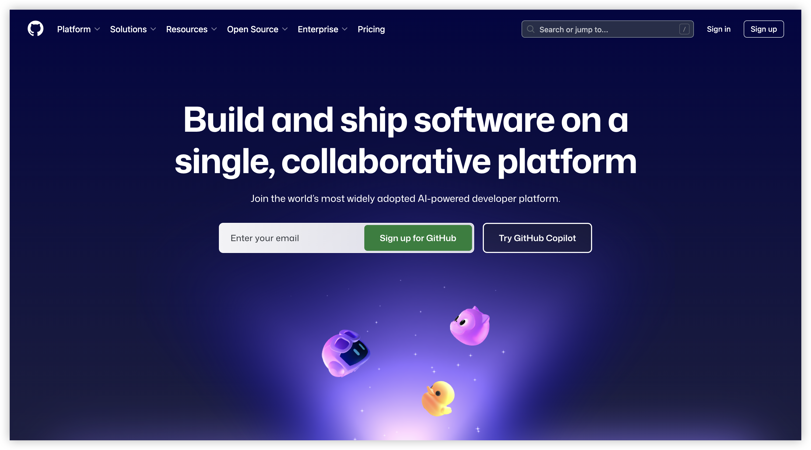

- Gitee 账户的创建

  - 官网自行注册即可

  

#### 3. Git 基础命令的使用

***接下来请紧跟步骤尝试自己创建并上传一个仓库，在此过程中熟悉Git的基础使用。***

- 配置信息，这些信息将出现在你的 Git 提交中
  - git config --global user.name "Your Name"
  - git config --global user.email "youremail@example.com"

- 创建仓库

  - 对于 Windows 系统，创建一个新的文件夹，右键选择`显示更多选项`-`Git Bash Here`

    对于 MacOS 或 Linux 系统，打开 `terminal` 即可

    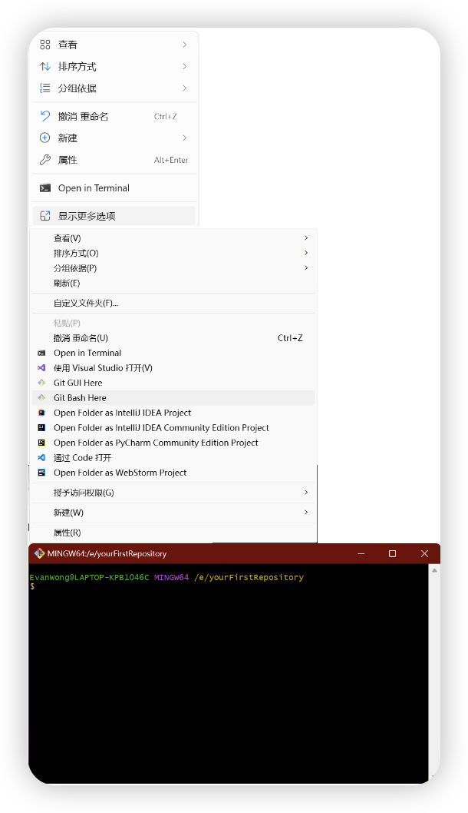

  - 直接输入`git`，你可以看到常用指令及用处

    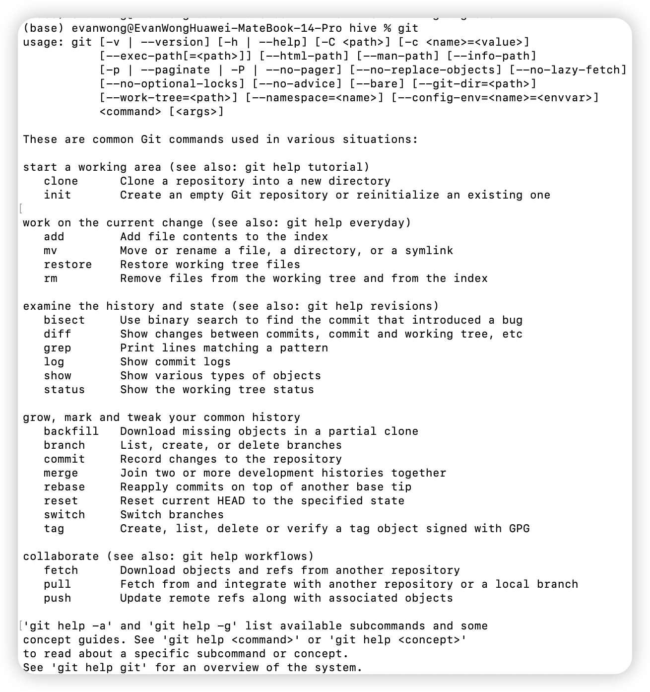

  - 输入 `git init` 以创建一个空的git repo。

  - 创建一个 `README.md`，随便向其写入内容，使用 `git add` 指令将其添加到暂存区（Staging Area）中。你可以使用 `git add filename` 将单个指定文件添加到 git repo 中，或者使用 `git add .` 将所有新修改文件添加到暂存区（Staging Area）中，或者使用 `git add directory/` 添加指定目录下的所有修改文件到暂存区（Staging Area）。

  - 使用 `git commit` 命令将在暂存区（Staging Area）中的文件快照保存到本地仓库中，每个 `git commit` 创建的提交对象都有一个唯一的哈希值，用于标识版本。这使得你可以随时回滚到先前的版本，比较不同版本之间的差异，以及追踪代码的演变。具体用法为 `git commit -m "commit message"`，提交信息用于描述本次提交的目的，这十分有用。
    - 你也可以使用 `-a` 选项来跳过 `git add` 步骤，将工作目录中的所有更改（包括已被跟踪的文件）添加到暂存区并提交，但要小心使用它，因为它不会包含新添加的未跟踪文件。具体用法为 `git commit -a -m "Commit message"`
    
  - 你可以使用 `git status` 显示当前工作目录和暂存区的状态，以便你了解哪些文件已被修改、添加到暂存区或尚未被跟踪。接下来修改 `README.md` 的内容，创建 `casually1.txt`，`casully2.txt` 两个文件，将 `casually1.txt` 添加到暂存区。此时使用 `git status`，你就可以查看到三种状态 `Changes to be committed`, `Changes not staged for commit`, `Untracked files`。
    - **未跟踪的文件 (Untracked files)**：这是工作目录中未被 Git 跟踪的文件。这些文件不在 Git 的版本控制之下。
    
    - **已修改的文件 (Changes not staged for commit)**：这是工作目录中已被修改但尚未添加到暂存区的文件。
    
    - **已暂存的文件 (Changes to be committed)**：这是已经添加到暂存区，等待被提交的文件。
    
      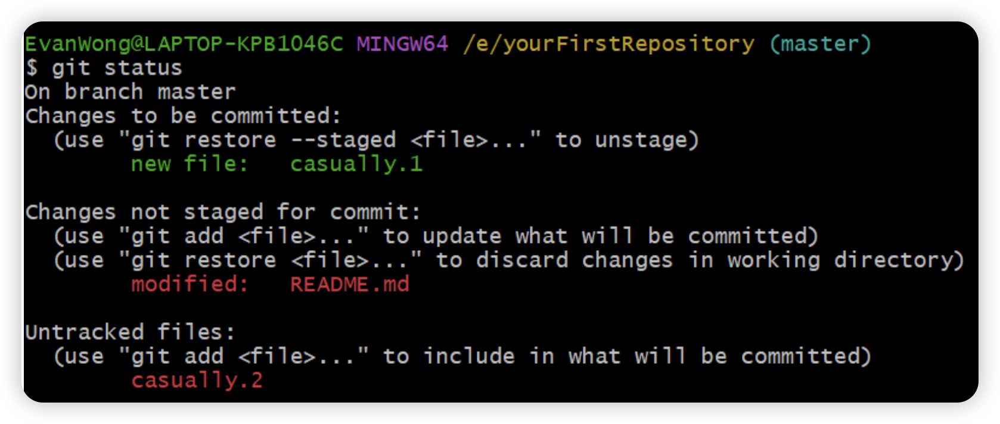
    
  - 使用 `git log` 指令打印仓库提交日志。

    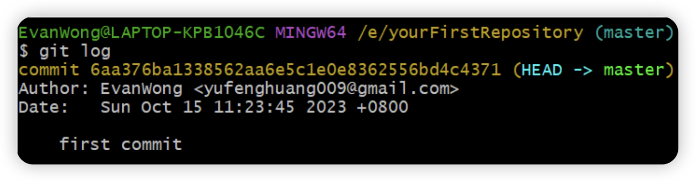

  - git 分支指令可能对你们目前来说暂时使用较少，本课程暂时不涉及。

  - 你可以在[此网站](https://learngitbranching.js.org/?locale=zh_CN)以游戏的方式学习并巩固你的 git 指令。

    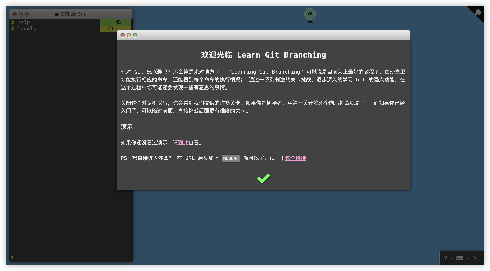

- **使用 SSH 完成 Git 与 GitHub/Gitee 的绑定**

  - 在 `Git Bash` 中输入 `ssh`，可以查看指令及参数。

    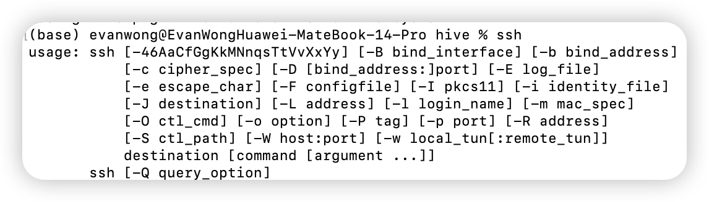

  - 输入 `ssh-keygen -t rsa` 指定 RSA 算法生成密钥，然后敲三次回车键。

  - 使用 `cat ~/.ssh/id_rsa.pub` 获取公钥。

  - 如果你是用的是 GitHub，在 `Settings -- SSH and GPG keys` 处选择 `New SSH key`，输入 `title` 和 `key` 即可，`title` 可随意。

    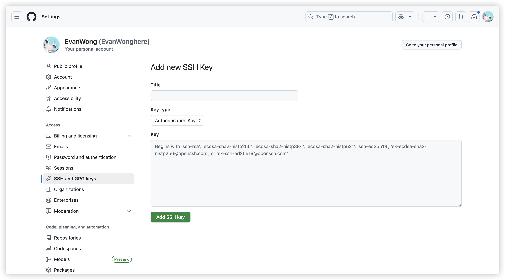

  - 如果你使用的是 Gitee，在`设置-安全设置-SSH公钥`处添加。

    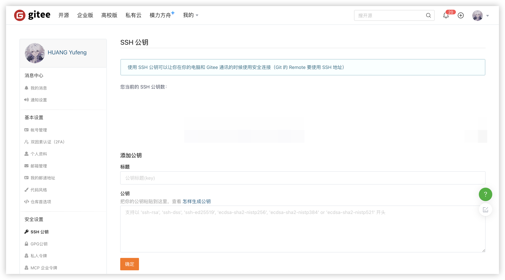

- **将本地仓库推送到 Github/Gitee**

  - 在 GitHub/Gitee 创建新仓库

    - GitHub 可在主页或者 Repositories 处找到 `new` 按钮

      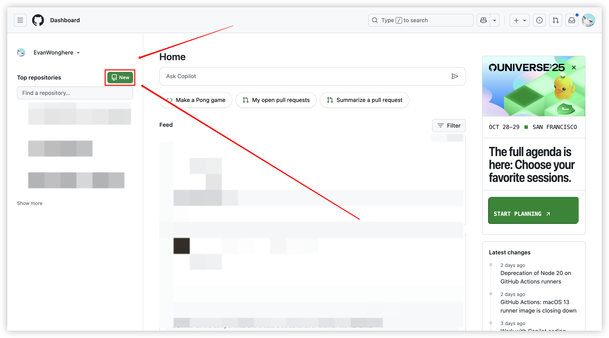

      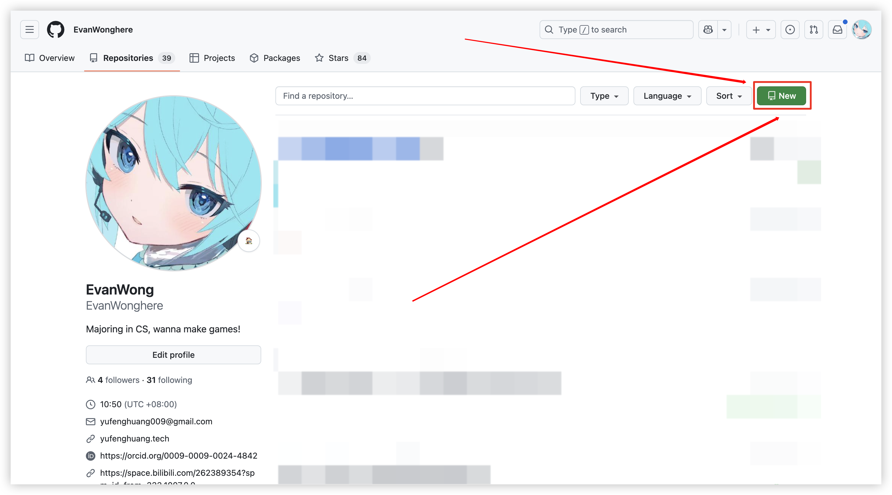

    - Gitee可在点击主页右上角加号找到`新建仓库`按钮

      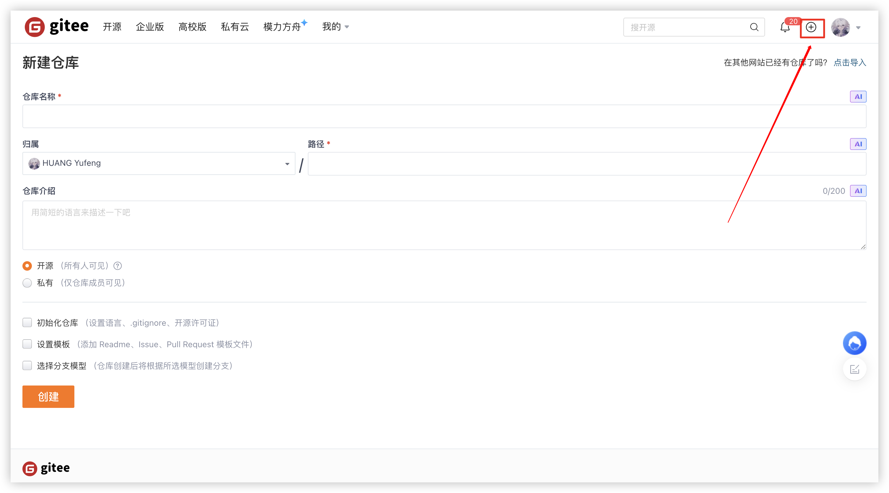

  - 推送本地仓库，执行 GitHub/Gitee 给出的官方指令即可

    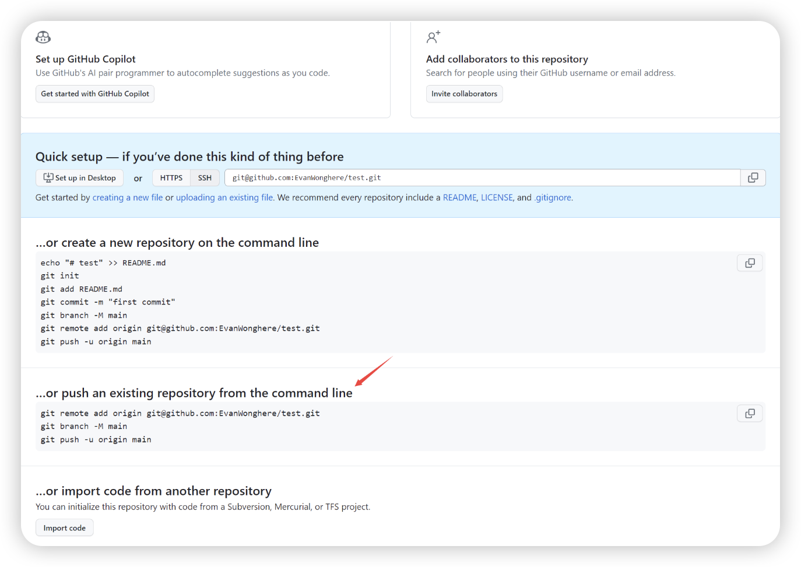

    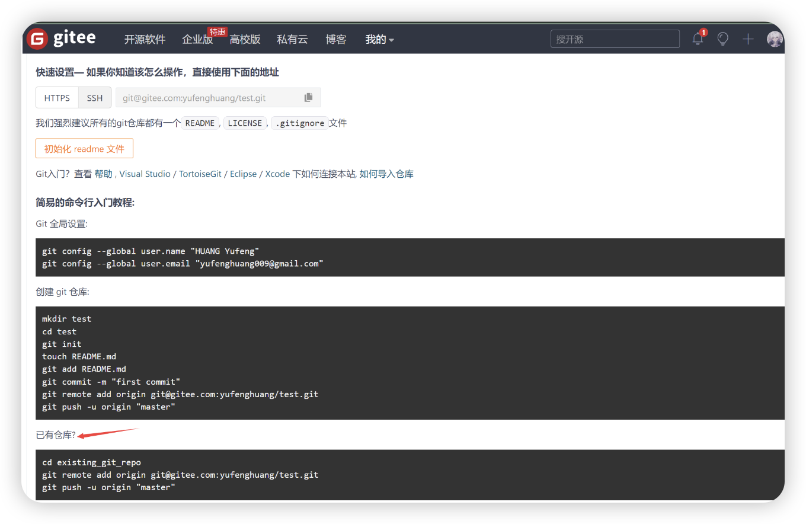

- **推送本地更新**

  - 当你更改了本地仓库之后，需要将本地仓库同步到 GitHub/Gitee 上。具体步骤为

  ```bash
  git add filename / git add .
  git commit -m "Updated nothing"
  git pull
  git push
  ```

  - **git pull**:

    `git pull` 用于从远程仓库拉取（获取）更新并将其合并到你的当前本地分支。它执行以下操作：

    - 检查当前所在分支。
    - 从远程仓库获取最新的提交。
    - 将这些提交合并到你的当前分支。

    基本语法如下：`git pull remote_repo "branch"`。如果不指定远程仓库和分支，`git pull` 将默认拉取与当前本地分支关联的远程分支的更新。

  - **git push**:

    `git push` 用于将本地的提交推送到远程仓库。它执行以下操作：

    - 将本地的提交上传到远程仓库。
    - 更新远程仓库中的分支，以包含你的提交。

    基本语法如下：`git push [远程仓库] [本地分支]:[远程分支]`

    - `[远程仓库]` 是远程 Git 仓库的名称（通常是别名，如 `origin`）。
    - `[本地分支]` 是你要推送的本地分支。
    - `[远程分支]` 是你要将本地分支的提交推送到的远程分支。

    例如，要将当前分支的更改推送到远程仓库的同名分支，你可以使用：`git push origin my-branch`

    这将把 `my-branch` 的更改推送到 `origin` 远程仓库的 `my-branch` 分支上。

    默认情况下，`git push` 命令将推送当前分支的更改到与之关联的远程分支。这意味着 Git 将尝试将你当前所在的分支的提交推送到远程仓库中同名的分支。

- **克隆仓库**

  ***尝试将本课程的仓库克隆到本地***

  - 创建一个新的目录，并且在该目录打开`Git Bash`。

  - 克隆GitHub仓库
    - GitHub仓库地址：[https://github.com/EvanWonghere/211LabLectures](https://github.com/EvanWonghere/211LabLectures)
    
    - 选择`Code - Local - Clone - SSH`然后复制。
      
      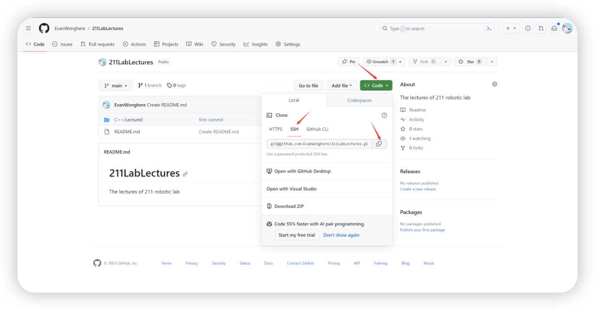
      
      - 在`Git Bash`输入`git clone git@github.com:EvanWonghere/211LabLectures.git`即可。
    
  - 克隆Gitee仓库
    - Gitee仓库地址：[https://gitee.com/yufenghuang/211LabLectures](https://gitee.com/yufenghuang/211LabLectures)
    
    - 选择`克隆/下载 - SSH - 复制。
    
      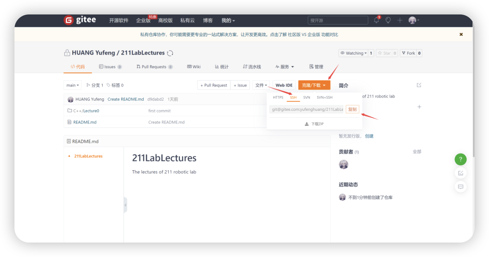
    
    - 在`Git Bash`输入`git clone git@gitee.com:yufenghuang/211LabLectures.git`即可。

