# C++基础课程

## 第零章——工欲善其事必先利其器

### 0.提前说明

- 本课程均以`Windows 11`系统作为示例，若为`Linux`或者`MacOS`可另外课外提问或自己查阅资料。

- 个人建议，少用百度，能则`Google`，不行的话`Bing`体验也不错。

### 第二节——C++开发环境配置

一般地，你可以使用***集成开发环境（Integrated Development Environment, AKA IDE）***或者***自行配置编译器 + 编辑器***来进行C++开发。

#### IDEs

- ***Visual Studio***

  - 在[官网](https://visualstudio.microsoft.com/zh-hans/downloads/)下载***Visual Studio 2022 Community Edition***

    

  - 只选择使用C++的桌面开发足够，之后也可在***Visual Studio Installer***中选择修改

    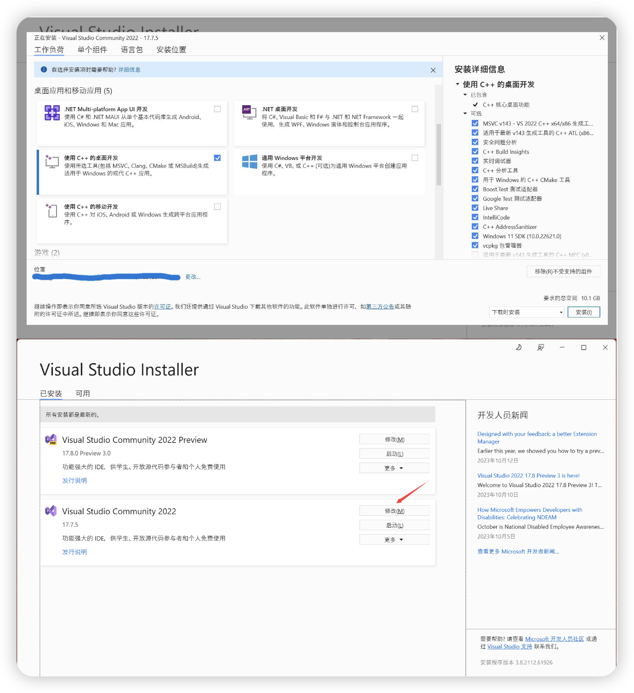

- ***CLion***

  - 请注意，在使用 ***CLion*** 之前你可能需要在 ***JetBrains*** 官网[申请](https://www.jetbrains.com/shop/eform/students) ***JetBrains Product Pack for Students***.

    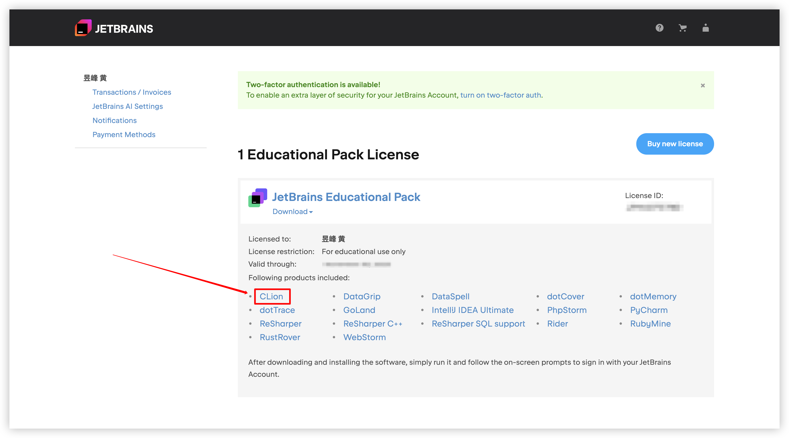

  - [官网](https://www.jetbrains.com/clion/)下载安装好后登陆你的 JetBrains 账户激活 License 即可。

    

- ***Code::Blocks***

  - [官网](https://www.codeblocks.org/downloads/binaries/)下载即可，如果你本地已有编译器则下载 `codeblocks-25.03-setup.exe` 即可，如果没有的话则下载 `codeblocks-25.03mingw-setup.exe`。

    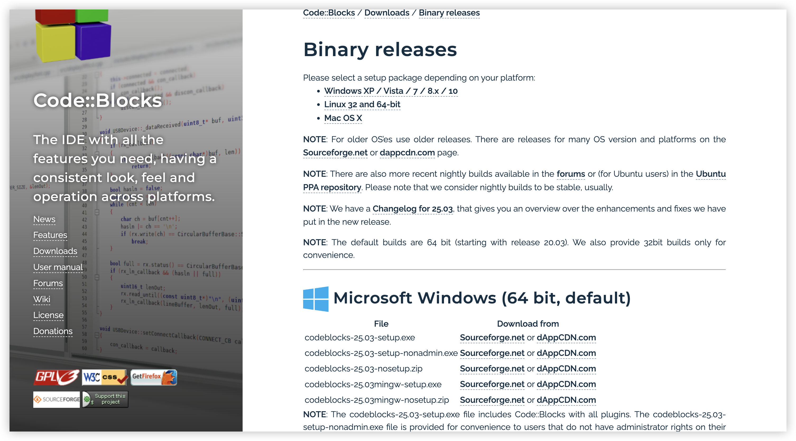

#### 编译器 + 编辑器

- 编译器

  只介绍 ***MinGW-w64（Minimalist GNU for Windows）***。

  - 在[官网](https://www.mingw-w64.org/source/)可以看到下载地址

    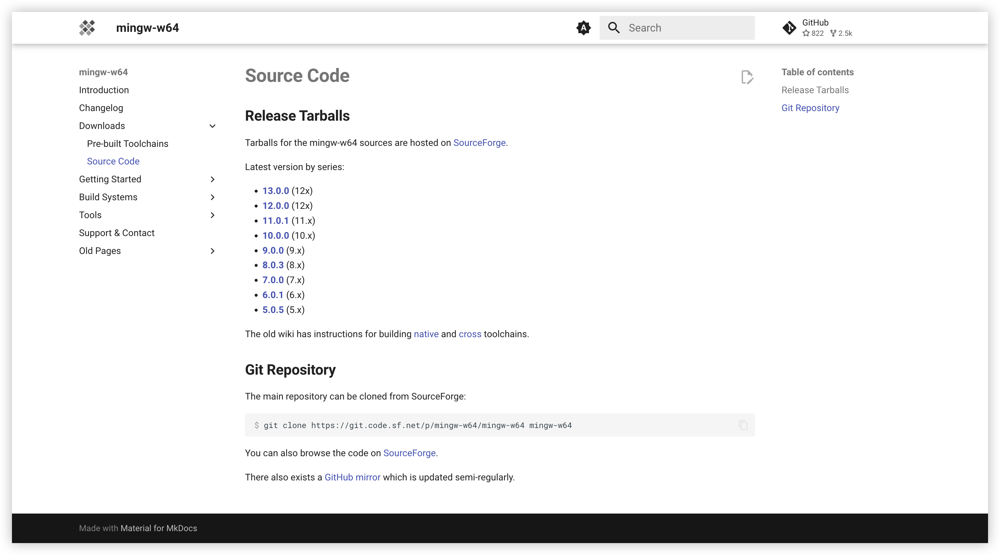

  - 下载好压缩包并解压后，windows 搜索“**编辑系统环境变量**”，打开。

    找到`系统变量 Path`，新建变量，变量的值为刚才解压的文件夹的`bin`目录的绝对路径。

    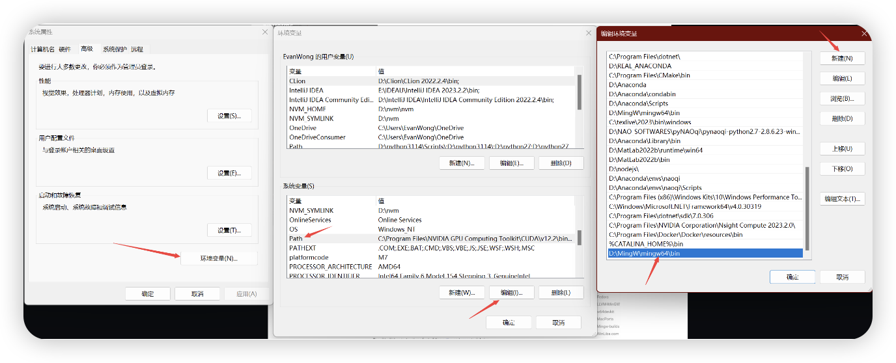

  - 终端输入`g++ -v`进行检测

    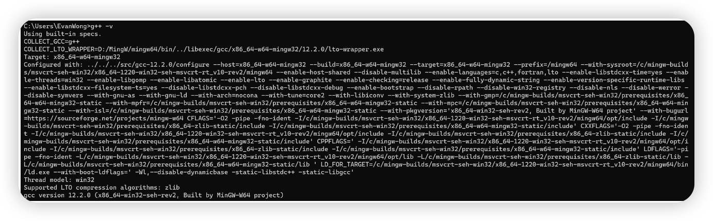

- 编辑器

  - ***Visual Studio Code***

    - VSCode 世界第一！

    - [官网](https://code.visualstudio.com/download)下载安装

      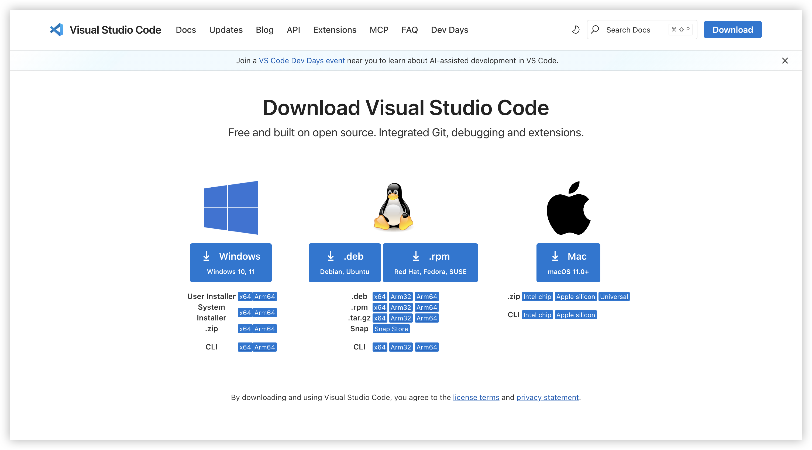

    - 拓展支持

      VSCode支持海量拓展！在此推荐几乎为必要的插件：

      1. ***Chinese (Simplified) (简体中文) Language Pack for Visual Studio Code***

         如果你想锻炼英语的话，不推荐安装

         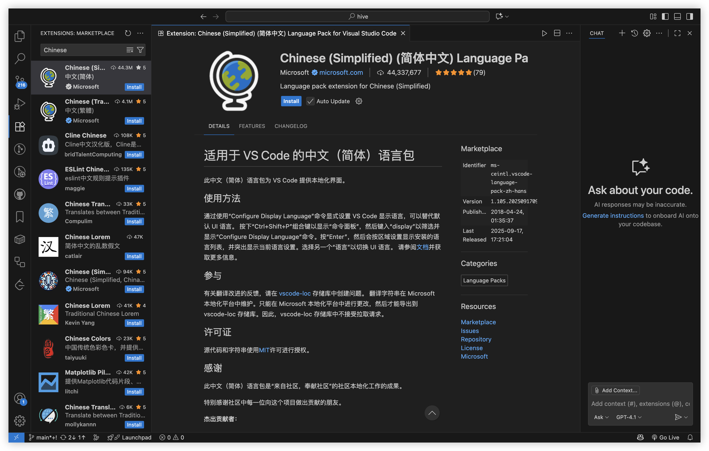

      2. ***C/C++***

         貌似内置了，不太清楚了

         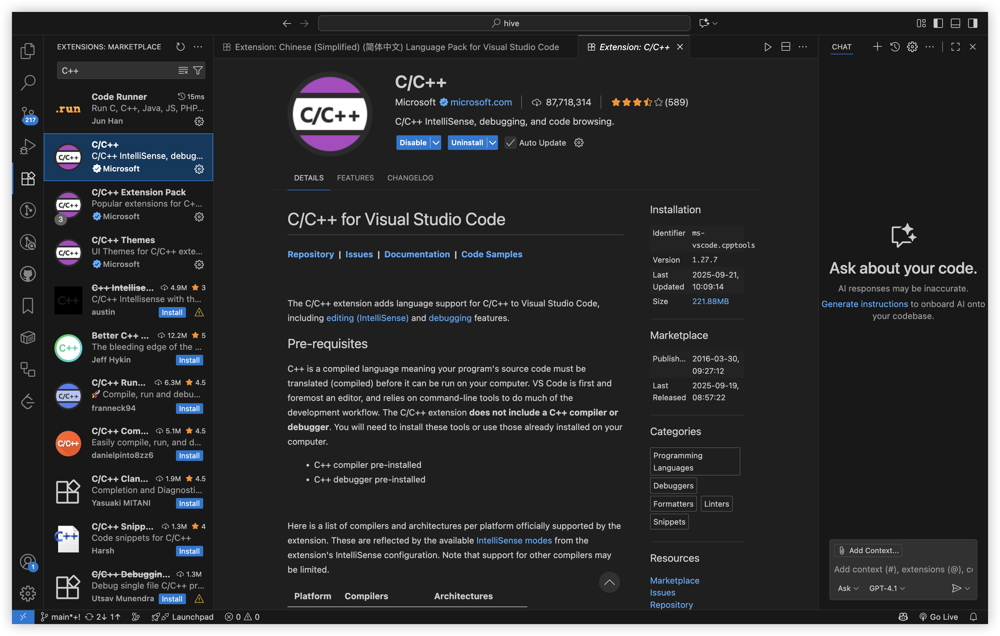

      3. ***Code Runner***

         Code Runner 的好处在于方便，不用编写配置的json文件

         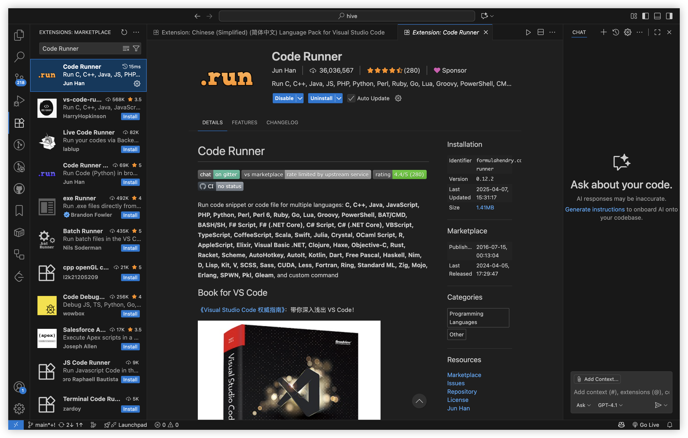

    - 配置编辑器
  
      创建一个新目录，在vscode中打开
  
      - 新建一个文件夹，并命名为`.vscode`。然后再在`.vscode`文件夹下新建三个文件，分别为：（或者当你新建一个工作空间时，会自动生成`.vscode`）
              1. `tasks.json`
              2. `launch.json`
                      3. `c_cpp_properties.json`
  
      - 编辑`task.json`
  
        ```json
        {
            "tasks": [
                {
                    "type": "cppbuild",
                    "label": "C/C++: g++.exe 生成活动文件",
                    "command": "Your_G++_Path",
                    "args": [
                        "-fdiagnostics-color=always",
                        "-g",
                        "${file}",
                        "-o",
                        "${fileDirname}\\${fileBasenameNoExtension}.exe"
                    ],
                    "options": {
                        "cwd": "${fileDirname}"
                    },
                    "problemMatcher": [
                        "$gcc"
                    ],
                    "group": {
                        "kind": "build",
                        "isDefault": true
                    },
                    "detail": "调试器生成的任务。"
                }
            ],
            "version": "2.0.0"
        }
        ```

        
  
      - 编辑`launch.json`
  
        ```json
        {
            "version": "0.2.0",
            "configurations": [
                {
                    "name": "g++.exe - Build and debug active file",
                    "type": "cppdbg",
                    "request": "launch",
                    "program": "${fileDirname}\\${fileBasenameNoExtension}.exe",
                    "args": [],
                    "stopAtEntry": false,
                    "cwd": "${fileDirname}",
                    "environment": [],
                    "externalConsole": false,
                    "MIMode": "gdb",
                    "miDebuggerPath": "Your_GDB_Path",
                    "setupCommands": [
                        {
                            "description": "Enable pretty-printing for gdb",
                            "text": "-enable-pretty-printing",
                            "ignoreFailures": true
                        }
                    ],
                    "preLaunchTask": "C/C++: g++.exe 生成活动文件"
                }
            ]
        }
        ```

        - **externalConsole** ：这个配置表明是否启动控制台， true 会出现额外的黑窗口， false 则会调用内置终端。由于黑窗口运行完之后会直接关闭，不利于查看运行结果，所以推荐设为 false ，这样就可以在终端中看到结果了。
  
        - **miDebuggerPath** ：调试器的路径。我们用 gdb 作为调试器，所以路径为mingw64/bin/gdb.exe

        - **preLaunchTask** ：前置运行任务，这里要和 tasks.json 里边的 label 属性一样。
          
          因为调试前需要先编译出可执行文件，所以这里需要调用编译可执行文件的配置，先去执行编译任务，再进行debug。

          也就是会先去调用前面的 tasks.json 里边定义的任务，生成一个 .exe 的文件。
          
          
  
      - 编辑`c_cpp_properties.json`
      
        ```json
        {
            "configurations": [
                {
                    "name": "Win32",
                    "includePath": [
                        "${workspaceFolder}/**"
                    ],
                    "defines": [
                        "_DEBUG",
                        "UNICODE",
                        "_UNICODE"
                    ],
                    "compilerPath": "Your_GCC_Path",
                    "intelliSenseMode": "windows-gcc-x64"
                    "cppStandard": "c++23",
                    "cStandard": "c23"
                }
            ],
            "version": 4
        }
        ```
        
      - **includePath** ：头文件的位置，这里的 `${workspaceFolder}/`**，“/”前为一个 vscode 变量，值为工作区路径（工作区就是你当前打开的文件夹），“/”后的“\*\*”的意思是递归向下寻找。如果你需要安装 C++ 第三方库，请看后面的 Q&A。头文件库默认包含了 C++ 标准库，无需指定。
        - **compilepath** ：编译器路径，C++ 扩展会从 path 环境变量中自动寻找 gcc 的路径，如果这个路径找不到，请手动设置。
        - **intelliSenseMode** ：选择当前的平台和编译器，我们是在 windows 平台上使用 gcc 作为编译器，所以填 windows-gcc-x64。
        - **cppStandard** & **cStandard** ：指定 C 和 C++标准。为了不影响代码编写（指某些奇怪的红色波浪线），同时享受新标准的便利，请至少设为 `c++17` 或以上和 `c11` 以上。我们所用的 gcc 12.2.0 已经部分支持 c++23 和 c++20 。
        
      > 以上的这些选项，也可以在设置->C/C++中寻找相同的选项进行配置，我觉得会更加友好。
  
  - ***Sublime Text***
  
    - [官网](https://www.sublimetext.com/download)下载安装
  
      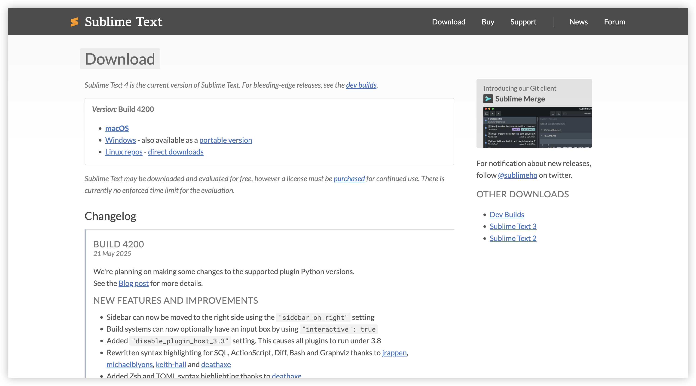
  
    - **创建 C++ 项目**:
  
      使用 Sublime Text 创建一个文件夹，将你的 C++ 项目文件添加到文件夹中。打开 Sublime Text，然后选择 "File" -> "Open Folder"，选择你的项目文件夹。
  
    - **配置编译系统**:
  
      在 Sublime Text 中，选择 "Tools" -> "Build System" -> "New Build System"，然后在新文件中输入适合你的 C++ 编译器的配置。以下是一个示例配置用于 MinGW：
  
      ```json
      {
          "shell_cmd": "g++ -std=c++11 -o \"$file_base_name\" \"$file\"",
          "working_dir": "$file_path",
          "selector": "source.c++"
      }
      ```
  
      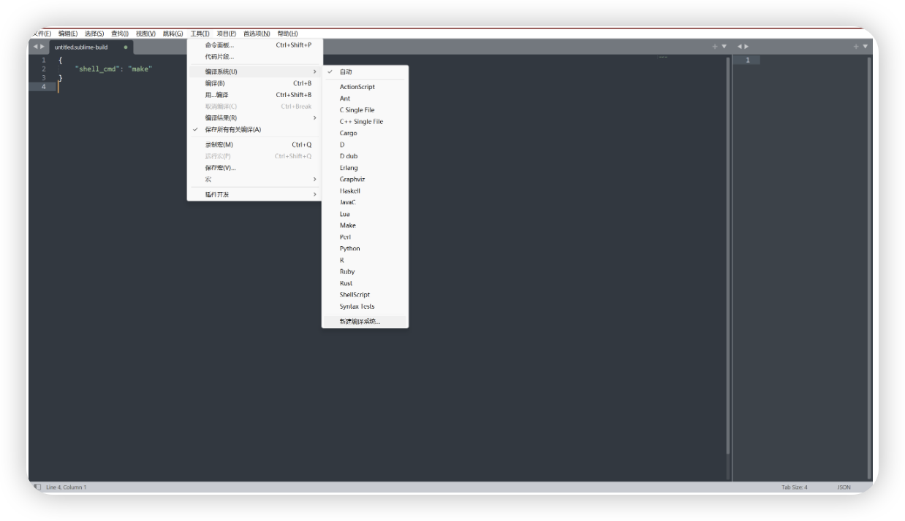
  
    - **构建和运行代码**:
  
      编辑你的 C++ 代码文件，然后按 `Ctrl` + `B` 来编译和运行代码。Sublime Text 将使用你配置的编译系统执行编译操作，并在输出面板中显示编译结果。