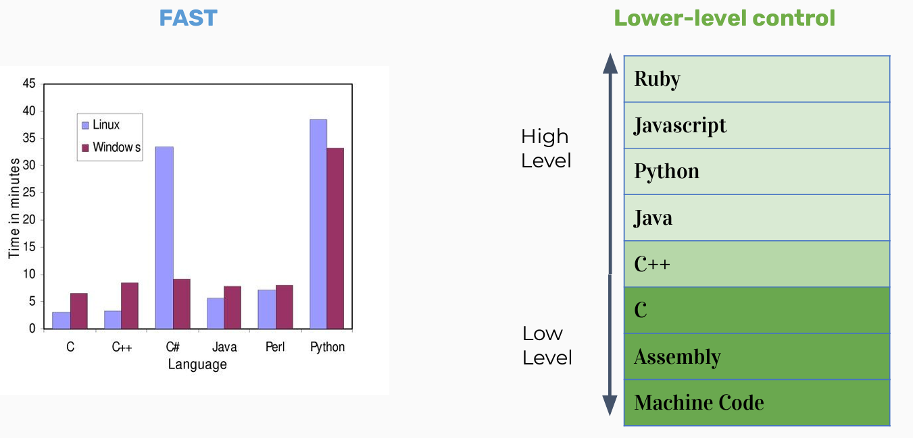
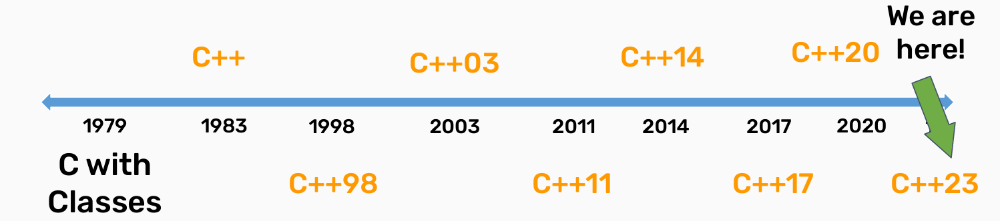

# C++ Basic Course

## Chapter 1——Hello, C++!

### WHY C++?

1. ***Popular***

   As a qualified programmer, you should know how to chase trends!

   

   [**TIOBE Index for September 2025**](https://www.tiobe.com/tiobe-index/)

2. ***Fast && Lower level control***

   C++ is fast, including but not limited to

   - its static type system, which reduces runtime overhead
   - and its ability to allow direct memory access and management, thereby reducing additional runtime costs.

   

### What is C++?

- This is some C++ code

  ```c++
  #include <iostream>
  
  int main() {
  	std::cout << "Hello, world!" << std::endl;
  	return 0;
  }
  ```

- This is also some C++ code! (code style before C99)

  ```c++
  #include "stdio.h"
  #include "stdlib.h"
  
  int main(int argc, char *argv) {
  	printf("%s" "Hello, world!\n");
  	return EXIT_SUCCESS;
  }
  ```

- Also technically C++ code!

  ```c++
  #include "stdio.h"
  #include "stdlib.h"
  
  int main(int argc, char *argv) {
      asm( 	"sub	$0x20,%rsp\n\t"
         		"movabs	$0x77202c6f6c6c6548,%rax\n\t"
         		"mov	%rax,(%rsp)\n\t"
         		"movl	$0x646c726f, 0x8(%rsp)\n\t"
         		"movw	$0x21, 0xc(%rsp)\n\t"
         		"movb	$0x0,0xd(%rsp)\n\t"
         		"leaq	(%rsp),%rax\n\t"
  			"mov	%rax,%rdi\n\t"
          	"call	__Z6mtputsPc\n\t"
          	"add	$0x20, %rsp\n\t"
          );
      return EXIT_SUCCESS;
  }
  ```

- Code is getting longer and older

- All that means C++ is backwards compatible with lower level languages! And neat!

### C++ History: Assembly

Observe the following assembly code, make a guess about its purpose, and note any distinctive features of the code.

```bash
section		.text
global		_start					;must be declared for linker (ld)

_start:								;tell linker entry point

	mov 	edx,len					;message length
	mov		ecx,msg					;message to write
	mov		ebx,1					;file descriptor (stdout)
	mov		eax,4					;system call number (sys_write)
	int		0x80					;call kernel
	mov		eax,1					;system call number (sys_exit)
	int 	0x80					;call kernel
	
section		.data
msg		db	'Hello, world!',0xa		;our dear string
len		equ	$ - msg					;length of our dear string
```

**Benefits:**

- Unbelievable ***simple*** instructions
- Extremely ***fast*** (when well-written)
- Complete ***control*** over your program

***Why don’t we always use assembly?***

**Drawbacks:**

- ***A LOT of code*** to do simple tasks
- Very ***hard to understand***
- Extremely ***unportable*** (hard to make work across all systems)


### C++ History: invention of C

**Problem:** computers can only understand assembly!

**Idea:**

- Source code can be written in a more intuitive language for humans.
- An additional program can convert it into assembly!
  - This additional program is called a compiler!


Based on the above concepts, Ken Thompson and Dennis Ritchie created C in 1972, to much praise.


C made it easy to write code that was:

- Fast
- Simple
- Cross-platform

C was popular because it was simple, this was also its weakness：

- No ***Objects*** or ***classes***
- Difficult to write ***generic code***
- ***Tedious*** when writing large programs


### C++ History: Welcome to C++

In 1983, the beginnings of C++ were created by Bjarne Stroustrup.


He wanted a language that was:

- Fast
- Simple to use
- Cross-platform
- ***Had high-level features***


### C++ History: Evolution of C++



### Design Philosophy of C++

- ***Only add features if they solve an actual problem***
  - This principle emphasizes that new language features should be added to address real-world programming problems rather than introducing complexity for its own sake. It helps maintain the simplicity and maintainability of the language.
- ***Programmers should be free to choose their own style***
  - C++ provides multiple programming paradigms (such as procedural, object-oriented, and generic programming) and doesn't impose a specific coding style. This allows programmers to write code according to their own needs and preferences.
  - Not code style
- ***Compartmentalization is key***
  - This means that programs should be broken down into small, independent modules, each responsible for specific tasks. Modular code is easier to maintain, test, and reuse.
- ***Allow the programmer full control if they want it***
  - C++ offers low-level memory access and operations to satisfy the needs of programmers who require a higher degree of control. This is valuable for system programming and performance optimization.
- ***Don't sacrifice performance except as a last resort***
  - C++ places a high priority on performance and encourages programmers to write efficient code. Performance should only be sacrificed when there are no other alternatives.
- ***Enforce safety at compile time whenever possible***
  - C++ strives to catch and prevent common programming errors, such as type errors and null pointer references, at compile time. This reduces runtime errors, enhancing code quality and reliability.


## But... Back to that question: what is C++?

***See you tomorrow!***
