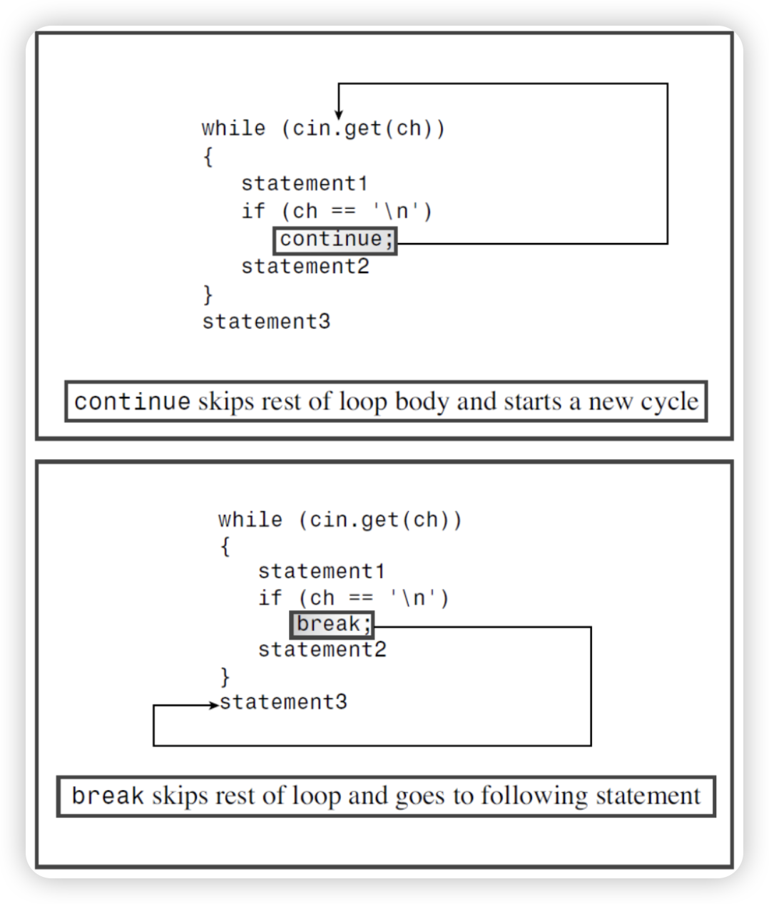
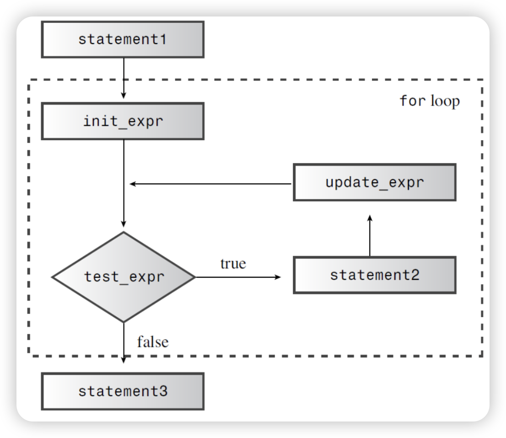
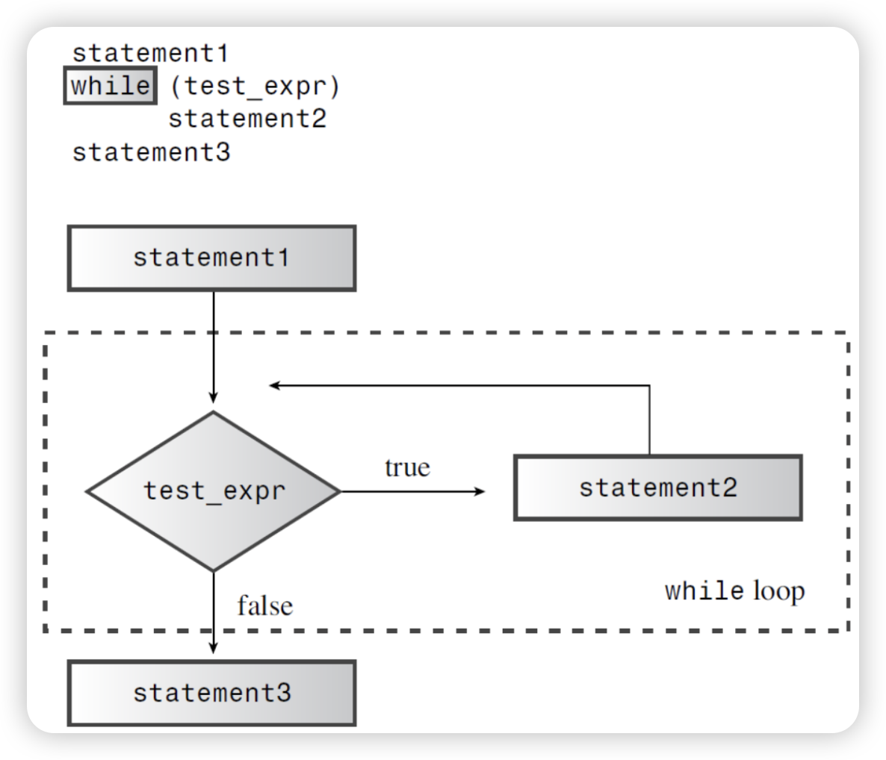
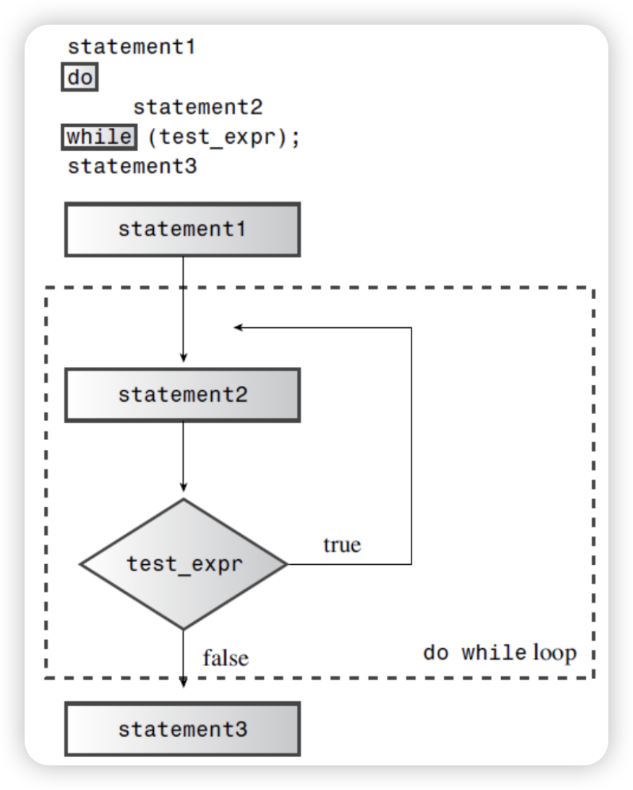

# C++ Basic Course

## Chapter 1 —— Hello, C++!

### What is C++?

***C++ = C + Object-Oriented Programming + Generic Programming***

#### C Programming Philosophy

​	Let's talk about C  programming philosophy first. Like most mainstream language when C was created, C is a ***procedural*** language. That means it emphasizes the algorithm side of programming. Conceptually, procedural programming consists of figuring out the actions a computer should  take and then using the programming language to implement those actions. In short, ***Data + algorithms = program***. BTW, procedural programming, AKA ***Procedural-Oriented Programming***.

​	Earlier procedural languages, such as FORTRAN and BASIC, ran into organizational problems as problems as programs grew larger. Many older programs had such tangled routing (called "**spaghetti programming**") that is virtually impossible to understand a program by reading it, and modifying such a program was an invitation to disaster. In response, computer scientists developed a more disciplined style of programming called ***structured programming***. C includes features to facilitate this approach. The primary idea behind structured programming is to avoid the use of undesirable control flow structures such as infinite loops, unrestricted goto statements, and deeply nested conditional statements, and instead focus on using clear, organized control structures.

​	Structured programming has the following characteristics:

1. Sequential Structure: Programs execute statements sequentially, from top to bottom, one after the other.

2. Selection Structure: Conditional statements are used to choose different code blocks for execution based on specific conditions.

   - **operators**

     - *relational operator*

       - ***<, >***
       - ***<=, >=***
       - ***==, !=***
       
     - *logical operator*
     
       - ***&&***
     
         ​	The logical **AND** operator, written `&&`, also combines two expressions into one. The  resulting expression has the value true only if both of the original expressions are true.
     		
         ​	Because the && (and `||`) has a lower precedence than the relational operators, you don’t need to use parentheses in these expressions.
     		
         ​	C++ specifies that the `&&` (and `||`) operator serves as a sequence point. In other words, any value changes on the left side occur before the right side is evaluated. (Or, in the updated terminology of C++11, the subexpression on the left side of the operator is sequenced before the subexpression on the right side.) This means that you can assert the higher priority of the left side over the right side.
     
       - ***||***
     
         ​	In English, the word or can indicate when one or both of two conditions satisfy a requirement. The C++ equivalent is the logical **OR** operator, written `||`.
     		
         ​	This operator combines two expressions into one. If either or both of the original expressions is true, or nonzero, the resulting expression has the value true. Otherwise, the expression has the value false.
     
       - ***!***
     
         ​	The `!` operator negates, or reverses the truth value of, the expression that follows it. That is, if expression is true, then !expression is false—and vice versa. More precisely, if expression is true, or nonzero, then !expression is false. Incidentally, many people call the exclamation point bang, making !x “bang-ex” and !!x “bang-bang-ex.”
     
       - ***logical operator facts***
     
         ​	As mentioned earlier, the C++ logical **OR** and logical **AND** operators have a lower precedence than relational operators. The `!` operator, on the other hand, has a higher precedence than any of the relational or arithmetic operators. Therefore, to negate an expression, you should enclose the expression in parentheses.
     		
         ​	The logical AND operator has a higher precedence than the logical OR operator.Thus this expression:
     
         ```cpp
         age > 30 && age < 45 || weight < 300
         ```
     
         means the following:
     
         ```cpp
         (age > 30 && age < 45) || weight < 300
         ```
     
         ​	Although the C++ operator precedence rules often make it possible to write compound comparisons without using parentheses, the simplest course of action is to use parentheses to group the tests, whether or not the parentheses are needed. It makes the code easier to read, it doesn’t force someone else to look up some of the less commonly. used precedence rules, and it reduces the chance of making errors because you don’t quite remember the exact rule that applies.
     		
         ​	C++ guarantees that when a program evaluates a logical expression, it evaluates it from left to right and stops evaluation as soon as it knows what the answer is.
         
       - ***alternative representations***
       
         ​	Not all keyboards provide all the symbols used for the logical operators, so the C++ Standard provides alternative representations, as shown in Table. The identifiers and, or, and not are C++ reserved words, meaning that you can’t use them as names for variables and so on. They are not considered keywords because they are alternative representations of existing language features. Incidentally, these are not reserved words in C, but a C program can use them as operators, provided that the program includes the iso646.h header file. C++ does not require using a header file.
       
         | operator | alternative representation |
         | :------: | :------------------------: |
         |    &&    |            and             |
         |   \|\|   |             or             |
         |    !     |            not             |
       
     - *bitwise operations operator*
     
       ​	It should be noted that bitwise operators have lower precedence than ordinary arithmetic operators.
       
       ​	Bitwise operations are calculations performed based on the binary representation of integers. Since computers store data internally in binary, bitwise operations are quite fast.
       
       ​	There are six basic bitwise operations: bitwise AND, bitwise OR, bitwise XOR, bitwise NOT, left shift, and right shift.
       
       - ***&, |, ^***
       
       | Operation | Operator | Mathematical Symbol | Explanation                                      |
       | --------- | -------- | ------------------- | ------------------------------------------------ |
       | AND       | &        | &, and              | 1 only when both corresponding bits are 1        |
       | OR        | \|       | \|, or              | 1 if at least one of the corresponding bits is 1 |
       | XOR       | ^        | $\oplus$, xor       | 1 only when corresponding bits are different     |
       
       ​	Certainly, it's important to distinguish between logical AND ( represented by && ) and bitwise AND, as well as between logical OR ( || ) and bitwise OR.
       
       ​	XOR, short for Exclusive OR, is a logical operation used to compare the dissimilarity of two values. In XOR, if the two operands (typically Boolean values) are different, the result is true; if the operands are the same, the result is false. The XOR operation is usually represented by the "^" symbol.
       
       ​	Here is the truth table for the XOR operation:
       
       | Input A | Input B | Output (A XOR B) |
       | ------- | ------- | ---------------- |
       | 0       | 0       | 0                |
       | 0       | 1       | 1                |
       | 1       | 0       | 1                |
       | 1       | 1       | 0                |
       
       - ***~***
       
         ​	Bitwise NOT is a **unary** operation performed on a number (num) in binary representation. It does not have a commonly used mathematical symbol and is represented by the operator ~. Its purpose is to invert all the bits (0 becomes 1, and 1 becomes 0) in the two's complement binary representation of num. In the bitwise NOT operation, the sign bit of a signed integer will also be inverted.
         
         ​	Two's complement: In binary representation, the two's complement of a positive number or zero is the number itself, while the two's complement of a negative number is obtained by bitwise inverting the corresponding positive number and then adding one. 
         
         ​	Example (for signed integers):
         $$
         \begin{aligned}
              5 &= (00000101)_2 \\
         \sim 5 &= (11111010)_2 = -6 \\
         \text{The two's complement of} -5 &= (11111011)_2 \\
         \sim (-5) &= (00000100)_2 = 4
         \end{aligned}
         $$
         
       - ***<<, >>***
       
         ​	The `num << i` operation represents shifting the binary representation of `num` to the left by `i` positions.
         
         ​	The `num >> i` operation represents shifting the binary representation of `num` to the right by `i` positions.
         
         ​	For example:
         $$
         \begin{aligned}
         11 &= (00001011)_2 \\
         11 << 3 &= (01011000)_2 = 88 \\
         11 >> 2 &= (00000010)_2 = 2
         \end{aligned}
         $$
         ​	In shift operations, certain conditions lead to undefined behavior:
       
         1. When the right operand (i.e., the number of positions to shift) is negative.
         2. When the right operand is greater than or equal to the number of bits in the left operand.
       
         	For example, for a variable `a` of type `int`, `a << -1` and `a << 32` both result in undefined behavior.
       
         	In left shift operations, it is crucial to ensure that the shifted result can be accommodated within the original variable's type; otherwise, the behavior is undefined. Left-shifting a negative number is also undefined.
       
         	In right shift operations, the excess bits on the right are discarded. However, the behavior on the left side is more complex:
       
         - For unsigned numbers, zeros are filled in on the left.
         - For signed numbers, the most significant bit (the sign bit) is used to fill in on the left. In practice, this means filling with zeros for non-negative numbers and ones for negative numbers.
     
   - **statements**

     - ***if / if -- else / if -- else if -- else***
     
       ```cpp
       // emphasizes the block structure for the statements
       if (test_expr1)
       {
           statement1;
       }
       else if (testexpr2)
       {
           statement2;
       }
       else
       {
           testexpr3;
       }
       
       // more closely ties the blocks to the keywords if and else.
       if (test_expr1) {
           statement1;
       } else if (testexpr2) {
           statement2;
       } else {
           testexpr3;
       }
       ```
     
       ​	Keep in mind that the two alternatives in an if else statement must be single statements. If you need more than one statement, you must use braces to collect them into a single block statement. Unlike some languages, such as BASIC and FORTRAN, C++ does not automatically consider everything between if and else a block, so you have to use braces to make the statements a block. The following code, for example, produces a compiler error:
     
       ```cpp
       ...
       if (ch == 'Z')
           ++ zorro;
       	std::cout << "Another zorro candidate" << std::endl;
       else
           ++ dull;
       	std::cout << "Not a zorro candidate" << std::endl;
       ...
           
       In function 'int main()':
       error: 'else' without a previous 'if'
          19 |     else
             |     ^~~~
       ```
     
     - ***: ?***
     
       ​	C++ has an operator that can often be used instead of the if else statement. This operator is called the conditional operator, written `? :`, and, for you trivia buffs, it is the only C++
       operator that requires three operands. The general form looks like this:
       
       ```cpp
       expression1 ? expression2 : expression3
       ```
       
       ​	Which means the same thing as
       
       ```cpp
       Type judge(Type expr1, Type expr2, Type expr3)
       {
           if (expr1)
           {
               return expr2;
           }
           else
           {
               return expr3;
           }
       }
       ```
       
       ​	Hence you could write a simple and precise `max()` or something:
       
       ```cpp
       int c = a > b ? a : b
       auto result = (score >= passingScore) ? "Pass" : "Fail";
       ```
       
     - ***switch -- case***
     
       ​	Suppose you create a screen menu that asks the user to select one of five choices—for example, Cheap, Moderate, Expensive, Extravagant, and Excessive. You can extend an if else if else sequence to handle five alternatives, but the C++ switch statement more easily handles selecting a choice from an extended list. Here’s the general form for a switch statement:
     
       ```cpp
       switch (integer-expression)
       {
       	case label1: statement(s)
       	case label2: statement(s)
       	...
       	case labeln: statement(s)
       	default	   : statement(s)
       }
       ```
     
       ​	A C++ switch statement acts as a routing device that tells the computer which line of code to execute next. On reaching a switch statement, a program jumps to the line labeled with the value corresponding to the value of integer-expression. The value integer-expression, as the name suggests, must be an expression that reduces to an integer value. Also each label must be an integer constant expression (like int or char).
     	
       ​	If integer-expression doesn’t match any of the labels, the program jumps to the line labeled default. The default label is optional. If you omit it and there is no match, the program jumps to the next statement following the switch.
     	
       ​	Each C++ case label functions only as a line label, not as a boundary between choices. That is, after a program jumps to a particular line in a switch, it then sequentially executes all the statements following that line in the switch unless you explicitly direct it otherwise. Execution does not automatically stop at the next case. To make execution stop at the end of a particular group of statements, you must use the break statement. This causes execution to jump to the statement following the switch.
     
     - ***continue / break***
     
       ​	The break and continue statements enable a program to skip over parts of the code. You can use the break statement in a switch statement and in any of the loops. It causes program execution to pass to the next statement following the switch or the loop. The continue statement is used in loops and causes a program to skip the rest of the body of the loop and then start a new loop cycle.
     
       
     
     - ***goto***
     
       ​	C++, like C, also has a `goto` statement. A statement like this means to jump to the location bearing the paris: label:
     
       ```cpp
       goto paris;
       ```
     
       ​	That is, you can have code like this:
     
       ```cpp
       char ch;
       std::cin >> ch;
       if (ch == 'p')
       	goto paris;
       std::cout << ...
       ...
       pairs: std::cout << "You've just arrived Paris!" << std::endl;
       ```
     
       ​	In most circumstances (some would say in all circumstances), using goto is a bad hack, and you should use structured controls, such as if else, switch, continue, and the like, to control program flow.
     
       

3. **Iteration Structure**

   ​	Loop statements (e.g., for loops, while loops) are used to repeat a section of code until a specific condition is met.

   - ***for***

     ​	A for loop provides a step-by-step recipe for performing repeated actions. Let’s take a detailed look at how it’s set up. The usual parts of a for loop handle these steps:

     1. Setting a value initially 
     2. Performing a test to see whether the loop should continue
     3. Executing the loop actions
     4. Updating value(s) used for the test

     	​	The C++ loop design positions these elements so that you can spot them at a glance. The initialization, test, and update actions constitute a three-part control section enclosed in parentheses. Each part is an expression, and semicolons separate the expressions from each other. The statement following the control section is called the body of the loop, and it is executed as long as the test expression remains true:

     ```cpp
     for (initialization; test_expression; update_expression)
         body
     ```
     
     ​	C++ syntax counts a complete for statement as a single statement, even though it can incorporate one or more statements in the body portion. (Having more than one statement requires using a compound statement, or block.) The loop performs initialization just once. Typically, programs use this expression to set a variable to a starting value and then use the variable to count loop cycles. Test-expression determines whether the loop body gets executed. Typically, this expression is a relational expression—that is, one that compares two values.
     ​     	
     ​	The for loop is an ***entry-condition loop***. This means the test expression is evaluated before each loop cycle. The loop never executes the loop body when the test expression is false.
     ​     	
     ​	Update-expression is evaluated at the end of the loop, after the body has been executed. Typically, it’s used to increase or decrease the value of the variable keeping track of the number of loop cycles. However, it can be any valid C++ expression, as can the other control expressions. This makes the for loop capable of much more than simply counting.
     
      
     
      > **Tips:**
      >
      > ​	A for statement looks something like a function call because it uses a name followed by paired parentheses. However, for’s status as a C++ keyword prevents the compiler from thinking for is a function. It also prevents you from naming a function for.
      >
      > ​	Common C++ style is to place a space between for and the following parenthesis and to omit space between a function name and the following parenthesis:
      >
      > ```cpp
      > for (int i = 6; i < 10; ++i)
      > 	smart_function(i);
      > ```
      >
      > ​	Other control statements, such as if and while, are treated similarly to for. This serves to visually reinforce the distinction between a control statement and a function call.

      - ***while***
      
        	Th​	The while loop is a for loop stripped of the initialization and update parts; it has just a test condition and a body:
      
        ```cpp
        while (test_condition)
        	body
        ```
      
        ​	First, a program evaluates the parenthesized test-condition expression. If the expression evaluates to true, the program executes the statement(s) in the body. 
      
        ​	As with a for loop, the body consists of a single statement or a block defined by paired braces. After it finishes with the body, the program returns to the test condition and re-evaluates it. If the condition is nonzero, the program executes the body again. 
      
        ​	This cycle of testing and execution continues until the test condition evaluates to false Clearly, if you want the loop to terminate eventually, something within the loop body must do something to affect the test-condition expression
        
        
        
        > *for* **Versus** *while*:
        >
        > In C++ the `for` and `while` loops are essentially equivalent. For example, the `for` loop
        >
        > ```cpp
        > for (init_expression; test_expression; update_expression)
        > {
        >  statement(s)
        > }
        > ```
        >
        > could be rewritten this way:
        >
        > ```cpp
        > init_expression;
        > while (test_expression)
        > {
        > 	statement(s)
        > 	update_expression;
        > }
        > ```
        >
        > 	Similarly, the  `while` loop
        >
        > ```cpp
        > while (test_expression)
        > 	body
        > ```
        >
        > could be rewritten this way:
        >
        > ```cpp
        > for ( ;test_expression;)
        > 	body
        > ```
        >
        > This `for` loop requires three expressions (or, more technically, one statement followed by two expressions), but they can be empty expressions (or statements). Only the two semicolons are mandatory. Incidentally, a missing test expression in a for loop is construed as true, so this loop runs forever:
        >
        > ```cpp
        > for ( ; ;)
        > 	body
        > ```
        >
        > Because for loops and while loops are nearly equivalent, the one you use is largely a matter of style.
        > 			
        > Keep in mind the following guidelines when you design a loop:
      >
      > - Identify the condition that terminates loop execution.
      > - Initialize that condition before the first test.
      > - Update the condition in each loop cycle before the condition is tested again.

      - ***do while***
      
        	Yo​	You’ve now seen the for loop and the while loop. The third C++ loop is the do while. It’s different from the other two because it’s an `exit-condition`loop. 
      
        ​	That means this devil-may-care loop first executes the body of the loop and only then evaluates the test expression to see whether it should continue looping.If the condition evaluates to false, the loop terminates; otherwise,a new cycle of execution and testing begins. 
        
        ​	Such a loop always executes at least once because its program flow must pass through the body of the loop before reaching the test. Here’s the syntax for the do while loop:
        
        ```cpp
      do
            body
      while (test_expression)
      ```
      
      

      - ***range-based for***
      
        	Th​	The C++11 adds a new form of loop called the range-based for loop. It simplifies one common loop task—that of doing something with each element of an array, or, more generally, of one of the container classes, such as vector or array, we'll learn container later in lecture. Here is an example:
      
        ```cpp
        double prices[5] = {4.99, 10.99, 6.87, 7.99, 8.49};
        std::vector<int> vi(10);
        std::iota(vi.begin(), vi,end(), 1);
        
        for (double p : prices)
            std::cout << p << std::endl;
        for (const int& i : vi)
            std::cout << i << endl;
   	```
   	
   	​	What else need to be mentioned is the ***Top-down design***. 
   	
   	​	With C, the idea is to break a large program into smaller, more manageable tasks. If one of these tasks is still too broad, you divide it into yet smaller tasks. You continue this process until the program is compartmentalized into small, easily programmed modules. C's design facilitates this approach, encouraging you to develop program units called ***functions*** to represent individual task modules. 
   	
   	​	As you may have noticed, **the structured programming techniques reflect a procedural mind-set, thinking of a program in terms of the actions it perform.**


#### The C++ Shift: Object-Oriented Programming

​	Although the principle of structured programming improved the clarity, reliability, and ease of maintenance of programs, large-scale programming still remains a challenge. ***Object-Oriented Programming*** brings a new approach to that challenge. Unlike procedural programming, which emphasizes algorithms, OOP emphasizes the data. Rather than try to fit a problem to the procedural approach of language, OOP attempts to fit the language to the problem. The idea is to design data forms that correspond to the essential features of a problem. That data forms are called "***Classes***".

​	The OOP approach to program design is to first design classes that accurately represent those thing with which the program deals. Then you would proceed to design a program, suing  objects of those classes. The process of going from a lower level of organization, such as classes, to a high level, such as program design, is called ***bottom-up programming***. However, top-down programming and bottom-up programming are **not contradictory**.

#### C++ and Generic Programming

​	Generic programming is yet another programming paradigm supported by C++. It shares with OOP the aim of making it simpler to reuse code and the technique of abstracting general concepts. But whereas OOP emphasizes the data aspect of programming, generic programming emphasizes independence from a particular data type. And its focus is different. OOP is a tool for managing large projects, whereas generic programming provides tools for performing common tasks, such as sorting data or merging lists. The term generic refers to code that is type independent. C++ data representations come in many types— integers, numbers with fractional parts, characters, strings of characters, and user-defined compound structures of several types. If, for example, you wanted to sort data of these various types, you would normally have to create a separate sorting function for each type. Generic programming involves extending the language so that you can write a function for a generic (that is, an unspecified) type once and use it for a variety of actual types. C++ templates provide a mechanism for doing that. 

