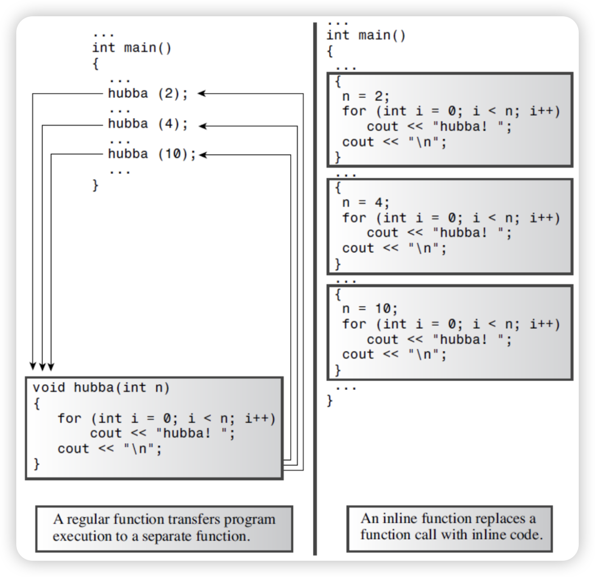

# C++ Basic Course

## Chapter 1 —— Hello, C++!

### Basic syntax

***Our goal is to completely understand the code below!***

```C++
#include <iostream>
#include <typeinfo>

using namespace std;

// Function prototypes
void swap(int, int);
void swap(int*, int*);
void swapPointer(int*, int*);
void swapReference(int&, int&);

// Inline function to print variable values
inline void output(const int& p, const int& q = 0) {
    cout << "a: " << p << endl
         << "b: " << q << endl << endl;
}

int main() {
    int a, b;

    cout << "Enter two integers: ";
    cin >> a >> b;
    
    cout << "Before swap: " << endl;
    output(a, b);
    cout << "Address of a: " << &a << endl
         << "Address of b: " << &b << endl << endl;
    
    swap(a, b);
    cout << "After swap(int, int): " << endl;
    output(a, b);
    
    swap(&a, &b);
    cout << "After swap(int*, int*): " << endl;
    output(a, b);
    
    swapPointer(&a, &b);
    cout << "After swapPointer(int*, int*): " << endl;
    output(a, b);
    
    swapReference(a, b);
    cout << "After swapReference(int&, int&): " << endl;
    output(a, b);
    
    return 0;
}

// Value-passing version
void swap(int a, int b) {
    int tmp = a;
    a = b;
    b = tmp;

    cout << "In function swap(int, int): " << endl
         << "a: " << a << endl << "b: " << b << endl
         << "Address of a: " << &a << endl
         << "Address of b: " << &b << endl;
}

// Pointer-passing version
void swap(int* a, int* b) {
    decltype(a) tmp = a;
    a = b;
    b = tmp;
    
    cout << "In function swap(int*, int*) after swap: " << endl
         << "type of tmp: " << typeid(tmp).name() << endl
         << "Address that a points to: " << a << endl
         << "Address that b points to: " << b << endl
         << "Value that the address a points to stored: " << *a << endl
         << "Value that the address b points to stored: " << *b << endl;
}

// Pointer-passing version
void swapPointer(int* a, int* b) {
    int tmp = *a;
    *a = *b;
    *b = tmp;

    cout << "In function swapPointer(int*, int*) after swap: " << endl
         << "Address that a points to: " << a << endl
         << "Address that b points to: " << b << endl
         << "Value that the address a points to stored: " << *a << endl
         << "Value that the address b points to stored: " << *b << endl;
}

// Reference-passing version
void swapReference(int& a, int& b) {
    auto tmp = a;
    a = b;
    b = tmp;

    cout << "In function swapReference(int&, int&) after swap: "
         << endl << "type of tmp: " << typeid(tmp).name() << endl
         << "a: " << a << endl << "b: " << b << endl
         << "Address of a " << &a << endl
         << "Address of b " << &b << endl;
}

```

- ***The C++ Preprocessor***

  ​	C++, like C, uses a ***preprocessor***. This is a program that processes a source file before the main compilation takes place.  You don’t have to do anything special to invoke this preprocessor. It automatically operates when you compile the program.

  ```cpp
  #include <iostream>		// a PREPROCESSOR directive
  ```

  ​	This directive causes the preprocessor to add the contents of the iostream file to your program. This is a typical preprocessor action: adding or replacing text in the source code before it’s compiled. In essence, the contents of the iostream file replace the `#include <iostream>` line in the program. **Your original file is not altered, but a composite file formed from your file and iostream goes on to the next stage of compilation.**

- ***header***

  | Kind of header | Convention               | Example      | Comments                                                     |
  | -------------- | ------------------------ | ------------ | ------------------------------------------------------------ |
  | C++ old style  | Ends in `.h`             | `iostream.h` | Usable by C++ programs                                       |
  | C old style    | Ends in `.h`             | `math.h`     | Usable by C and C++ programs                                 |
  | C++ new style  | No extension             | `iostream`   | Usable by C++ programs, uses `namespace std`                 |
  | Converted C    | `c` prefix, no extension | `cmath`      | Usable by C++ programs, might use non-C features, such as `namespace std` |

- ***namespace***

  ​	Namespace support is a C++ feature designed to simplify the writing of large programs and of programs that combine pre-existing code from several vendors and to help organize programs. 

  ​	One potential problem is that you might use two prepackaged products that both have, say, a function called `wanda()`. If you then use the `wanda()` function, the compiler won’t know which version you mean. 

  ​	The namespace facility lets a vendor package its wares in a unit called a ***namespace*** so that you can use the name of a namespace to indicate which vendor’s product you want. So Microflop Industries could place its definitions in a namespace called `Microflop`.Then `Microflop::wanda()` would become the full name for its wanda() function. Similarly, `Piscine::wanda()` could denote Piscine Corporation’s version of wanda(). 

  ​	Thus, your program could now use the namespaces to discriminate between various versions:

  ```cpp
  Microflop::wanda("go dancing?");		// use Microflop namespace version
  Piscine::wanda("a fish named Desire")	// use Piscine namespace version
  ```

  ​    The using directive like `using namespace std` makes all the names in the `std` namespace available. Modern practice regards this as a bit lazy and potentially a problem in large projects. The preferred approaches are to use the std:: qualifier or to use something called a using declaration to make just particular names available:

  ```C++
  using std::cout;
  using std::cin;
  using std::endl;
  ```

  ​	However, for me, it is more customary not to use the using directive.

  ​	In addition, the using directive can also give aliases to types:

  ```cpp
  using i64 = long long;
  ```

  ​    	It is somewhat similar to ```#define LL long long```, but still different:

  - ***Scope:*** "using i64 = long long;" is the syntax for creating a type alias in C++, and its scope is limited to the current namespace or scope. On the other hand, "#define i64 long long" is a preprocessing directive in C and C++ that performs text replacement during the preprocessing phase, and its scope extends throughout the entire source file.

  - ***Type Safety:*** "using i64 = long long;" preserves type safety when creating a type alias. "i64" and "long long" are essentially the same type with just a different name. This means that when using "i64," the compiler performs type checking to ensure that only "long long" operations are allowed.

    "#define i64 long long" is a simple text replacement and lacks type checking. When using "i64," the preprocessor replaces all occurrences of "i64" with "long long" without performing type checks.

  - ***Life time:*** The type alias created with "using i64 = long long;" remains valid for the entire lifetime of the program and can be used anywhere in the code. In contrast, the text replacement performed by "#define i64 long long" is only effective within the current source file and does not affect other files.

- ***comments***

  ​	The ***double slash (//)*** introduces a C++ comment. A comment is a remark from the programmer to the reader that usually identifies a section of a program or explains some aspect of the code. The compiler ignores comments.

  - C++ also recognizes C comments, which are enclosed between /* and */ symbols:

    ```C++
    #include <iostream> /* a C-style comment */
    ```

- ***cout && cin***

  ​	For now, you only need to know that `cin` is used for **input**, similar to `scanf`, and `cout` is used for **output**, similar to `printf`. We will explain it in more depth when we reach ***stream*** in the lesson.

  ​	You can currently understand it this way, `cout` and `cin` are both intelligent and do not need to specify the type. `<<` is the output operator and `>>` is the read operator. The input and output can be spliced through corresponding operators. For example, `std::cin >> a >> b;` is to read the two values a and b; `std::cout << a << b;` is to output a, b these two values. 

  ​	Moreover, C++’s free format rules treat newlines and spaces between tokens interchangeably, so you can write code like this:

  ```cpp
  std::cin >> a
  		 >> b;
  		 
  std::cout << "a is: "
  		  << a
  		  << ", and b is: "
  		  << b
  		  << endl;
  ```

  - The Manipulator ***endl***

    ​	`endl` is a special C++ notation that represents the important concept of beginning a new line. Special notations like endl that have particular meanings to cout are dubbed manipulators. Like cout, endl is defined in the iostream header file and is part of the `std namespace`.

    ​	Note that the cout facility does not move automatically to the next line when it prints a string, the output for each cout statement begins where  the last output ended.

    ​	You can still use `\n` in  C++

  - Other ***manipulators***

    1. `std::setw` - Set the field width for the next output.
    2. `std::setprecision` - Set the decimal precision for floating-point output.
    3. `std::setfill` - Set the fill character used for padding.
    4. `std::left` and `std::right` - Set the text alignment for output.
    5. `std::fixed` - Display floating-point numbers in fixed-point notation.
    6. `std::scientific` - Display floating-point numbers in scientific (exponential) notation.
    7. `std::boolalpha` - Display boolean values as "true" or "false" instead of 1 or 0.
    8. `std::uppercase` - Output letters in uppercase.
    9. `std::nouppercase` - Output letters in lowercase.
    10. `std::showpos` - Always show the plus sign for positive numbers.
    11. `std::noshowpos` - Do not show the plus sign for positive numbers.
    12. `std::hex`, `std::oct`, and `std::dec` - Set the output base (hexadecimal, octal, or decimal).
    13. `std::setbase` - Set the base for numeric input and output.
    14. `std::noskipws` - Disable skipping of leading whitespace when reading from input.

- ***function***

  ​	Because functions are the modules from which C++ programs are built and because they are essential to C++ OOP definitions, you should become thoroughly familiar with them. Some aspects of functions are advanced topics, so the main discussion of functions comes later (maybe).

  ​	However, if we deal now with some basic characteristics of functions, you’ll be more at ease and more practiced with functions later.

  - ***function form***

    ```cpp
    returnType functionName(argumentList) {
    	statements;
    }
    ```

    ​	If return type is `void`, that means the function returns nothing, you can use `return;` statement to end the function, or let the program run to the end of the function automatically.

    ​	Similarly, if the argument is `void`, then it means that the arguments are not accepted, and `foo(void)` and `foo()` have the same meaning.
  
    ​	However, it should be noted that in C, the argumentList is empty, which means silence to accept arguments, rather than not accepting the arguments, unless explicitly declared as `foo(void)`
  
    ```cpp
    ...
    void foo() { printf("Function running\n"); }
    ...
    foo(1);
    ...
    // In C++
    error: too many arguments to function 'void foo()'
         foo(1);
    note: declared here
    void foo() { printf("Function running\n"); }
    
    /* In C */
    Function running
    ```

  - ***function header***
  
    ​	The `output()` function in code has this header

    ```cpp
    void output(int p, int q);
    ```
  
    ​	As we said before, the initial void means that little poor `output()` has no return value. So you can't use it this way:
  
    ```cpp
    auto var = output(a, b);
    
    error: 'void var' has incomplete type
       21 |     auto var = output(a, b);
    ```

    ​	The `int p, int q` within the parentheses means that you are expected to use `output()` with two arguments of type int. The `p, q` are new variables assigned the value passed during a function call.

    ​	What's more, `a, b` in the function call are `argument / actual parameter`, `p, q` in the function header are `parameter / formal parameter`. In function prototypes, the name of the `parameter / formal parameter` can be ignored, you just need to keep the types.

    

  - ***recursion***

    ​	And now for something completely different. A C++ function has the interesting characteristic that it can call itself. (Unlike C, however, C++ does not let main() call itself.) This ability is termed recursion.  In computer science, **recursion** is a method of solving a computational problem where the solution depends on solutions to smaller instances of the same problem. Recursion is an important tool in certain types of programming, such as artificial intelligence, Depth-First Search, Breadth-First Search, but we’ll just take a superficial look (artificial shallowness) at how it works.

    ​	A recursive function definition has one or more *base cases*, meaning input(s) for which the function produces a result trivially (without recurring), and one or more *recursive cases*, meaning input(s) for which the program recurs (calls itself).
  
    ​	If a recursive function calls itself, then the newly called function calls itself, and so on, ad infinitum unless the code includes something to terminate the chain of calls (**base cases**). The usual method is to make the recursive call part of an `if` statement. For example, a type `void `recursive function called `recurs()` can have a form like this:
  
    ```cpp
     void recurs(argumentList)
     {
         statements1;
         if (test)
             recurs(arguments);
         statements2;
     }
    ```

  - ***inline***
  
    ​	Inline functions are a C++ enhancement designed to speed up programs. The primary distinction between normal functions and inline functions is not in how you code them but in how the C++ compiler incorporates them into a program. To understand the distinction between inline functions and normal functions, you need to peer more deeply into a program’s innards than we have so far. So we won’t go into too deep an explanation, just briefly talk about the differences.
  
    ​	For ordinary functions, when the function is called, the program will jump to the function to continue execution, and then jump back after executing the function. Jumping back and forth and keeping track of where to jump means that there is an overhead in elapsed time to using functions.
  
    ​	C++ inline functions provide an alternative. In an inline function, the compiled code is “in line” with the other code in the program. That is, the compiler replaces the function call with the corresponding function code. With inline code, the program doesn’t have to jump to another location to execute the code and then jump back. 
  
    ​	Inline functions thus run a little faster than regular functions, but they come with a memory penalty. If a program calls an inline function at ten separate locations, then the program winds up with ten copies of the function inserted into the code.
  
    
  
    ​	You should be selective about using inline functions. If the time needed to execute the function code is long compared to the time needed to handle the function call mechanism, then the time saved is a relatively small portion of the entire process. 

    ​	If the code execution time is short, then an inline call can save a large portion of the time used by the non-inline call. On the other hand, you are now saving a large portion of a relatively quick process, so the absolute time savings may not be that great unless the function is called frequently.

    ​	To use this feature, you must take at least one of two actions:

    - Preface the function declaration with the keyword `inline`.
    - Preface the function definition with the keyword `inline`.
  
    	It should be noted that inline functions cannot be recursive, or recursive functions cannot be inline with the keyword
  
  - ***default arguments***
  
    ​	Let’s look at another topic from C++’s bag of new tricks: the default argument. A default argument is a value that’s used automatically if you omit the corresponding actual argument from a function call. For example, if you set up void wow(int n) so that n has a default value of 1, the function call wow() is the same as wow(1).This gives you flexibility in how you use a function. 
  
    ​	How do you establish a default value? You must use the function prototype. Because the compiler looks at the prototype to see how many arguments a function uses, the function prototype also has to alert the program to the possibility of default arguments. The method is to assign a value to the argument in the prototype.
  
    ​	When you use a function with an argument list, you must add defaults from right to left.That is, you can’t provide a default value for a particular argument unless you also provide defaults for all the arguments to its right:
  
    ```cpp
    int harpo(int n, int m = 4, int j = 5); 	  // VALID
    int chico(int n, int m = 6, int j);			  // INVALID
    int groucho(int k = 1, int m = 2, int n = 3); // VALID
    ```
  
    For example, the harpo() prototype permits calls with one, two, or three arguments:
  
    ```cpp
    beeps = harpo(2); 	   // same as harpo(2,4,5)
    beeps = harpo(1,8);    // same as harpo(1,8,5)
    beeps = harpo (8,7,6); // no default arguments used
    ```
  
    ​	The actual arguments are assigned to the corresponding formal arguments from left to right; you can’t skip over arguments. Thus, the following isn’t allowed: 
  
    ```cpp
    beeps = harpo(3, ,8); // invalid, doesn't set m to 4
    ```
  
    ​	Default arguments aren’t a major programming breakthrough; rather, they are a convenience. When you begin working with class design, you’ll find that they can reduce the number of constructors, methods,and method overloads you have to define. 
  
    ​	Note that only the prototype indicates the default. The function definition is the same as it would be without default arguments
  
  - ***function polymorphism / function overloading***
  
    ​	In C, you are not allowed to write the code like this:
  
    ````c
    ...
    void swap(int, int);
    void swap(int*, int*);
    ```
    swap(a, b);
    swap(&a, &b);
    ...
    ````
  
    ​	You'll get a bunch of error:
  
    ```C
    error: conflicting types for 'swap'; have 'void(int *, int *)'
        4 | void swap(int*, int*);
          |      ^~~~
    note: previous declaration of 'swap' with type 'void(int,  int)'
        3 | void swap(int, int);
          |      ^~~~
    In function 'main':
    warning: passing argument 1 of 'swap' makes pointer from integer without a cast [-Wint-conversion]
        9 |     swap(a, b);
          |          ^
          |          |
          |          int
    note: expected 'int *' but argument is of type 'int'
        4 | void swap(int*, int*);
          |           ^~~~
    warning: passing argument 2 of 'swap' makes pointer from integer without a cast [-Wint-conversion]
        9 |     swap(a, b);
          |             ^
          |             |
          |             int
    note: expected 'int *' but argument is of type 'int'
        4 | void swap(int*, int*);
          |                 ^~~~
    At top level:
    error: conflicting types for 'swap'; have 'void(int *, int *)'
       19 | void swap(int* p, int* q) {
          |      ^~~~
    note: previous definition of 'swap' with type 'void(int,  int)'
       15 | void swap(int p, int q) {
          |      ^~~~
    ```
  
    ​	But just like you saw before, it's not only allowed in C++, but also very very very widely used.	
  
    ​	***Function polymorphism*** is a neat C++ addition to C’s capabilities. Whereas default arguments let you call the same function by using varying numbers of arguments, function polymorphism, also called ***function overloading***, lets you use multiple functions sharing the same name. 
  
    ​	The word polymorphism means having many forms, so function polymorphism lets a function have many forms. Similarly, the expression function overloading means you can attach more than one function to the same name, thus overloading the name. Both expressions boil down to the same thing, but we’ll usually use the expression function overloading—it sounds harder working. You can use function overloading to design a family of functions that do essentially the same thing but using different argument lists.
  
    ​	The key to function overloading is a function’s argument list, also called the ***function signature***. If two functions use the same number and types of arguments in the same order, they have the same signature; the variable names don’t matter. 
    
    ​	C++ enables you to define two functions by the same name, provided that the functions have different signatures. The signature can differ in the number of arguments or in the type of arguments, or both. For example, you can define a set of print() functions with the following prototypes:
    
    ```cpp
    void print(const char* str, int width);	// #1
    void print(double d, int width);		// #2
    void print(long l, int width);			// #3
    void print(int i, int width);			// #4
    void print(const char* str);			// #5
    ```
    
    ​	When you then use a print() function, the compiler matches your use to the prototype that has the same signature:
    
    ```cpp
    print("Pancakes", 15);		// use #1
    print("Syrup");				// use #5
    print(1999.0, 10);			// use #2
    print(1999, 12);			// use #4
    print(1999L, 15);			// use #3
    ```
    
    ​	When you use overloaded functions, you need to be sure you use the proper argument types in the function call. For example, consider the following statements:
    
    ```cpp
    unsigned int year = 2023;
    print(year, 6);				// ambiguous call
    ```
    
    ​	Which prototype does the print() call match here? It doesn’t match any of them! A lack of a matching prototype doesn’t automatically rule out using one of the functions because C++ will try to use standard type conversions to force a match. 
    
    ​	If, say, the only print() prototype were #2, the function call print(year, 6) would convert the year value to type double. But in the earlier code there are three prototypes that take a number as the first argument, providing three different choices for converting year. Faced with this ambiguous situation, C++ rejects the function call as an error.
    
    ```cpp
    error: call of overloaded 'print(unsigned int&, int)' is ambiguous
       19 |     print(year, 6);
          |     ~~~~~^~~~~~~~~
    note: candidate: 'void print(double, int)'
       10 | void print(double d, int width);
          |      ^~~~~
    note: candidate: 'void print(long int, int)'
       11 | void print(long l, int width);
          |      ^~~~~
    note: candidate: 'void print(int, int)'
       12 | void print(int i, int width);
          |      ^~~~~
    ```
    
    ​	Some signatures that appear to be different from each other nonetheless can’t coexist. For example, remember the code we gave at first? Can I change the name of `swapReference()` to `swap()`? The answer is **no**! We'll explain it later when we talk about reference.
    
    ​	Keep in mind that the signature, not the function type, enables function overloading. For example, the following two declarations are incompatible:
    
    ```cpp
    long gronk(int n, float m);		// same signatures
    double gronk(int n, float m);	// hence not allowed
    
    error: ambiguating new declaration of 'double gronk(int, float)'
       10 | double gronk(int n, float m);
          |        ^~~~~
    note: old declaration 'long int gronk(int, float)'
        9 | long gronk(int n, float m);
    ```
    
    ​	Therefore, C++ doesn’t permit you to overload gronk() in this fashion. You can have different return types, but only if the signatures are also different:
    
    ```cpp
    long gronk(int n, float m);
    double gronk(double n, float m);
    ```