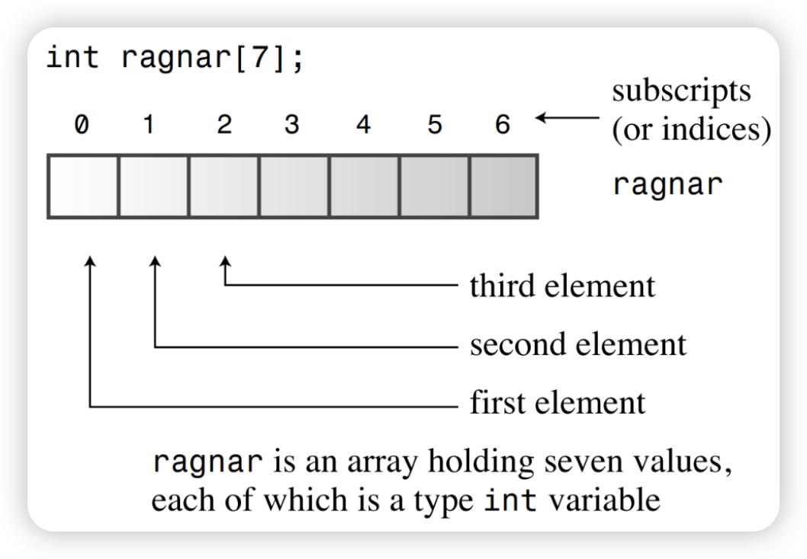

# C++ Basic Course

## Chapter 2 —— Dealing with data

- ***type alias***

  - using the `typedef` keyword:

    ```cpp
    typedef int Integer;
    Integer doorNumber = 211;
    ```

  - using the `using` keyword:

    ```cpp
    WHAT ARE YOU EXPECTING WE JUST LEARNED NOT LONG AGO
    BTW, using is the superset of typedef, we recommend you to use using
    ```

  - using the `decltype` keyword:

    The `decltype` keyword allows you to obtain the type of a variable or expression and use it as a type alias.

    ```cpp
    int x = 211;
    decltype(x) y = 985;
    decltype(x + y) res;
    ```

  - ***WARNING AGAIN***

    ***What the `#define` directive does is simply replace the text.***

    

- ***const && constexpr***

  - ***const***

  	​	Now let’s return to the topic of symbolic names for constants. A symbolic name can suggest what the constant represents. Also if the program uses the constant in several places and you need to change the value, you can just change the single symbol definition. Suppose, for example, that you want a symbolic constant for the number of months in a year. Just enter this line in a program:
		
  	```cpp
  	const int Months = 12; // Months is symbolic constant for 12
  	```
		
  	​	Now you can use Months in a program instead of 12. (A bare 12 in a program might represent the number of inches in a foot or the number of donuts in a dozen, but the name Months tells you what the value 12 represents.) After you initialize a constant such as Months, its value is set.The compiler does not let you subsequently change the value Months. If you try to, for example, g++ gives an error message that the program used an assignment of a read-only variable.The keyword const is termed a qualifier because it qualifies the meaning of a declaration.

  - ***constexpr***

		​	`constexpr` variables are constants computed at compile-time. They must be initialized at declaration and can only contain values known at compile-time.
		
		```cpp
		constexpr int y = 2 + 3;  // Calculate y's value at compile-time
		```
		
		​	`constexpr` functions are executed at compile-time. Their parameters and return values must be of `constexpr` types, and their bodies can only contain operations known at compile-time.
		
		```c++
		constexpr int add(int a, int b) {  // A compile-time addition function
		    return a + b;
		}
		```

- the ***auto*** keyword

      ​	C++11 introduces a facility that allows the compiler to deduce a type from the type of an initialization value. For this purpose it redefines the meaning of auto, a keyword dating back to C, but one hardly ever used. (We'll discuss the previous meaning of auto later, or not.) Just use auto instead of the type name in an initializing declaration, and the compiler assigns the variable the same type as that of the initializer:

  ```c++
  auto n = 100;		// n is int
  auto x = 1.5;		// x is double
  auto y = 1.3e12L;	// y is long double
  ```

  ​	However, this automatic type deduction isn’t really intended for such simple cases. Indeed, you might even go astray. Only use when the type is obvious or when the type is annoyingly verbose to write out.

  ```c++
  #include <iostream>
  #include <string>
  #include <map>
  #include <unordered_map>
  #include <vector>
  
  int main() {
  	std::map<std::string, std::vector<std::pair<int, std::unordered_map<char, double> > > complexType;
  	
      // What does this do? We'll find out in the iterators lecture!
  	std::map<std::string, std::vector<std::pair<int, std::unordered_map<char, double> > >::iterator it = complexType.begin();
  	
  	// vs
  	auto it = complexType.begin();
  	
  	return 0;
  }
  ```

- ***lvalue && rvalue***

  ​	To help you understand better, here is a simple and crude definition of lvalue and rvalue: lvalue is a value that can appear on the left side of the assignment operator, and of course it can also appear on the right side; and rvalue, is a value that is not lvalue.

  ​	But you still need to understand a little more deeply. lvalues are generally addressable objects, while rvalues represent temporary or non-addressable values. It may be counter-intuitive: string literals are lvalues. This is because in C++, the string constant pool mechanism was introduced. This special area of the string constant pool is located in the data segment (Data Segment) of the program. When writing a program, we can declare a string constant using const char* or string. During the running of the program, these strings are saved in the data segment. As long as the contents of the two strings are the same, they will be saved at the same address.

  ​	Since the string constant pool in C++ is read-only, we cannot modify the strings in it. If modification is attempted, the program will throw an exception. Therefore, when we need to modify a string, we need to use other methods to modify it, such as using a char array.

  

  According to [cpp reference](https://en.cppreference.com/w/cpp/language/value_category.html)，The following expressions are *lvalue expressions*：

  - the name of a variable, a function, a [template parameter object](https://en.cppreference.com/w/cpp/language/template_parameters#Non-type_template_parameter) (since C++20), or a data member, regardless of type, such as [std::cin](http://en.cppreference.com/w/cpp/io/cin) or [std::endl](http://en.cppreference.com/w/cpp/io/manip/endl). Even if the variable's type is rvalue reference, the expression consisting of its name is an lvalue expression (but see [Move-eligible expressions](https://en.cppreference.com/w/cpp/language/value_category#Move-eligible_expressions));
  - a function call or an overloaded operator expression, whose return type is lvalue reference, such as [std::getline](http://en.cppreference.com/w/cpp/string/basic_string/getline)([std::cin](http://en.cppreference.com/w/cpp/io/cin), str), [std::cout](http://en.cppreference.com/w/cpp/io/cout) << 1, str1 = str2, or ++it;
  - a = b, a += b, a %= b, and all other built-in [assignment and compound assignment](https://en.cppreference.com/w/cpp/language/operator_assignment) expressions;
  - ++a and --a, the built-in [pre-increment and pre-decrement](https://en.cppreference.com/w/cpp/language/operator_incdec#Built-in_prefix_operators) expressions;
  - *p, the built-in [indirection](https://en.cppreference.com/w/cpp/language/operator_member_access#Built-in_indirection_operator) expression;
  - a[n] and p[n], the built-in [subscript](https://en.cppreference.com/w/cpp/language/operator_member_access#Built-in_subscript_operator) expressions, where one operand in a[n] is an array lvalue (since C++11);
  - a.m, the [member of object](https://en.cppreference.com/w/cpp/language/operator_member_access#Built-in_member_access_operators) expression, except where `m` is a member enumerator or a non-static member function, or where a is an rvalue and `m` is a non-static data member of object type;
  - p->m, the built-in [member of pointer](https://en.cppreference.com/w/cpp/language/operator_member_access#Built-in_member_access_operators) expression, except where `m` is a member enumerator or a non-static member function;
  - a.*mp, the [pointer to member of object](https://en.cppreference.com/w/cpp/language/operator_member_access#Built-in_pointer-to-member_access_operators) expression, where a is an lvalue and `mp` is a pointer to data member;
  - p->*mp, the built-in [pointer to member of pointer](https://en.cppreference.com/w/cpp/language/operator_member_access#Built-in_pointer-to-member_access_operators) expression, where `mp` is a pointer to data member;
  - a, b, the built-in [comma](https://en.cppreference.com/w/cpp/language/operator_other#Built-in_comma_operator) expression, where b is an lvalue;
  - a ? b : c, the [ternary conditional](https://en.cppreference.com/w/cpp/language/operator_other#Conditional_operator) expression for certain b and c (e.g., when both are lvalues of the same type, but see [definition](https://en.cppreference.com/w/cpp/language/operator_other#Conditional_operator) for detail);
  - a [string literal](https://en.cppreference.com/w/cpp/language/string_literal), such as "Hello, world!";
  - a cast expression to lvalue reference type, such as static_cast<int&>(x) or static_cast<void(&)(int)>(x);
  - a non-type [template parameter](https://en.cppreference.com/w/cpp/language/template_parameters) of an lvalue reference type;
  - a function call or an overloaded operator expression, whose return type is rvalue reference to function;(Since C++ 11)
  - a cast expression to rvalue reference to function type, such as static_cast<void(&&)(int)>(x). (Since C++11)

  Properties:

  - Same as glvalue (below).
  - Address of an lvalue may be taken by built-in address-of operator: &++i[[1\]](https://en.cppreference.com/w/cpp/language/value_category#cite_note-1) and &[std::endl](http://en.cppreference.com/w/cpp/io/manip/endl) are valid expressions.
  - A modifiable lvalue may be used as the left-hand operand of the built-in assignment and compound assignment operators.
  - An lvalue may be used to [initialize an lvalue reference](https://en.cppreference.com/w/cpp/language/reference_initialization); this associates a new name with the object identified by the expression.

  

  #### rvalue

  An *rvalue expression* is either prvalue or xvalue.

  The following expressions are *prvalue expressions*:

  - a [literal](https://en.cppreference.com/w/cpp/language/expressions#Literals) (except for [string literal](https://en.cppreference.com/w/cpp/language/string_literal)), such as 42, true or nullptr;
  - a function call or an overloaded operator expression, whose return type is non-reference, such as str.substr(1, 2), str1 + str2, or it++;
  - a++ and a--, the built-in [post-increment and post-decrement](https://en.cppreference.com/w/cpp/language/operator_incdec#Built-in_postfix_operators) expressions;
  - a + b, a % b, a & b, a << b, and all other built-in [arithmetic](https://en.cppreference.com/w/cpp/language/operator_arithmetic) expressions;
  - a && b, a || b, !a, the built-in [logical](https://en.cppreference.com/w/cpp/language/operator_logical) expressions;
  - a < b, a == b, a >= b, and all other built-in [comparison](https://en.cppreference.com/w/cpp/language/operator_comparison) expressions;
  - &a, the built-in [address-of](https://en.cppreference.com/w/cpp/language/operator_member_access#Built-in_address-of_operator) expression;
  - a.m, the [member of object](https://en.cppreference.com/w/cpp/language/operator_member_access#Built-in_member_access_operators) expression, where `m` is a member enumerator or a non-static member function[[2\]](https://en.cppreference.com/w/cpp/language/value_category#cite_note-pmfc-2);
  - p->m, the built-in [member of pointer](https://en.cppreference.com/w/cpp/language/operator_member_access#Built-in_member_access_operators) expression, where `m` is a member enumerator or a non-static member function[[2\]](https://en.cppreference.com/w/cpp/language/value_category#cite_note-pmfc-2);
  - a.*mp, the [pointer to member of object](https://en.cppreference.com/w/cpp/language/operator_member_access#Built-in_pointer-to-member_access_operators) expression, where `mp` is a pointer to member function[[2\]](https://en.cppreference.com/w/cpp/language/value_category#cite_note-pmfc-2);
  - p->*mp, the built-in [pointer to member of pointer](https://en.cppreference.com/w/cpp/language/operator_member_access#Built-in_pointer-to-member_access_operators) expression, where `mp` is a pointer to member function[[2\]](https://en.cppreference.com/w/cpp/language/value_category#cite_note-pmfc-2);
  - a, b, the built-in [comma](https://en.cppreference.com/w/cpp/language/operator_other#Built-in_comma_operator) expression, where b is an prvalue;
  - a ? b : c, the [ternary conditional](https://en.cppreference.com/w/cpp/language/operator_other#Conditional_operator) expression for certain b and c (see [definition](https://en.cppreference.com/w/cpp/language/operator_other#Conditional_operator) for detail);
  - a cast expression to non-reference type, such as static_cast<double>(x), [std::string](http://en.cppreference.com/w/cpp/string/basic_string){}, or (int)42;
  - the [`this`](https://en.cppreference.com/w/cpp/language/this) pointer;
  - an [enumerator](https://en.cppreference.com/w/cpp/language/enum);
  - a non-type [template parameter](https://en.cppreference.com/w/cpp/language/template_parameters) of a scalar type;

  |                                                              |               |
  | ------------------------------------------------------------ | ------------- |
  | a [lambda expression](https://en.cppreference.com/w/cpp/language/lambda), such as [](int x){ return x * x; }; | (since C++11) |
  | a [requires-expression](https://en.cppreference.com/w/cpp/language/constraints), such as requires (T i) { typename T::type; };a specialization of a [concept](https://en.cppreference.com/w/cpp/language/constraints), such as [std::equality_comparable](http://en.cppreference.com/w/cpp/concepts/equality_comparable)<int>. | (since C++20) |

  

  The following expressions are *xvalue expressions*:

  - a.m, the [member of object](https://en.cppreference.com/w/cpp/language/operator_member_access#Built-in_member_access_operators) expression, where a is an rvalue and `m` is a non-static data member of an object type;
  - a.*mp, the [pointer to member of object](https://en.cppreference.com/w/cpp/language/operator_member_access#Built-in_pointer-to-member_access_operators) expression, where a is an rvalue and `mp` is a pointer to data member;
  - a, b, the built-in [comma](https://en.cppreference.com/w/cpp/language/operator_other#Built-in_comma_operator) expression, where b is an xvalue;
  - a ? b : c, the [ternary conditional](https://en.cppreference.com/w/cpp/language/operator_other#Conditional_operator) expression for certain b and c (see [definition](https://en.cppreference.com/w/cpp/language/operator_other#Conditional_operator) for detail);

  |                                                              |               |
  | ------------------------------------------------------------ | ------------- |
  | a function call or an overloaded operator expression, whose return type is rvalue reference to object, such as std::move(x);a[n], the built-in [subscript](https://en.cppreference.com/w/cpp/language/operator_member_access#Built-in_subscript_operator) expression, where one operand is an array rvalue;a cast expression to rvalue reference to object type, such as static_cast<char&&>(x); | (since C++11) |
  | any expression that designates a temporary object, after [temporary materialization](https://en.cppreference.com/w/cpp/language/implicit_conversion#Temporary_materialization); | (since C++17) |
  | a [move-eligible expression](https://en.cppreference.com/w/cpp/language/value_category#Move-eligible_expressions). |               |

  

  An *rvalue expression* is either prvalue or xvalue.

  Properties:

  - Address of an rvalue cannot be taken by built-in address-of operator: &int(), &i++[[3\]](https://en.cppreference.com/w/cpp/language/value_category#cite_note-3), &42, and &std::move(x) are invalid.
  - An rvalue can't be used as the left-hand operand of the built-in assignment or compound assignment operators.
  - An rvalue may be used to [initialize a const lvalue reference](https://en.cppreference.com/w/cpp/language/reference_initialization), in which case the lifetime of the temporary object identified by the rvalue is [extended](https://en.cppreference.com/w/cpp/language/reference_initialization#Lifetime_of_a_temporary) until the scope of the reference ends
  - An rvalue may be used to [initialize an rvalue reference](https://en.cppreference.com/w/cpp/language/reference_initialization), in which case the lifetime of the temporary object identified by the rvalue is [extended](https://en.cppreference.com/w/cpp/language/reference_initialization#Lifetime_of_a_temporary) until the scope of the reference ends. (Since C++ 11)
  - When used as a function argument and when [two overloads](https://en.cppreference.com/w/cpp/language/overload_resolution) of the function are available, one taking rvalue reference parameter and the other taking lvalue reference to const parameter, an rvalue binds to the rvalue reference overload (thus, if both copy and move constructors are available, an rvalue argument invokes the [move constructor](https://en.cppreference.com/w/cpp/language/move_constructor), and likewise with copy and move assignment operators). (Since C++ 11)

  Here you only need a basic understanding of lvalues and rvalues, and we may do a more in-depth discussion later with references.

  

- ***array***

  ​	An *array* is a data form that can hold several values,all of one type. Each value is stored in a separate array element, and the computer stores all the elements of an array consecutively in memory.

  ​	To create an array, you use a declaration statement. An array declaration should indicate three things:

  - The type of value to be stored in each element
  - The name of the array
  - The number of elements in the array

  	Each element, in essence, is a variable that you can treat as a simple variable.

  	This is the general form for declaring an array

  ```cpp
  typeName arrayName[arraySize];
  ```

  ​	The expression `arraySize`, which is the number of elements, must be an integer constant, such as 10 or a const value, or a constant expression, such as 8 * sizeof (int), for which all values are known at the time compilation takes place. In particular, arraySize cannot be a variable whose value is set while the program is running. How ever, later in this chapter you’ll learn how to use the new operator to get around that restriction.

  > 		For C language, before the C99 standard, the size of the array must be a constant or a constant expression (sizeof() is regarded as an integer constant), and the array length must be specified in the source code. But after the introduction of VLA in C99, you can use variables to specify the array length. But notice that VLA could not be initialized, we'll talk about later.
  > 		
  > 		As for C++, in fact, the C++ standard does not provide any support for VLA. If your compilation can pass, it is an extension added by the compiler (GCC, Clang++). If you are using VS, then in MSVC The admiral failed to compile. If you wanna really really wanna use it, you can use const or constexpr keyword, and maybe the better idea is to use std::vector or std::array.

  ​	An array is called a *compound type* because it is built from some other type. You can’t simply declare that something is an array; it always has to be an array of some particular type. There is no generalized array type. Instead, there are many specific array types, such as array of char or array of long.   For example, consider this declaration:

  ```cpp
  float loans[20];
  using T = decltype(loans);
  ```
  
  ​	The `T` not “array”; rather, it is “array of float.” This emphasizes that the loans array is built from the float type.

  ​	You can access array elements individually. The way to do this is to use a *subscript*, or an *index*, to number the elements. C++ array numbering starts with ***zero***(not one).  C++ uses a bracket notation with the index to specify an array element. . Note that the index of the last element is one less than the size of the array. Thus,an array declaration enables you to create a lot of variables with a single declaration,and you can then use an index to identify and access individual elements.

  

  > ## The Importance of Valid Subscript Values
  >
  > The compiler does not check to see if you use a valid subscript. For instance, the compiler won’t complain if you assign a value to the nonexistent element months[101]. But that assignment could cause problems when the program runs, possibly corrupting data or code, possibly causing the program to abort. So it is your responsibility to make sure that your program uses only valid subscript values.
  
  

  - **Initialize rules**

    ​	C++ has several rules about initializing arrays. They restrict when you can do it,and they determine what happens if the number of array elements doesn’t match the number of values in the initializer. Let’s examine these rules.

    ​	You can use the initialization form *only* when defining the array. You cannot use it later, and you cannot assign one array wholesale to another, and for VLA in C, initialize is not allowed:

    ```cpp
    int cards[4] = {3, 6, 8, 10}; 				// okay
    int hand[4]; 								// okay
    hand[4] = {5, 6, 7, 9}; 					// not allowed
    hand = cards; 								// not allowed
    int size = 5;
    char arr[size] = {'h', 'e', 'l', 'l', 'o'}; // not allowed in C
    											// but allowed in GCC/Clang++
    ```
  
    ​	However, you can use subscripts and assign values to the elements of an array individually. When initializing an array, you can provide fewer values than array elements. If you partially initialize an array, the compiler sets the remaining elements to zero ('\0' for char array). If you leave the square brackets ([]) empty when you initialize an array, the C++ compiler counts the elements for you. Suppose, for example, that you make this declaration, the compiler makes things an array of four elements:

    ```cpp
    short things[] = {1, 1, 4, 5}
    ```
  
    > How to get the amount of array's elements?
    >
    > ```cpp
    > int arr[] = {1, 1, 4, 5, 1, 4};
    > int num_elements = sizeof(things) / sizeof(short)
    > ```
  
  - **C++11 Array Initialization**

    ​	First, you can drop the = sign when initializing an array:

    ```cpp
    double earnings[4] {1.2e4, 1.6e4, 1.1e4, 1.7e4}; // okay with C++11
    ```
  
    ​	Second, you can use empty braces to set all the elements to 0 ('\0' in char array):

    ```cpp
    int counts[10] = {}; // all elements set to 0
    ```
  
- ***string***

  ​	A *string* is a series of characters stored in consecutive bytes of memory. C++ has two ways of dealing with strings. The first, taken from C and often called a *C-style string*, and alternative method based on a string class library. Here we only discuss the second method. As for the first, it is the job of your C language teacher.

  ​	The ISO/ANSI C++98 Standard expanded the C++ library by adding a string class. So now, instead of using a character array to hold a string, you can use a type string variable (or object, to use C++ terminology).As you’ll see, the string class is simpler to use than the array and also provides a truer representation of a string as a type.

  ```cpp
  #include <iostream>
  #include <string> // make string class available
  
  int main()
  {
      char charr1[20]; 				// create an empty array
      char charr2[20] = "jaguar"; 	// create an initialized array
      std::string str1; 				// create an empty string object
      std::string str2 = "panther";  	// create an initialized string
  
      std::cout << "Enter a kind of feline: ";
      std::cin >> charr1;
      std::cout << "Enter another kind of feline: ";
      std::cin >> str1; 								// use cin for input
      
      std::cout << "Here are some felines:\n";
      std::cout << charr1 << " " << charr2 << " "
      		  << str1   << " " << str2 				// use cout for output
      		  << endl;
      std::cout << "The third letter in " << charr2 << " is "
      	 	  << charr2[2] << std::endl;
      std::cout << "The third letter in " << str2   << " is "
      	 	  << str2[2] << std::endl; 						// use array notation
      
      return 0;
  }
  ```

  ​	You should learn from this example that, in many ways, you can use a string object in the same manner as a character array:

  - You can initialize a string object to a C-style string.

  - You can use cin to store keyboard input in a string object.

  - You can use cout to display a string object.

  - You can use array notation to access individual characters stored in a string object

  	The main difference between string objects and character arrays is that you declare a string object as a simple variable, not as an array.  Using a string object both more convenient and safer than using an array. Conceptually, one thinks of an array of char as a collection of char storage units used to store a string but of a string class variable as a single entity representing the string.

  	String initialization is as same as char array.

  

  **Assignment, Concatenation, and Appending**

  ​	The string class makes some operations simpler than is the case for arrays. For example, you can’t simply assign one array to another. You can only use strcpy/strncpy (in <string.h> or <cstring>) to copy an array to another, which is considered not safe. But you can assign one string object to another:

  ```cpp
  char charr1[20]; 			// create an empty array
  char charr2[20] = "jaguar"; // create an initialized array
  string str1; 				// create an empty string object
  string str2 = "panther";	// create an initialized string
  charr1 = charr2; 			// INVALID, no array assignment
  str1 = str2; 				// VALID, object assignment ok
  ```

  ​	The string class simplifies combining strings. In C, you need to use strcat/strncat (in <string.h> or <cstring>) which is also unsafe. In C++, you can use the + operator to add two string objects together and the += operator to tack on a string to the end of an existing string object. Continuing with the preceding code, we have the following possibilities:

  ```cpp
  string str3;
  str3 = str1 + str2; // assign str3 the joined strings
  str1 += str2; 		// add str2 to the end of str1
  ```

  ​	The string class can automatic resizing as necessary, is you wanna get the length of a string object at that time, use std::string::size() or std::string::length().

  ```cpp
  char arr[] = {"Let us all unite!"};
  std::string str = "Let us all unite!";
  std::cout << str.size()   << ' '
      	  << str.length() << ' '
      	  << strlen(arr)  << std::endl;
  ```

  *We will learn more about its features when we study STL (Standard Template Library) later.*