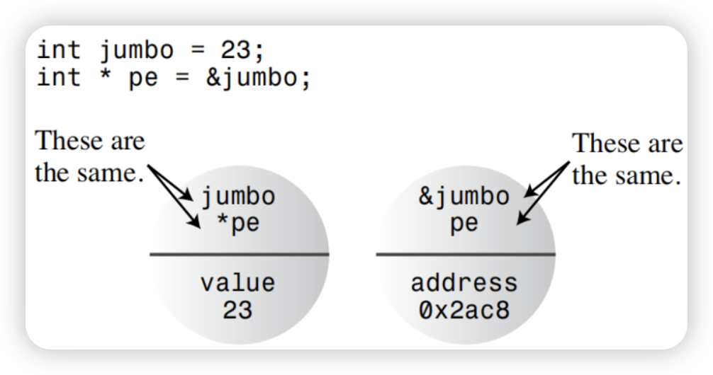
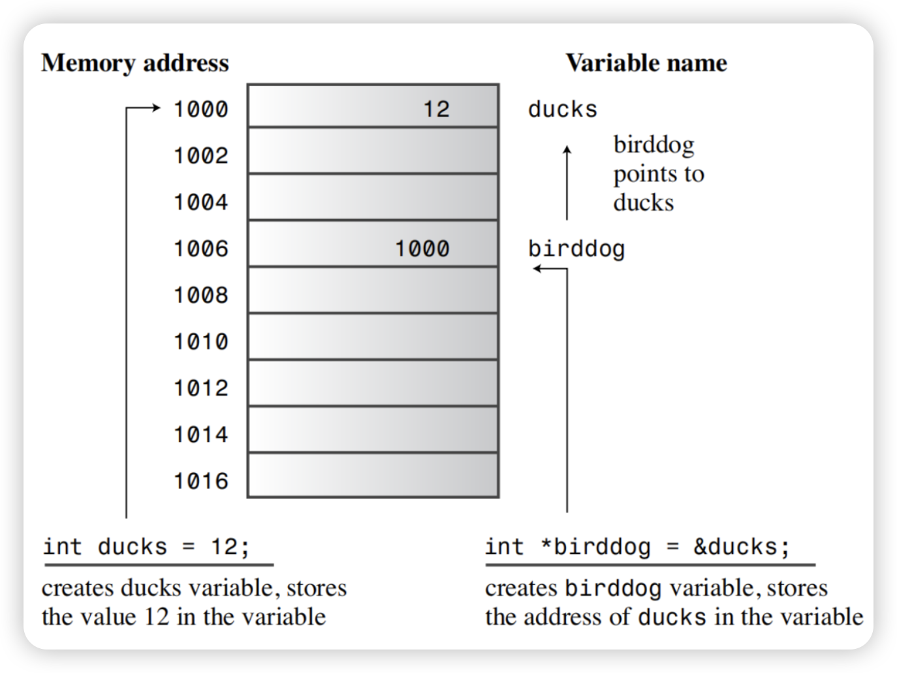

# C++ Basic Course

## Chapter 2 —— Dealing with data

- ***pointer***

  ​	Today we'll deals with the basic language mechanisms for referring to memory. Obviously, we can refer to  object by name, but in C++ (most) objects “have identity.” That is, they reside at a specific address in memory, and an object can be accessed if you know its address and its type. The language constructs for holding and using addresses are pointers and references.

  ​	Pointers, which are variables that store addresses of values rather than the values themselves. But before discussing pointers, let’s talk about how to explicitly find addresses for ordinary variables. You just apply the address operator, represented by &, to a variable to get its location; the name of the pointer represents the location. Applying the * operator, called the *indirect value* or the *dereferencing* operator, yields the value at the location. (Yes, this is the same * symbol used for multiplication; C++ uses the context to determine whether you mean multiplication or dereferencing.)

  

  ​	As you can see, the int variable updates and the pointer variable p_updates are just two sides of the same coin. The updates variable represents the value as primary and uses the & operator to get the address, whereas the p_updates variable represents the address as primary and uses the * operator to get the value. 

  ​	Because p_updates points to updates, *p_updates and updates are completely equivalent. You can use *p_updates exactly as you would use a type int variable. As the program below shows, you can even assign values to *p_updates. Doing so changes the value of the pointed-to value, updates.

  ```cpp
  #include <iostream>
  
  int main() {
      int update = 6;
      int* p_update; // or int * p_update or int *p_update
      p_update = &update;
  
      // Express values in two ways
      std::cout << "Values: update = " << update
                << ", *p_update = "    << *p_update << std::endl;
  
      // Express address in  two ways
      std::cout << std::endl << "Address: &update = " << &update
                << ", p_update = "        << p_update << std::endl;
  
      // Use pointer to change value
      *p_update = *p_update + 1;
      std::cout << std::endl << "Now update = " << update << std::endl;
  
      return 0;
  }
  
  ```

  - ***Declaring and Initializing Pointers***

    ​	Let’s examine the process of declaring pointers. A computer needs to keep track of the type of value to which a pointer refers. For example, the address of a char typically looks the same as the address of a double, but char and double use different numbers of bytes and different internal formats for storing values. Therefore,a pointer declaration must specify what type of data to which the pointer points.

    ​	For example, the preceding example has this declaration:

    ```cpp
    int * p_update;
    ```

    ​	This states that the combination * p_updates is type int. Because you use the * operator by applying it to a pointer, the p_updates variable itself must *be* a pointer. We say that p_updates points to type int. We also say that the type for p_updates is pointer-to-int or, more concisely, int *.To repeat: p_updates is a pointer (an address),and *p_updates is an int and not a pointer.

    

    ​	Incidentally, the use of spaces around the * operator are optional.

    ```cpp
    int *ptr; 	// C programmers have used this form,
    		  	// accentuates the idea that the combination *ptr is a type int value.
    
    int* ptr;	// C++ programmers, on the other hand, use this form,
    			// This emphasizes the idea that int* is a type, pointer-to-int.
    
    int*ptr;	// You could even do this
    
    int* p1, p2;	// Be aware, this declaration creates
    				// one pointer (p1) and one ordinary int (p2)
    				// You need an * for each pointer variable name.
    ```

  - ***pointer danger***

    ​	Danger awaits those who incautiously use pointers. One extremely important point is that when you create a pointer in C++, the computer allocates memory to hold an address, but it does not allocate memory to hold the data to which the address points. Creating space for the data involves a separate step. Omitting that step,as in the following, is an invitation to disaster:

    ```cpp
    long * fellow;		// create pointer to double
    *fellow = 223323;	// where is the value stores? .. Who knows?
    ```

    ​	Sure, fellow is a pointer. But where does it point? The code failed to assign an address to fellow. So where is the value 223323 placed? We can’t say. Because fellow wasn’t initialized, it could have any value. Whatever that value is, the program interprets it as the address at which to store 223323. If fellow happens to have the value 1200, then the computer attempts to place the data at address 1200, even if that happens to be an address in the middle of your program code. Chances are that wherever fellow points, that is not where you want to put the number 223323. This kind of error can produce some of the most insidious and hard -to-trace bugs.

    ​	Hence remember that  ***Always* initialize a pointer to a definite and appropriate address before you apply the dereferencing operator (*) to it.**

  

  - ***Pointers, Arrays, and Pointer Arithmetic***

    ​	The near equivalence of pointers and array names stems from *pointer arithmetic* and how C++ handles arrays internally. First, let’s check out the arithmetic. Adding one to an integer variable increases its value by one, but adding one to a pointer variable increases its value by the number of bytes of the type to which it points. Adding one to a pointer to double adds 8 to the numeric value on systems with 8-byte double, whereas adding one to a pointer-to-short adds two to the pointer value if short is 2 bytes. The code below demonstrates this amazing point. It also shows a second important point: C++ interprets the array name as an address.

    ```cpp
    #include <iostream>
    
    int main() {
        double wages[3] = {10000.0, 20000.0, 30000.0};
        short stacks[3] = {3, 2, 1};
    
        // Here are two ways to get the address of an array
        double * pw = wages;        // name of an array = address
        short * ps = &stacks[0];    // or use address operator
    
        // with array element
        std::cout << "pw = " << pw << ", *pw = " << *pw << std::endl;
        pw = pw + 1;
        std::cout << "add 1 to the pw pointer:\n"
                  << "pw = " << pw << ", *pw = " << *pw << "\n\n";
    
        std::cout << "ps = " << ps << ", *ps = " << *ps << std::endl;
        ps = ps + 1;
        std::cout << "add 1 to the ps pointer:\n"
                  << "ps = " << ps << ", *ps = " << *ps << "\n\n";
    
        std::cout << "access two elements with array notation\n"
                  << "stacks[0] = "   << stacks[0]
                  << ", stacks[1] = " << stacks[1] << std::endl;
    
        std::cout << "access two elements with pointer notation\n"
                  << "*stacks = " << *stacks
                  << ", *(stacks + 1) = " << *(stacks + 1) << std::endl;
    
        std::cout << sizeof(wages) << " = size of wages array\n"
                  << sizeof(pw)    << " = size of pw pointer\n";
    
        return 0;
    }
    ```

    ​	In most contexts, C++ interprets the name of an array as the address of its first element. But remember that the name of an array is not a pointer! It do always interprets to pointer, but it not!

    ```cpp
    int arr[] = {1, 2, 3};
    using T1 = delctype(arr);
    using T2 = delctype(+arr);
    ```

    ​	You can use it like a pointer, like we said before

    ```cpp
    arr == &arr[0] == the address of first element in array
    ```

    ​	So what is &arr means? In value, its equals to a and &a[0], but in meaning, it stands for the whole array.

    ```cpp
    int arr[] = {1, 2, 3};
    std::cout << "arr:         " << arr			<< std::endl
              << "&arr[0]:     " << &arr[0] 	<< std::endl
              << "&arr:        " << &arr 		<< std::endl
              << "arr + 1:     " << arr + 1 	<< std::endl
              << "&arr[0] + 1: " << &arr[0] + 1 << std::endl
              << "&arr + 1:    " << &arr + 1    << std::endl;
    ...................................OUTPUT....................................
    arr:         0x61fe14
    &arr[0]:     0x61fe14
    &arr:        0x61fe14
    arr + 1:     0x61fe18
    &arr[0] + 1: 0x61fe18
    &arr + 1:    0x61fe20
    ```

    ​	In general, wherever you use array notation, C++ makes the following conversion:

    ```cpp
    arrayname[i] becomes *(arrayname + i)
    ```

    ​	And if you use a pointer instead of an array name, C++ makes the same conversion:

    ```cpp
    pointername[i] becomes *(pointername + i)
    ```

    ​	Thus, in many respects you can use pointer names and array names in the same way. You can use the array brackets notation with either. You can apply the dereferencing operator (*) to either. In most expressions, each represents an address. One difference is that you can change the value of a pointer, whereas an array name is a constant:

    ```cpp
    pointername = pointername + 1;	// valid
    arrayname = arrayname + 1;		// not allowed
    ```

    ​	A second difference is that applying the sizeof operator to an array name yields the size of the array, but applying sizeof to a pointer yields the size of the pointer, even if the pointer points to the array.

  - **Allocating Memory with *new***

    ​	It can be advantageous to create arrays during runtime rather than at compile time. You can use the new operator to allocate a piece of memory to a pointer. The new operator is used to dynamically allocate memory on the heap and returns the allocated memory address. You can use this pointer to access and manipulate dynamically allocated memory.

    ```cpp
    int* ptr1;
    int* ptr2 = new int;
    
    *ptr1 = 3; // dangerous
    *ptr2 = 3;
    ```

    ​	But this only allocates memory for a single element to the pointer, but how can the pointer achieve the same function as an array and store a large number of elements? The new operator is also used, but the syntax is different

    ```cpp
    int* ptr = new int[5]; // similar to int arr[5];
    ```

    ​	It is very important to note that the memory space dynamically allocated by the program from the operating system should be released after use and returned to the operating system so that the operating system can allocate this memory space to other programs. C++ provides the delete operator to release dynamically allocated memory space.

    ```cpp
    int* ptr1 = new int;
    int* ptr2 = new int[5];
    
    delete ptr1;
    delete [] ptr2;
    ```

    ​	In C++, once you use the `delete` operator to release memory pointed to by a pointer, the pointer still exists, but the memory it points to no longer belongs to your program. This is called a dangling pointer. Trying to use a dangling pointer can lead to undefined behavior because the memory has been deallocated and may be used by other programs, or due to memory management reasons, it can result in crashes or unpredictable outcomes.

    ​	Therefore, in most cases, after using `delete`, you should set the pointer to `nullptr` to avoid accidentally referencing a dangling pointer. This can help you prevent dangling pointer issues. For example:

    ```cpp
    int* myPointer = new int;
    // Perform some operations with myPointer
    delete myPointer;
    myPointer = nullptr; // Set the pointer to nullptr
    ```

    ​	By doing this, if you attempt to use `myPointer` afterward, it will be a null pointer rather than pointing to deallocated memory as a dangling pointer.

    ​	But... What is `nullptr`?

  - ***NULL && nullptr***

    A null pointer has several important uses and reasons in programming:

    1. Initialization: When you create a pointer variable but don't have a valid target to allocate memory to, a null pointer is a suitable initial value. It allows you to specify a valid memory address later.
    2. Representing Absence: A null pointer can be used to indicate that a pointer doesn't point to anything, i.e., no memory has been allocated. This is meaningful in many situations, such as in data structures to represent a node without child nodes.
    3. Error Handling: In some cases, if memory allocation fails or a pointer references invalid memory, you can use a null pointer to represent an error state and take appropriate actions.
    4. Function Return Values: In certain situations, a function may need to return a pointer, but due to some reason, cannot allocate valid memory. In such cases, the function can return a null pointer to indicate failure or a specific condition.

    ​	In summary, a null pointer is a useful tool in programming for representing the absence or invalidity of a pointer. It can help you deal with various scenarios, from memory allocation to error handling. 

    ​	However, it's essential to use null pointers safely to avoid issues like dangling pointers and segmentation faults. 

    ​	When it comes to `NULL` and `nullptr` in C++, it's important to understand their background and purposes.

    1. `NULL`:
       - `NULL` is a macro, typically defined as 0. In earlier versions of C and C++, it was used to indicate that a pointer doesn't point to any valid memory address.
       - However, `NULL` has some issues because 0 can also be used to represent integers or floating-point numbers, leading to potential ambiguities. It may also trigger certain compiler warnings or errors.
       - In more recent C++ standards, it is recommended to avoid using `NULL` and use `nullptr` instead.

    2. `nullptr`:
       - `nullptr` is a keyword introduced in C++11 specifically for representing a null pointer. It is type-safe.
       - `nullptr` will not be interpreted as an integer or other data types; it can only be assigned to pointer types, helping catch some errors at compile time.
       - The type of `nullptr` is `nullptr_t`, and it can be implicitly converted to any pointer type.
       
       Now, let's elaborate on the differences between them:
       
    1. Type Safety:
       - `NULL` is a macro with no specific type; it's just 0.
       - `nullptr` is a keyword with a specific type, `nullptr_t`, making it stronger in terms of type safety. It can only be assigned to pointer types.

    2. Compile-Time Checks:
       - `nullptr` can help catch certain type mismatches at compile time.
       - `NULL` cannot offer the same level of safety because it's just an integer and can be confused with other integer types.

    3. Recommended Usage:
       - In newer C++ standards, it's recommended to use `nullptr` over `NULL` because of its improved type safety and ability to prevent some common errors.

    ​	In summary, for writing safer and clearer C++ code, it's advisable to use `nullptr` to represent null pointers and avoid using `NULL`. `nullptr` provides better type safety and compile-time checks.

  - ***void* ***

    ​	`void*` is a special pointer type in C++, often referred to as a "void pointer" or "generic pointer." Its primary characteristic is that it can point to memory of any data type, as it doesn't have a specified type. Here's a detailed explanation of `void*`:

    1. Versatility: `void*` can point to memory of any data type. This makes it highly flexible and suitable for handling pointers to various data types.

    2. Type Safety: `void*` lacks type information, so the compiler doesn't perform type checking. This means you need to use `void*` with caution because it won't tell you the actual data type the pointer points to.

    3. Use Cases:
       - Dynamic Memory Allocation: When using dynamic memory allocation functions like `malloc()` or `new`, they typically return `void*` because they don't know the data type to be allocated.
       - Callback Functions: When writing generic callback functions that need to accept pointers to different data types, `void*` can be helpful.
       - Data Passing: In some situations, you might need to pass pointers to data where the data type is determined at runtime; `void*` can be used for passing such pointers.

    4. Usage Considerations:
       - When using `void*`, you need to be very careful to keep track of the actual data type the pointer points to in order to avoid type mismatch errors when accessing the data.
       - When casting `void*` back to the original pointer type, you'll need to perform explicit type conversions. This may involve using operations like `static_cast` or `reinterpret_cast`.

    Example:
    ```cpp
    int myValue = 42;
    void* ptr = &myValue; // Using void* to point to an int
    int* intPtr = static_cast<int*>(ptr); // Reverting to an int pointer
    std::cout << *intPtr; // Outputs 42
    ```

    ​	In summary, `void*` is a useful tool, but it requires careful handling as it sacrifices type safety. It's commonly used for dealing with pointers to unknown data types or for passing pointers in certain situations, but it needs to be managed and type-cast with caution.

- ***reference***

  *We’ll leave it to tommorow.*

  