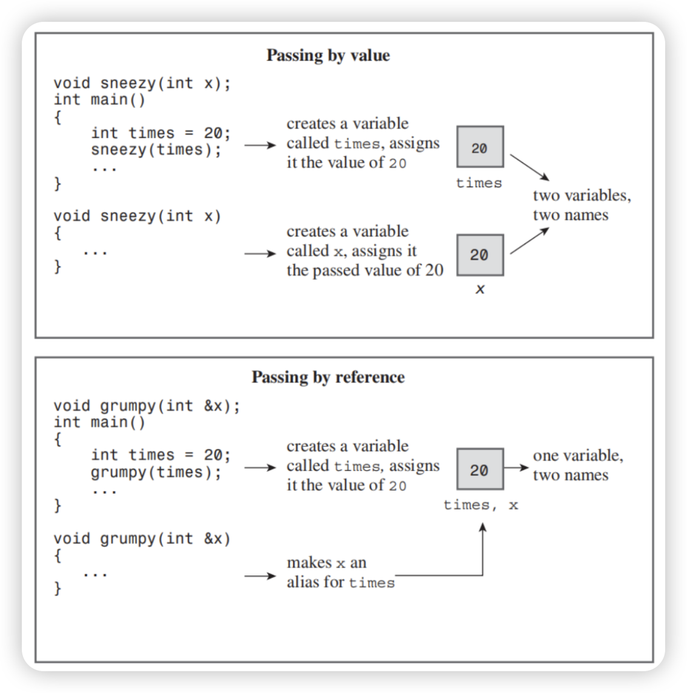

# C++ Basic Course

## Chapter 2 —— Dealing with data

- ***reference***

  ​	C++ adds a new compound type to the language—the reference variable. Cpp reference says "Declares a named variable as a reference, that is, an alias to an already-existing object or function.". Yes, you heard it right, a reference is a name that acts as an alias, or an alternative name, for a previously defined variable. Unlike the alias we walked before, in which they are type alias.

  ​	Of what use is such an alias? Is it to help people who are embarrassed by their choice of variable names? Maybe, but the main use for a reference variable is as a formal argument to a function. If you use a reference as an argument, the function works with the original data instead of with a copy. References provide a convenient alternative to pointers for processing large structures with a function.

  **Creating a Reference Variable**

  ​	You might recall that C and C++ use the & symbol to indicate the address of a variable. C++ assigns an additional meaning to the & symbol and presses it into service for declaring references. For example, to make `rodents` an alternative name for the variable `rats`, you could do the following:

  ```cpp
  int rats;
  int& rodents = rat;	// makes rodents an alias for rats
  ```

  ​	In this context, & is not the address operator. Instead, it serves as part of the type identifier. Just as char * in a declaration means pointer-to-char, int & means reference-to int. The `rats` and `rodents` above have the same value and the same memory. The code below illustrates the truth of this claim.

  ```cpp
  #include <iostream>
  
  int main() {
      int rats = 10;
      int& rodents = rats;
  
      std::cout << "rats    = " << rats    << std::endl
                << "rodents = " << rodents << std::endl
                << std::endl;
  
      ++rodents;
      std::cout << "After ++rodents: "     << std::endl
                << "rats    = " << rats    << std::endl
                << "rodents = " << rodents << std::endl
                << std::endl;
  
      std::cout << "rats address    = " << &rats    << std::endl
                << "rodents address = " << &rodents << std::endl;
  
      return 0;
  }
  ```

  ​	Note that the & operator in the declaration statement *is not* the address operator but declares that rodents is of type int & (that is, it is a reference to an int variable). As you can see, both rats and rodents have the same value and the same address. (The address values and display format vary from system to system.) Incrementing rodents by one affects both variables. More precisely, the rodents++ operation increments a single variable for which there are two names.

  ​	References tend to be a bit confusing at first to C veterans coming to C++ because they are tantalizingly reminiscent of pointers, yet somehow different. For example, you can create both a reference and a pointer to refer to rats:

  ```cpp
  int rats;
  int& rodents = rats;
  int* prats = &rats;
  ```

  ​	Then you could use the expressions rodents and *prats interchangeably with rats and use the expressions &rodents and prats interchangeably with &rats. From this standpoint, a reference looks a lot like a pointer in disguised notation in which the * dereferencing operator is understood implicitly. And, in fact, that’s more or less what a reference is. But there are differences besides those of notation. For one, it is necessary to initialize the reference when you declare it; you can’t declare the reference and then assign it a value later the way you can with a pointer:

  ```cpp
  int rats;
  int& rodents; //  error: 'rodents' declared as reference but not initialized
  ```

  ​	A reference is rather like a const pointer; you have to initialize it when you create it, and when a reference pledges its allegiance to a particular variable, it sticks to its pledge.

  ````cpp
  int& rodents = rats;
  ````

  ​	That is, in essence,a disguised notation for something like this:

  ```cpp
  int* const prats = &rats;
  ```

  ​	Here, the reference rodents plays the same role as the expression *prats.

  ***References as Function Parameters***

  ​	Most often, references are used as function parameters, making a variable name in a function an alias for a variable in the calling program. This method of passing arguments is called *passing by reference*. Passing by reference allows a called function to access variables in the calling function. C++’s addition of the feature is a break from C, which only passes by value. Passing by value, recall results in the called function working with copies of values from the calling program.

  

  ​	Looking back at the functions we initially provided, you should now have a basic understanding, but there are two points to add:

  1. The compiler cannot distinguish between versions of overloaded functions with parameters as regular variables and parameters as references of the same type.

  2. When using a reference as a return value for a function, you must adhere to the following rules:

     - You cannot return a reference to a local variable. The main reason is that local variables are destroyed after the function returns, making the returned reference a "dangling reference," similar to a wild pointer, causing the program to enter an undefined state.
     - You cannot return a reference to memory allocated by `new` inside the function. While there is no issue of local variables being destructed, in this case, you face other awkward situations. For example, if the reference returned by the function only appears as a temporary variable and is not assigned to an actual variable, then the space it points to (allocated by `new`) cannot be released, resulting in a memory leak.
     - You can return a reference to a class member, but it's preferable to make it `const` to avoid accidentally modifying the class's members.
     
     ```cpp
     #include <iostream>
     
     int& foo(int a) {return a;}
     
     int main() {
         int a = 1;
         int b = foo(a);
     
         std::cout << b;
         return 0;
     }
     ---------------------------------------------------
     warning: reference to local variable 'a' returned [-Wreturn-local-addr]
      int& foo(int a) {return a;}
               ~~~~^
     ```
     
     ​	Regarding references, there are also more specialized topics like rvalue references, which we won't delve into here. If you're interested, you can explore this concept on your own.

- ***enum***

  ​	The C++ enum facility provides an alternative to const for creating symbolic constants. It also lets you define new types but in a fairly restricted fashion.

  ```cpp
  enum Color {RED, ORANGE, YELLOW, GREEN, BLUE, INDIGO, VIOLET};
  ```

  ​	This statement does two things:

  - It makes `Color` the name of a new type; `Color` is termed an *enumeration*.

  - It establishes red, orange, yellow, and so on, as symbolic constants for the integer values 0–7. These constants are called *enumerators*.

  	By default, enumerators are assigned integer values starting with 0 for the first enumerator, 1 for the second enumerator, and so forth. You can override the default by explicitly assigning integer values. We'll talk about that later.

  	You can use an enumeration name to declare a variable of the enumeration type:

  ```cpp
  Color cc; // cc a variable of type spectrum
  ```

  ​	An enumeration variable has some special properties, which we’ll examine now. The only valid values that you can assign to an enumeration variable without a type cast are the enumerator values used in defining the type. Thus, we have the following:

  ```cpp
  cc = blue; // valid, blue is an enumerator
  cc = 2000; // invalid, 2000 not an enumerator
  ```

  ​	Thus,a spectrum variable is limited to just eight possible values. Some compilers issue a compiler error if you attempt to assign an invalid value, whereas others issue a warning. For maximum portability, you should regard assigning a non-enum value to an enum variable as an error. 

  ​	Only the assignment operator is defined for enumerations. In particular, arithmetic operations are not defined:

  ```cpp
  cc = orange; 		// valid
  ++cc; 				// not valid
  cc = orange + red; 	// not valid, but a little tricky
  ```

  ​	Enumerators are of integer type and can be promoted to type int, but int types are not converted automatically to the enumeration type:

  ```cpp
  int color = blue; 	// valid, spectrum type promoted to int
  cc = 3; 			// invalid, int not converted to spectrum
  color = 3 + red;	// valid, red converted to int
  ```

  ​	You can assign an int value to an enum, provided that the value is valid and that you use an explicit type cast:

  ```cpp
  cc = spectrum(3); // typecast 3 to type spectrum
  ```

  ​	What if you try to type cast an inappropriate value? The result is undefined, meaning that the attempt won’t be flagged as an error but that you can’t rely on the value of the result:

  ```cpp
  cc = spectrum(40003); // undefined
  ```

  ​	As you can see, the rules governing enumerations are fairly restrictive. In practice, enumerations are used more often as a way of defining related symbolic constants than as a means of defining new types. 

  ​	For example, you might use an enumeration to define symbolic constants for a switch statement. (See Chapter 6, “Branching Statements and Logical Operators,” for an example.) If you plan to use just the constants and not create variables of the enumeration type, you can omit an enumeration type name, as in this example:

  ```cpp
  enum {RED, ORANGE, YELLOW, GREEN, BLUE, INDIGO, VIOLET};
  ```

  ***Setting Enumerator Values***

  ​	You can set enumerator values explicitly by using the assignment operator:

  ```cpp
  enum bits{one = 1, two = 2, four = 4, eight = 8};
  ```

  ​	The assigned values must be integers.You also can define just some of the enumerators explicitly:

  ```cpp
  enum bigstep{first, second = 100, third};
  ```

  ​	In this case, first is 0 by default. Subsequent uninitialized enumerators are larger by one than their predecessors. So, third would have the value 101.

  ​	Finally, you can create more than one enumerator with the same value:

  ```cpp
  enum {zero, null = 0, one, numero_uno = 1};
  ```

  ​	Here, both zero and null are 0,and both one and numero_uno are 1. In earlier versions of C++, you could assign only int values (or values that promote to int) to enumerators, but that restriction has been removed so that you can use type long or even long long values.

  

  ***Value Ranges for Enumerations***

  ​	Originally, the only valid values for an enumeration were those named in the declaration. However, C++ has expanded the list of valid values that can be assigned to an enumeration variable through the use of a type cast. Each enumeration has a *range*,and you can assign any integer value in the range, even if it’s not an enumerator value, by using a type cast to an enumeration variable. 

  ​	For example, suppose that bits and myflag are defined this way:

  ```cpp
  enum bits{one = 1, two = 2, four = 4, eight = 8};
  
  bits myflag;
  ```

  ​	In this case, the following is valid:

  ```cpp
  myflag = bits(6); // valid, because 6 is in bits range
  ```

  ​	Here 6 is not one of the enumerations, but it lies in the range the enumerations define.

  ​	The range is defined as follows. First, to find the upper limit, you take the largest enumerator value. Then you find the smallest power of two greater than this largest value and subtract one; the result is the upper end of the range. 

  

- ***union***

  ​	A *union* is a data format that can hold different data types but only one type at a time. That is, whereas a structure can hold, say, an int *and* a long *and* a double, a union can hold an int *or* a long *or* a double. For example, consider the following declaration:

  ```cpp
  union one4all
  {
  int int_val;
  long long_val;
  double double_val;
  };
  ```

  ​	You can use a one4all variable to hold an int, a long, or a double, just as long as you do so at different times:

  ```cpp
  one4all pail;
  pail.int_val = 15; 		// store an int
  cout << pail.int_val;
  pail.double_val = 1.38; // store a double, int value is lost
  cout << pail.double_val;
  ```

  ​	Thus,  pail can serve as an int variable on one occasion and as a double variable at another time. The member name identifies the capacity in which the variable is acting. Because a union holds only one value at a time, it has to have space enough to hold its largest member. Hence, the size of the union is the size of its largest member.

  ​	One use for a union is to save space when a data item can use two or more formats but never simultaneously.

  ​	Unions often (but not exclusively) are used to save memory space. That may not seem that necessary in these days of gigabytes of RAM and terabytes of storage, but not all C++ programs are written for such systems. C++ also is used for embedded systems, such as the processors used to control a toaster oven, an MP3 player, or a Mars rover. In these applications space may be at a premium. Also, unions often are used when working with operating systems or hardware data structures.