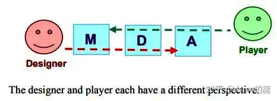

> 长文预警！！！另外其实笔者并不咋会做笔记，基本可以看作翻译和吐槽......

## Chapter 1 Thinking Like a Designers
​	本章首先以Bartok游戏为例，简单讲解如何设计并迭代一个游戏，其实应该说讲的是如何迭代一个经过基本设计的游戏。

### Playtesting

​	首先要做的事就是试玩上几轮， "to get a feel for it"。如果你想玩Bartok的网页版本，可以访问 https://book.prototools.net/BartokWebBuild/BartokWebBuild.html。

### Analysis: Asking the Right Question

​	在每次试玩之后，问自己正确的问题很重要，不同游戏自然问题不同，但一般都基于以下几个 general guidelines：

- **Is the game of the appropriate difficulty for the intended audience?** 
  
  ​	对目标受众而言难度是否合适？是否会太困难或太简单，还是刚刚好？
  
- **Is the outcome of the game based more on strategy or chance?** 
  
  ​	这个游戏的结果更吃运气还是更看重策略？随机因素作用是否会太强？或者游戏决定性太强，一名玩家领先后其他玩家根本没机会赶上？
  
- **Does the game have meaningful, interesting decisions?** 
  
  ​	游戏是否有有意义且有趣的决策？到你的回合时，你是否有多个选择，且在这些选择之间做决定会是有趣的事吗？
  
  ​	("When it's your turn, do you have several choices, and is the decision between those choices an interesting one?"）
  
- **Is the game interesting when it's not your turn?**
  
  ​	你是否能影响其他玩家的回合？或者其他玩家回合能否对你产生立即影响？
  
  ​	我们还能问出许多其他问题，但是这几个是最常见的。

### Modifying the Rules

​	正如你会在这整本书里看到的，从过程的角度来看游戏设计十分简单，几乎就总是：

1. 逐渐修改规则，每次测试后只修改很小一部分
2. 用新规则游玩测试游戏
3. 分析新规则之下游戏的feel如何改变
4. 设计你认为能让游戏的feel往你想要的方向进行移动的新规则
5. 重复这个过程直到你满意

​	以上这个重复的过程，术语为“迭代设计（Iterative Design）”。对于Bartok的例子，你可以从以下三个规则改动当中挑一个来开始游玩测试：

- **Rule 1**: 如果一个玩家打出了2，那么ta左边的玩家不得出牌，且必须抽取两张牌

- **Rule 2:** 如果一个玩家的某张牌的颜色和数字都能对的上此时目标牌，那么可以无视顺序随时打出此牌并大喊 "**Match Card!**"，随后游戏从该玩家的下一位玩家继续。此规则可用来强行跳过某些玩家的回合。

- **Rule 3**: 如果某名玩家只剩最后一张手牌，那么需要立刻宣布 "**Last Card**"，如果被其他玩家先宣布，那么需要罚抽两张牌。

### Analysis: Comparing the Rounds

​	在你游玩过不同规则选项的游戏之后，分析每一轮的结果，回看你的笔记去看不同的规则是如何改变游戏的感觉的。你或许能体验到即使是简单的规则改变也能够很大程度地改变游戏的感觉。书中列出了Bartok在不同规则下的场景反馈，在此简单列出来：

- **The original rules** 有些无聊，没有什么有趣的选择，游戏越到后面就越经常只有一个选择。游戏很靠运气，玩家不需要很在意其他玩家的回合，也没办法影响到其他玩家。

- **Rule 1** 增加了游戏的趣味性，允许玩家直接影响其他人。

- **Rule 2** 对玩家注意力影响很大，因为所有玩家都有机会中断其他玩家的回合，玩家们会更加其他玩家的回合，增加了紧张刺激感，更能吸引玩家。

- **Rule 3** 这条规则只在游戏可能快要结束时生效，不会影响游戏主进程，但仍会影响玩家在此时的行为。这条规则将引入一种有趣的紧张感，当某个玩家即将只剩一张牌时其他玩家将会想办法抢先说出"Last Card"（"try to jump in and say"）。这是多米诺和纸牌游戏的常见规则，当玩家正尝试清空手牌而忘记了这条规则，这就让其他玩家有机会赶上领先的玩家。

## Chapter 2 Game Analysis Framework 

​	首先学一个 “fancy word”，**ludology**，这是给 study of games and game design 取的 “fancy name”。它的词源是 "From the Latin ludus (“game”) +‎ -ology. May also be construed as ludo +‎ -ology, although the prefix ludo- apparently derives from this word." 
### Common Frameworks for Ludology

​	本章将要介绍的框架如下：

- **Mechanics, Dynamics, and Aesthetics (MDA)**

  ​	由 Robin Hunicke, Marc Lebranc 和 Robert Zubek 首次提出，MDA 分别代表 Mechanics（机制）, Dynamics（动态）和 Aesthetics（美学），最为业内设计师所熟知。

- **Formal, Dramatic, and Dynamic elements (FDD)**

  ​	由 Tracy Fullerton 和 Chris Swain 在 Game Design Workshop（游戏设计梦工厂）一书中提出。FDD 与电影学有着千丝万缕的联系。

- **Elemental tetrad（四元法）**
  
  ​	由 Jesse Schell 在他的 The Art of Game Design（游戏设计艺术）一书中提出，将游戏分为四个核心元素：
  
  ​	mechanics（机制）, aesthetics（美学）, story（剧情）和 technology（技术）。
  
  ​	每个框架都有优缺点，他们共同促成了本书所述的 Layered Tetrad（分层四元法）。

#### MDA: Mechanics, Dynamics, and Aesthetics

​	MDA的核心元素是 mechanics, dynamics, and aesthetics 的定义、设计师和玩家看待游戏的不同视角的理解，并且提出设计师应当首先通过美学的视角来接近游戏，再回过头来处理能够产生这些美学的动态和机制。

##### Definitions of Mechanics, Dynamics, and Aesthetics

​	需要注意的是上面提到的几个框架有一些共同的名词，但是它们的定义不尽相同，甚至会完全不同。

​	以下为MDA的定义：

- **Mechanics**

  ​	游戏在数据表示和算法层次的特定组件，包括游戏规则和玩家交互的设计方面。 （第一句话中文版第一版翻译的是“游戏的数据层面上的组件和算法”，但是英文版第三版原文为 “The particular components of the game at the level of data representation and algorithms.”，原论文表述为 “Mechanics describes the particular components of the game, at the level of data representation and algorithms.”，英文版 wiki 介绍为“Mechanics are the base components of the game - its rules, every basic action the player can take in the game, the algorithms and data structures in the game engine etc.”，中文版 wiki 为“机制，指游戏的基础部分 - 规则。在游戏中玩家可执行的每个基本动作、以及游戏编程、游戏引擎中的算法算法和数据结构等等。”，故可基本认定为中文版第一版翻译错误。）

- **Dynamics**

  ​	响应玩家输入以及其他输出的机制的运行时表现，会随着时间变化，包括所有在游戏时由于机制而发生的实际操作。 （先给大家看原文第一句“The runtime behavior of the mechanics acting on player inputs and each other’s outputs over time. ”， btw，这句话基本上和论文原文一致。中文版第一版翻译为“相应玩家输入和其他输出的实时行为”，这个翻译我认为不好，并没有体现mechanics和dynamics的联系。所以我觉得翻译的不好！）

- **Aesthetics**

  ​	玩家在与游戏系统交互时（设计师）期望（玩家）唤起的情感响应。在MDA框架中，玩家在游玩游戏时和结束游戏后的感受都属于美学。

> 在第一版中，以上三点都只有从论文中摘抄下来的部分，也就是只有第一句，故中文版第一版也只翻译了第一句。（我说这翻译怎么都只翻译一半）

​	MDA对美学的定义是很独特的，没有其他的框架会如此定义。美学通常指的是哲学上的一个分支，和美、丑等概念有关。而更通俗地说，设计美学（design aesthetic）是设计的一种统一意图。（讲道理，我觉得这并不“colloquially”，因为其实我并没有看懂，还是 po 出原文吧"And, more colloquially, a design aesthetic is the cohesive intent of a design."）

##### Designer and Player Views of a Game

​	基于 MDA，设计者应该首先从美学视角看待游戏，考虑游玩时要给玩家如何的情感体验。再回过头寻找能够产生那些情感的动态，再最终寻找能够创造这些动态的机制。而玩家倾向于以一个相反的方向看待游戏，首先体验到游戏的机制（经常是通过阅读游戏规则），然后在游玩中体验到动态，最后（希望）体验到设计师一开始预想的美学。

##### Design from Aesthetics to Dynamics to Mechanics

​	书中以Snakes and Ladders为例（想必这个游戏的规则不用再介绍），体现了设计师是如何通过修改机制影响动态和美学的。

​	原始版本的游戏被设计成让孩子们感觉良好并且始终有赢的可能，玩家必须能感觉到游戏的结局不是固定的，在游戏过程中始终可以寄希望于好运气。期望的美学是让玩家体验希望、好运的逆转还有完全不做决定的刺激。实现此的机制就是蛇和梯子，而动态就是两者的交汇，产生在玩家与机制遭遇之时，带来了希望和刺激的美学感觉。	

​	但成年人更倾向更具有挑战性的游戏，他们不希望靠运气而是使用策略来赢得游戏。因此设计师希望让游戏感觉更策略化和目的化，我们可以通过仅修改规则（机制的元素之一）来达成这样的美学改变。比如说加入以下规则：

- 每个玩家控制两枚棋子
- 每个回合，玩家掷两枚骰子
- 可以两枚骰子都给一个棋子用，或者一个棋子一枚骰子
- 可以选择牺牲一枚骰子，然后用另一枚骰子来逆向移动对手的棋子
- 如果玩家的棋子行进后遇到对手的棋子，那么可将对手棋子下移一行
- 如果玩家的棋子行进后遇到自己的棋子，那么可选择自己的一个棋子上移一行
- 规则4、5让玩家之间相互协作或对抗，规则1、3让游戏减少运气的影响，都增加了游戏的策略性。

#### Formal, Dramatic, and Dynamic Elements

​	当 MDA 在试图帮助设计师和评论家更好地理解和讨论游戏时，由 Tracy Fullerton 和 Chris Swain 创建的 FDD 旨在帮助 USC 的 Game Design Workshop 课程的学生更效率地设计游戏。

​	这个框架将游戏拆解成三类元素：

- **Formal elements**

  ​	将游戏从其它类型的媒体或交互区分开来的元素，提供了游戏的结构。形式元素包括规则、资源和边界等。

- **Dramatic elements**

  ​	游戏的剧情和叙事，包括前提剧情/故事背景/背景设定（就是 premise，不知道怎么翻更确切）。戏剧元素将游戏连结在一起（tie the game together），帮助玩家理解规则，并鼓励玩家对游戏的结果产生情感投入（encourage the player to become emotionally invested in the outcome of the game）。

- **Dynamic elements**

  ​	游戏的动态过程（the game in motion）。当玩家将规则转变为实际的游玩时，游戏就进入了动态元素阶段。动态元素包括策略、行为和游戏实体间的联系等。需要注意的是，这和 MDA 中使用的 dynamics 术语有关联但范围更广，因为它不仅仅是机制的运行时表现（，还包括比如策略、行为和游戏实体间的联系等）。

##### Formal Elements

​	Game Design Workshop提出了将游戏和其他种类媒体区分开来的七种形式元素：

- **Player interaction pattern**
  
  ​	玩家如何交互？

  ​	游戏是单人、一对一、队伍对抗、乱斗（多个玩家相互对抗）、一对多、合作甚至是多人对抗一个系统？
  
- **Objective**
  
  ​	玩家在游戏中试图得到什么？如何赢下游戏？

  ​	（What are the players trying to achieve in the game? When has someone won the game?）
  
- **Rules**
  
  ​	规则通过告诉玩家能做什么不能做什么来限制玩家的行为。

  ​	许多规则明确写在游戏中，但有些 implicitly understood by all players（相当于默认规则/共识，比如尽管大富翁中没有明确写出不能抢银行，但玩家也明白不能。）
  
- **Procedures**
  
  ​	玩家在游戏中采取的行动类型。

  ​	Snakes and Ladders 中的规则告诉你投骰子并移动对应格数。这个规则所指明的过程（procedure）就是投骰子和移动棋子。过程由一系列规则的相互作用所定义（Procedures is defined by the interaction of a number of rules.）。但有一些仍在规则之外：尽管 Poker 中没有明确定义相关规则，但是虚张声势仍是游戏中一个重要的过程。
  
- **Resources**
  
  ​	资源是游戏中有价值的各种元素。

  ​	比如金钱、生命值、物品和财产等。
  
- **Boundaries**
  
  ​	游戏和现实的界限在哪？（Where does the game end and reality begin?）

  ​	Johan Huizinga 在他的书 Homo Ludens 中定义了 magic circle，这是个由游戏规则取代现实规则的临时世界（defines the magic circle as a temporary world where the rules of the game apply rather than the rules of the ordinary world）。在足球和冰球等运动中，magic circle 有场地的边界定义；但在 I Love Bee 这样的另类实境游戏（Alternative Reality Game）中，边界远不那么清晰。
  
- **Outcome**
  
  ​	游戏如何结束？在游戏中既有最终结果也有过程性结果。
  
  ​	（中文版第一版翻译为”除了终点，过程也不断导向结局“，原文为 "There are both final and incremental outcomes in games"，但根据后续内容，以及作者在书的官方网站所放出的 PPT ，作者要表达的应该是有 ”final“ 和 ”incremental“ 这两种 outcome，而不是什么都导向结局）在棋类游戏中，最终结果是一个玩家赢，另一个玩家输（显然作者忘了有和棋规则的说...）。在 D&D 这样的纸笔 RPG（"pen-and-paper RPG", AKA "tabletop RPG"）中，过程性结果是当玩家击败一个敌人或者提升了等级，甚至死亡通常都不是最终结果，因为还有方法来复活玩家。

​	根据 Fullerton 的理论，对形式元素的另一种看法是，当这些元素被移除时，游戏就不复存在了。如果从游戏中移除规则、结果等，它就不再是个游戏。（再次拷打中文版翻译，中文第一版翻译为”根据 Fullerton 的理论，另一种审视形式元素的看法是，尝试移除任意一种规则，看看它是否还称得上游戏“，原文为 "According to Fullerton, another way to look at formal elements is that game ceases to exist when they are removed. If one removes the rules, outcome and so on from a game, it ceases to be a game."，你就说说这翻译的什么东西？）

##### Dramatic Elements

​	戏剧元素帮助玩家更好地理解规则和资源，并且给予玩家在游戏中更强的情感投入。

​	Fullerton 提出了三种戏剧元素：

- **Premise**
  
  ​	游戏世界的基础故事（或者背景故事？"The basic story of the game world"）。

  ​	其为游戏叙事构建的基础。（The premise forms the basis around which the rest of the game's narrative is built.）
  
- **Character**
  
  ​	角色是故事围绕的个体（Characters are the individuals around whom the story revolves.）
  （依旧拷打中文版翻译：“角色是故事里的人物”，很明显作者指的是玩家扮演的角色啊，某个小支线里面的小NPC 也是故事里的人物，ta 难道也是 Fullerton 说的 Character 吗？），有的像 Quake 中的无名、定义不清、沉默的第一人称主角，也有的像 Uncharted 系列的 Nathan Drake 这样深刻且多维的角色，就像电影里的主角。
  
  ​	与电影不同，电影导演的目标鼓励观众与电影主角产生共鸣，但是在游戏中玩家就是主角，设计师必须选择主角是作为玩家的化身（avatar）（将玩家的情感、欲望和意图传递到游戏世界，并且遵循玩家的意愿），或者是作为玩家必须扮演的角色（role）（这样，相反地，玩家表现出游戏角色的意愿）。后者是最常见的，也是对写手和开发者来说更容易实现的。
  
- **Story**
  
  ​	游戏的情节。
  
  ​	故事包含整个游戏过程的的叙事内容。前提（premise）为故事的发生搭建了舞台。

​	戏剧元素的一个未被以上三种元素明确提及的主要目的是：**帮助玩家更好地理解规则**。

​	比如 1943 年 Milton Bradley 在美国出版 Snakes and Ladders 时将名字改成了 Chutes and Ladders，也许就是为了让美国儿童更容易理解规则，因为 Chutes 比 Snakes 更加直观。除此之外游戏的许多版本还有一张图片，图片上面的孩子在梯子底部做好事，在梯子底部得到奖励。相反，滑梯则是孩子在顶部犯错，在底部被惩罚。如此一来，叙事便与道德标准相结合起来。

​	戏剧元素兼具**嵌入叙事**（**embedded narrative**），**帮助玩家记忆规则**（比如将蛇换成梯子）和游戏叙事**向玩家传递游戏之外持续存在的意义的能力**（比如用图片表示行善作恶的后果）（这里感觉我翻的怪怪的，我认为大概意思是在说游戏叙事可以超脱游戏，给玩家传递来自游戏之外/超越游戏本身的意义，英文原文为"the ability of the game narrative to convey meaning to the players that persists outside of the game"，中文版翻译为“传达游戏叙事超越游戏本身的能力”）

##### Dynamic Elements

​	动态元素是指那些只在游戏被游玩后出现的东西（Dynamic are those that occur only when the game is being played）。

要理解游戏中的动态元素，有以下几个要点：

- **Emergence**
  
  ​	看似简单的规则的碰撞可以导致不可预料的结果。

  ​	哪怕是简单如 Snakes and Ladders 的游戏也会带来难以预料的动态体验。如果一个玩家整局游戏都恰好碰到梯子，而另一位玩家一直碰到蛇，那么带来的体验就完全不同。简单的规则会导致复杂并且难以预料的行为，游戏设计师的一个最重要的工作就是尝试理解游戏规则的涌现影响。（One of a game designer's most important jobs is to attempt to understand the emergent implications of the rules in a game.）
  
- **Emergent narrative**
  
  ​	除了MDA模型所提到的机制的动态行为之外，Fullerton的模型还指出叙事也可以是动态的，因为游戏玩法本身就能涌现出十分宽广的叙事。

  ​	游戏的天性就会将玩家置入非寻常的情境中，并且将因此引导产生有趣的故事。这是桌上 RPG 比如 D&D 的核心魅力，由一个玩家扮演 DM，给其他玩家创造体验的场景和交互的角色。这与 Fullerton 的戏剧元素提到的嵌入叙事（embedded narrative）不同，并且是互动体验独有的娱乐可能之一。
  
- **Playtesting is the only way to understand dynamics**
  
  ​	有经验的游戏设计师相比新人设计师能对动态行为和涌现做出更准确的预测，但是没人能不试玩却能清楚的理解游戏的动态会如何运行（but no one understands exactly how the dynamics of a game will play out without playtesting them.）。
  
  ​	重复试玩可以揭示游戏本来应该具有的各种动态行为，并且帮助设计师理解他们的游戏可能产生的体验范围。（大概就是都会玩出怎么样的体验）

#### The Elemental Tetrad

​	Jesse Schell 在书 The Art of Game Design: A book of Lenses 中描述了四元法，提出了他认为的游戏的四个基本元素：

- **Mechanics**
  
  ​	玩家和游戏交互的规则。

  ​	四元法中的机制是指将游戏和其他非互动形式媒体（如电影或书）区分开来的元素（和 FDD 的 formal elements很像）。机制包括规则、目标和其他 Fullerton 提到的形式元素。和 MDA 中提到的机制不同，Schell 用此术语来区别游戏机制和实现它们的技术。
  
- **Aesthetics**
  
  ​	美学描述了游戏如何被五感接受：视觉、听觉、嗅觉、味觉和触觉。

  ​	美学涵盖从原声带到人物模型、包装和封面艺术。这与 MDA 的美学不同，Schell 指的是那些由游戏开发者创造出来的东西，比如游戏艺术和声音。
  
- **Technology**
  
  ​	这个元素包括所有让游戏运作起来的根本技术（This element covers all the underlying technology that makes the game work.）。除了主机硬件、计算机软件等，还包括桌游中的技术元素，比如骰子的类型和数字、各种用来决定行动结局的表格等。
  
- **Story**
  
  ​	Schell 用这个表达 Fullerton 的全部戏剧元素，不仅仅她提到的 story。在 Schell 的定义中，剧情包含所有游戏中的叙事元素，包括前提和角色。

​	上图展示了四元法的四个元素如何相互关联。Schell 指出美学对玩家总是可见的（不是 MDA 的美学喔！）。游戏的技术是最不可见的，相比起来，玩家通常对游戏机制有更好的理解。Schell 的四元法并不涉及游戏的动态玩法，更多在于盒子里的（桌游）或硬盘里的游戏的静态元素。Schell 的四元法将在下一张更深入的探讨和拓展，因为它激发了分层四元法的四个元素。

### Summary

​	每个这些用来理解游戏和交互艺术的框架都从不同的视角来解读：

- **MDA** 旨在展示并具体化这样一个观点：玩家和设计师从不同的方向接近游戏，并且提出设计师可以通过学习从玩家体验的角度来看待他们的游戏来更有效地进行游戏设计。

- **FDD** 框架将游戏设计分解成可以分别考虑和改进的特定组件。它旨在成为设计师的toolkit，是设计师能够分离并检查游戏中所有可以被改进的组件。FDD还强调了叙事在玩家体验中的重要性。

- **四元法**更多用游戏开发者的视角来看待游戏。它将游戏的基本元素分为通常分配给开发团队不同组的部分：游戏设计师负责机制、艺术家负责美学、写手负责故事、程序员负责技术。