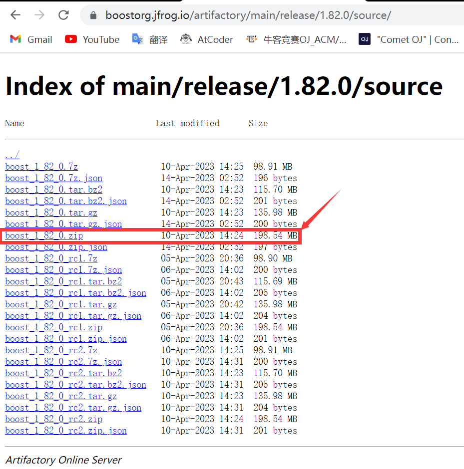
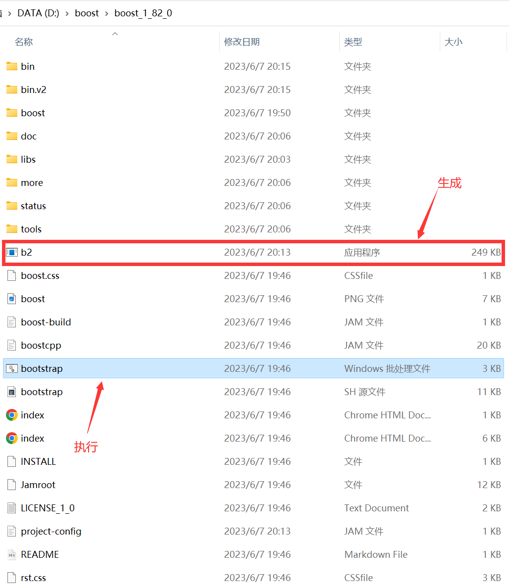
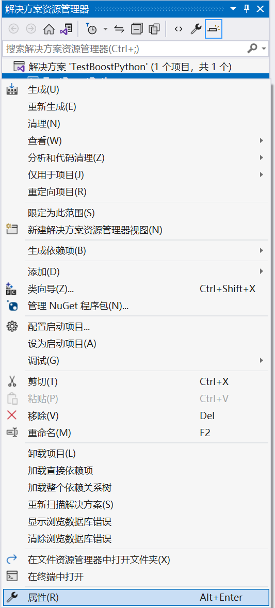
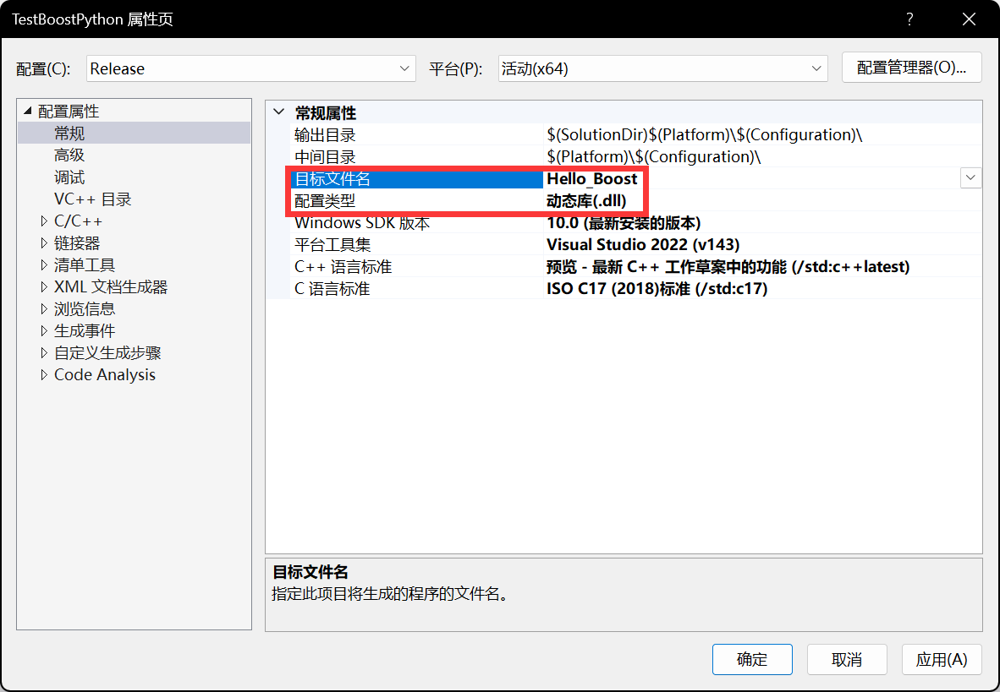
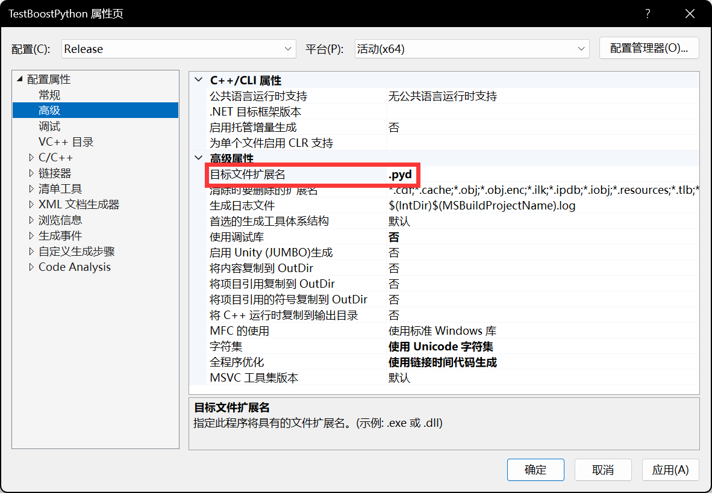
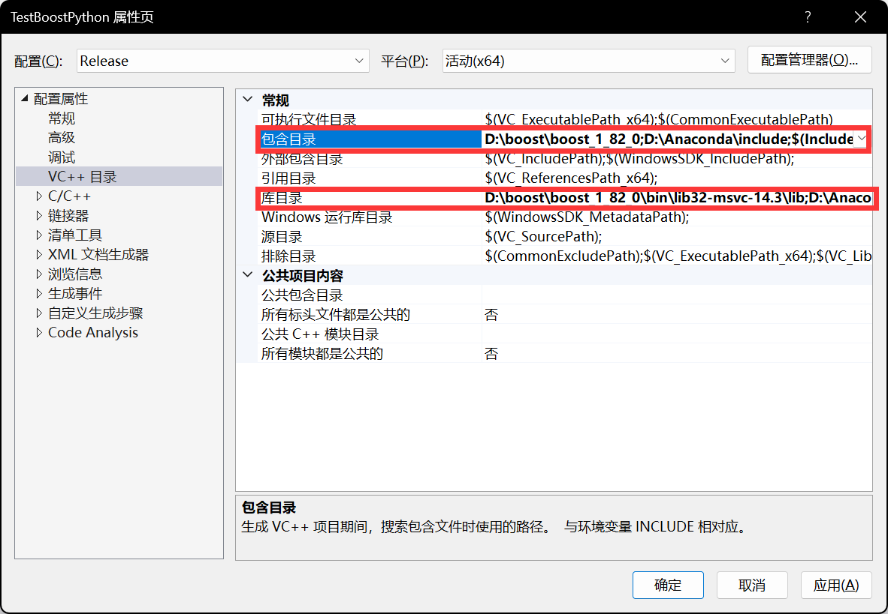
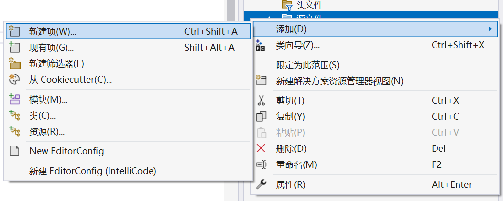
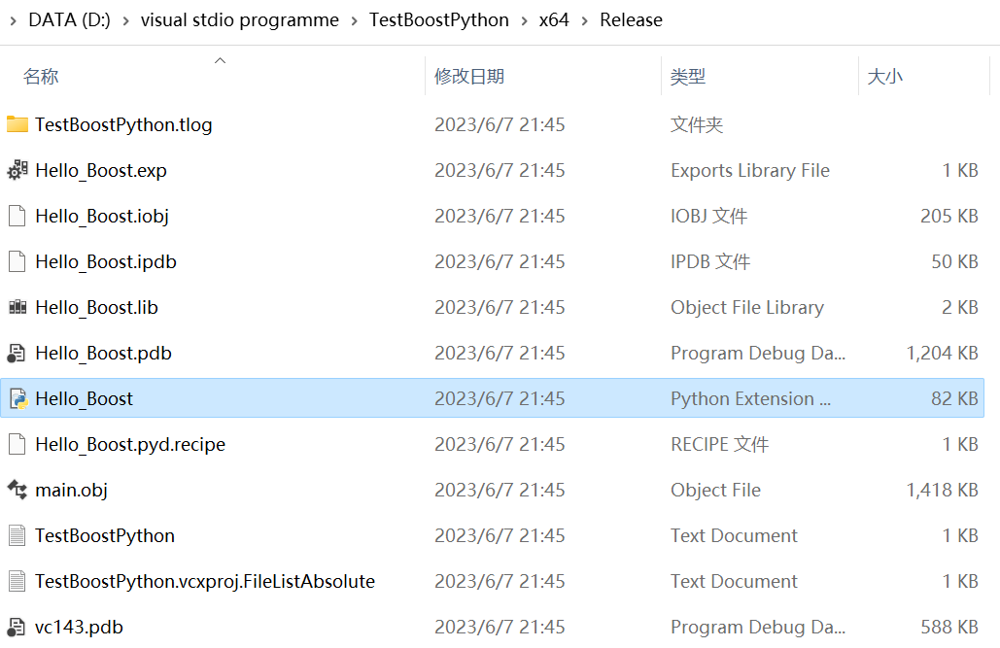
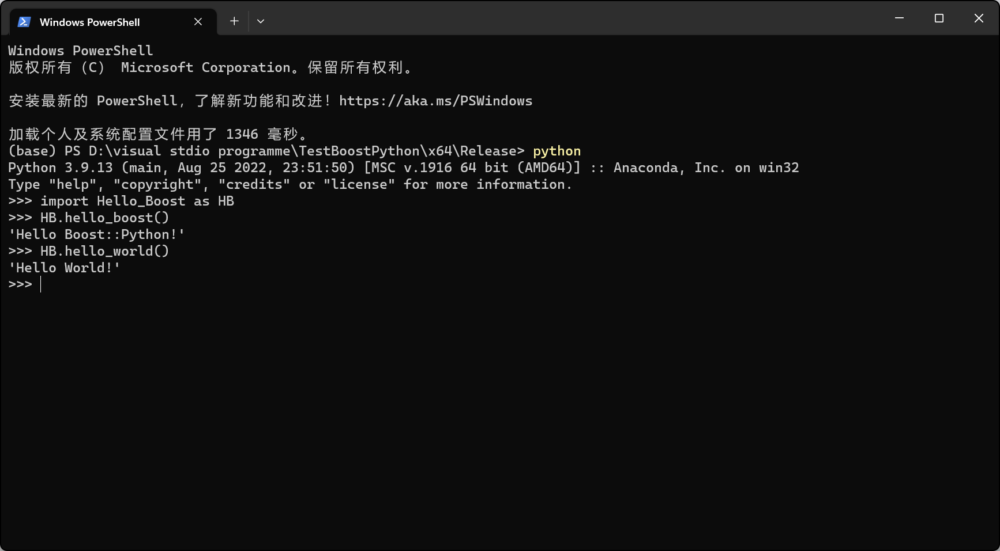

# 环境

笔者的环境是：

1. Windows 11 64 bit
2. Anaconda Python 3.9 64 bit
3. Visual Studio 2022 Community Edition version 17.6.2 (msvc v14.3)
4. Boost 1.82 

# 下载并编译

## 下载

​        官网下载地址为 [https://boostorg.jfrog.io/artifactory/main/release/1.82.0/source/](https://boostorg.jfrog.io/artifactory/main/release/1.82.0/source/)，截至此博客发布时最新版本为1.82。笔者下载的版本是 boost_1_82_0.zip

​		下载并解压后，执行 ```booststrap.bat```，会发现文件夹中多了一个 ```b2.exe```，这是一个编译工具。接下来我们进入编译工作。

### 配置 user_config.jam

​		你可以在 ```\\tool\\build\\example\\user-config.jam```看到模板，将其做如下修改：

```
...
# Configure msvc (default version, searched for in standard locations and PATH).
# using msvc : 14.3;
...
# Configure specific Python version.
# using python  : 3.9
                : "D:\Anaconda\python.exe"
                : "D:\Anaconda\include"
                : "D:\Anaconda\libs";
```

如果你不确定你的 **msvc** 版本，可以参考 [https://en.wikipedia.org/wiki/Microsoft_Visual_C++](https://en.wikipedia.org/wiki/Microsoft_Visual_C++)，***using python*** 使用自己的配置。修改好后将文件复制到 ```C:\\users\\youUserName\\``` 即可。

## 编译

​		我们通过命令行使用 ```b2.exe``` 进行编译，笔者使用的命令是

```bash
./b2.exe --with-python stage --stagedir="./bin/lib64-msvc-14.3" link=static address-model=64
```

### b2部分命令行参数说明

* ```--with``` 后面接的是需要编译的库，而 ```--with-python``` 则说明只编译 ```Boost::Python```。
* `install` | ```stage``` ```stage``` 即只生成库，而 `install` 还会生成 `include` 目录。通过 `--prefix="libPath"` 指定 `instalSl` 生成好的库的路径为 `"libPath"`。如果是 `stage` 则由 `--stagedir=` 来指定。
* `link` 即指定编译为动态库还是静态库 ( `.dll | .lib` )，`shared` 即编译为动态库，`static` 即为静态库，不填则默认编译为静态库。
* ```address-model``` 指定是编译为32位还是64位。

​		编译完成后，可以在 ```\\bin\\lib64-msvc-14.3\\lib\\``` 下看到四个文件，

```
libboost_numpy39-vc143-mt-gd-x64-1_82.lib
libboost_numpy39-vc143-mt-x64-1_82.lib
libboost_python39-vc143-mt-gd-x64-1_82.lib
libboost_python39-vc143-mt-x64-1_82.lib
```

其中，python 和 numpy 各 2 个，带 `gd` 的对应 ```debug``` 版本，反之对应``` release``` 版本。

# 配置Visual Studio

​		首先建立一个空项目，这一部分就不赘述了，然后打开项目属性：

> * 在***常规***中给**目标文件名**取一个名字，并***务必记住他***。
>
> * 在***高级***中将**目标文件后缀名**设置为 ***.pyd*** 。
>
> * 配置***包含目录***，包含boost目录和python目录，我的配置是
>
>   ```
>   D:\\boost\\boost_1_82_0\\
>   D:\\Anaconda\\include\\
>   ```
>
>   * 配置***库目录***，包含boost库目录和python库目录，我的配置是
>
>   ```
>    D:\\boost\\boost_1_82_0\\bin\\lib64-msvc-14.3\\lib\\
>   D:\\Anaconda\\libs\\
>   ```
> 









# 测试

## 编写 C++文件

​		不多说了，直接上文件！

```c++
// File : main.cpp
// 不在 #include <boost/python/...> 之前加上下面的宏定义的话
// 编译器会默认使用 Boost::Python 的动态链接库
#define BOOST_PYTHON_STATIC_LIB

#include <boost/python/module.hpp>
#include <boost/python/def.hpp>


const char* hello_boost() {
    return "Hello Boost::Python!";
}

const char* hello_world() {
    return "Hello World!";
}


// 此处 Hello_Boost 应该与之前设置的目标文件扩展名一致
// 否则想知道后果的话请自行尝试 ╮(╯▽╰)╭
BOOST_PYTHON_MODULE(Hello_Boost) {
    using namespace boost::python;
    def("hello_boost", hello_boost);
    def("hello_world", hello_world);
}
```

### 小提示

​		记得源代码要右键源代码然后添加啊不然就会像我一样以为没配置好环境一直再搞啊啊啊！！！



## Python测试

​		如果你执行的是 ```release```，进入目录 ```file2project\\x64\\release\\```，否则进入 ```file2project\\x64\\debug\\```，你能看到一个文件 ```Hello_Boost.pyd```，这就是刚才的 C++ 源代码生成的 Python 模块。



​		我们 ```open in terminal```，进入 Python，检测 ```import``` 及函数调用是否正常



如果到这一步都没有问题！那就应该没有问题了！写你的代码去吧！

# 特别鸣谢

## 参考博客（排名不分先后，如有侵权请联系我！）

> https://zhuanlan.zhihu.com/p/60215378
>
> https://blog.csdn.net/HaleyPKU/article/details/82911669
