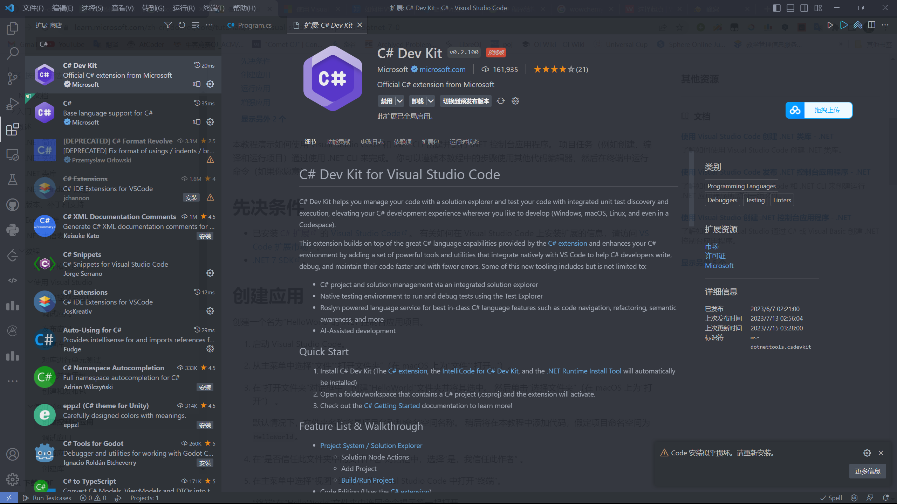
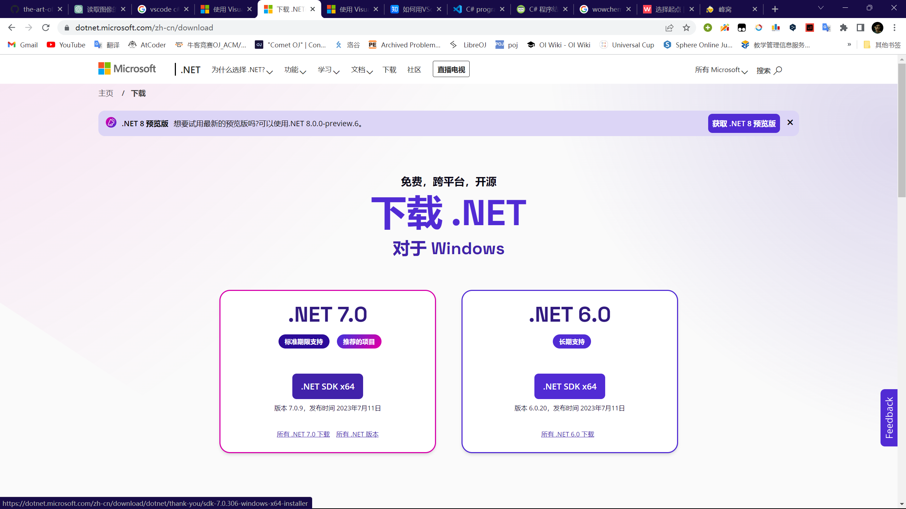

# 准备工作

1. 下载 C# 拓展

   

2. 下载[.NET7 SDK](https://dotnet.microsoft.com/zh-cn/download) 

   


# 创建应用并运行

​		***我们以HelloWorld为例：***

​	1. 创建一个HelloWorld文件夹或者在命令台输入

```bash
dotnet new console -o ProjectName -f net7.0
```

​		如果你在命令台输入了，请跳转到第**3.2**步

2. 在VSCode中选择打开**文件 > 打开文件夹**
2.  3.1 **使用VSCode命令面板**

> 1. 使用```Ctrl + Shift + P```打开命令面板
> 2. 查找并选择```.NET: New Project```
> 3. 随后需要选择项目模板，选择```Console App```
> 4. 输入项目名并选择项目路径
> 5. 你能在项目文件夹中看到```Program.cs```，它的内容如下：
>
> ```c#
> // See https://aka.ms/new-console-template for more information
> Console.WriteLine("Hello, World!");
> 
> ```
>
> 6. 将文件```Program```重命名为```HelloWorld.cs```，内容更改为
>
> ```c#
> namespace HelloWorld
> {
>     class Program
>     {
>         static void Main(string[] args)
>         {
>             Console.WriteLine("Hello, World!");
>         }
>     }
> }
> ```
>
> 7. 运行文件时，笔者直接点```Run code```会报错，应选择```Debug/Run project associated with this file```
>
> ```plaintext
> scriptcs : 无法将“scriptcs”项识别为 cmdlet、函数、脚本文件或可运行程序的名称。请检查名称的拼写，如果包括路径，请确保路径正确，然后再试一次。
> 所在位置 行:1 字符: 1
> ```

​		3.2 使用终端

> 1. 确认终端已经导航到项目文件夹的情况下，在**Shell**输入
>
> ```bash
> doenet new console
> ```
>
> ​	你可能已经注意到它和第一部的指令有些相像，其实第一步的指令就是一步完成创建文件夹和应用。
>
> 2. 接下来找到```Program.cs```，与**3.1**做同样修改即可。
> 2. 运行项目时，在终端输入
>
> ```bash
> dotnet run
> ```

 

> 后记：
>
> ​		有一说一，我感觉用VS都方便很多呢......
