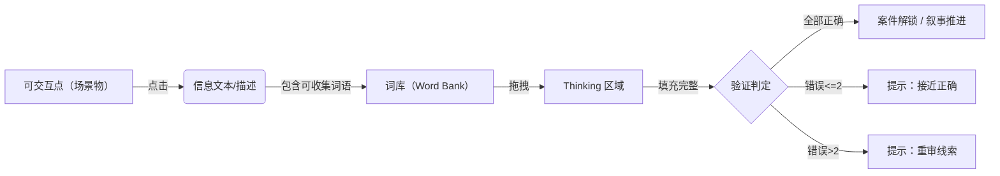
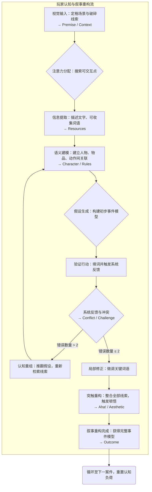

# 使用 FDD 框架分析《The Case of the Golden Idol》

> 《The Case of the Golden Idol》是一款以“观察与推理”为核心的叙事解谜游戏。它没有动态的剧情演出，也没有直接的文本叙事，却让玩家在一幅幅凝固的画面中拼出一连串离奇的谋杀事件。本文将使用 FDD（Formal, Dramatic, Dynamic）框架，分析这款作品如何通过“语言与观察”构建出独特的叙事体验。

------

## Formal Elements（形式/正规元素）

### Player and Objectives

玩家面对一个静态的场景，需要推断出画面中的人物身份、事件经过与动机。

 在这一过程中，玩家更像是一位**考古学家**——通过对零碎线索的主动挖掘与整理，逐步还原隐藏在定格瞬间背后的真相。

### Procedure and Rules

游戏分为两个部分：**Exploring** 与 **Thinking**。

 在 Exploring 部分，玩家可以点击可交互的物品或人物，查看相关信息、拾取可收集词语；
 在 Thinking 部分，玩家将这些词语填入相应的空格中，以完成事件重构。

 游戏会在所有空格被填满后进行验证，并反馈正确性。

对于填词验证机制，整个 Thinking 部分又按照内容分为几个子部分，但子部分的空格被填满后系统会自动验证该部分的填空是否完全正确，如果错误的话是否错误在两个以内。这是在「变相透题」，如果错误多于两个，说明推理与事实差距较大，鼓励玩家重新进行推理；如果错误在两个以内，说明推理与事实十分相近离真相已不远，鼓励玩家重新审视自己的推理。这样的机制从一定程度上防止了玩家使用「试错法」，而是尝试进行「深度思考」。

### Resources

- 玩家的主要资源是从场景中获得的**可收集词语**。

   这些词语分为人名、地名、物品名、动词等类型，并分别对应 Thinking 部分中的不同栏位。
   语言在此被物化为“信息碎片”，是理解与表达的双重媒介。

- 除此之外，玩家的**认知资源**也是主要资源

  系统通过提升信息的饱和度来消耗这些资源、提升玩家认知负荷、 Conflict 和 Challenge 的强度。

### Conflict

核心冲突并非角色之间的对抗，而是玩家自身的**认知冲突**——
 你的推断是否正确？你对线索的理解是否偏离事实？
 这种内在冲突构成了游戏最持续的张力。

### Boundaries

除了最后两案，玩家每次探索的区域局限于本案地图，并且探索画面局限于近乎静止的画面。

但后期案件通过回顾过去案件实现跨案连结，这也促成宏叙事连贯。

### Outcome

当玩家正确还原事件、完成全部填词后，系统即判定“胜利”。
 每一次正确的推理不仅是谜题的解答，也象征着一次成功的“理解行为”。

------

## Dramatic Elements（戏剧元素）

### Premise

某日，两个探险家发现了一尊神秘的金偶像。
 从那一刻起，一连串围绕“偶像”的阴谋与死亡开始上演。

### Character

每个案件都有不同的角色，但玩家并不扮演或控制他们。
 角色们更像是**定格在瞬间的符号**，通过姿态、物品与环境暗示出他们的关系与动机。

### Story

随着玩家逐案还原，故事逐步展开。
 虽然玩法无法改变剧情，但玩家的推理过程**重建了叙事本身**。
 在这层意义上，玩家并非编剧或表演者，而是“叙事的考古学家”。

### Dramatic Arc

每个独立案件大致遵循“震惊 → 疑惑 → 假设 → 验证 → 恍然大悟”的情绪曲线。

 而从整体来看，游戏的宏观结构也呈现相似的波动：

 “兄弟会”案件构成第一个高潮，最终案件达到全剧顶点，“尾声”则让一切谜团落幕。

 这种情绪节奏让玩家在不断的认知落差与顿悟中获得戏剧体验。

------

## Dynamic Elements（动态元素）

### 系统组成

- **物品**：包括角色、随身物、场景可交互物件、可收集线索、词库与填词框。
- **属性**：如是否可交互、可收集、词语类别（人名、物品名、动词等）及是否正确填入等。
- **行为**：点击调查、收集词语、拖拽填词、切换场景。
- **关系**：词语与填词框形成多对一或一对多关系，同一词语可重复使用。
- **信息结构**：信息半公开，玩家需主动探索才能获取。
- **反馈**：系统在区域填满后统一验证，并提示错误数量是否小于两处。

### 信息流

### 核心循环

观察画面 → 初步猜测 → 收集线索 → 进一步推理 → 填词验证 → 修正推理 → 还原事件。

整个循环是一种认知行为：从感知到理解，再到自我校正，直至构建出连贯的真相。

------

## Summary

《The Case of the Golden Idol》的独特之处，在于它几乎剥离了所有传统的戏剧表演，却仍然构建出强烈的戏剧张力。
 叙事不再被“讲述”，而是被**理解**；
 戏剧不在角色行动中上演，而在玩家的思考过程中重生。

这款游戏让玩家成为“考古学家”，在语言、图像与逻辑的碎片中发掘过去的故事。
 它所探索的，不仅是推理的边界，更是一个深层问题：

> 当叙事被彻底静止，玩家的理解是否仍能让它重新活过来？